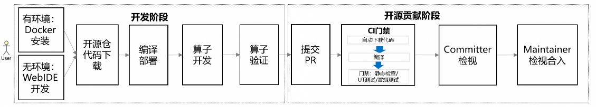

# Contribution Guide

This project welcomes developers to experience and contribute. Before participating in community contributions, refer to [cann-community](https://gitcode.com/cann/community) to understand the code of conduct, sign the CLA agreement, and learn about the contribution process for the source code repository.

Developers should pay attention to the following points when preparing local code and submitting PRs:

1. When submitting a PR, carefully fill in the business background, purpose, and solution according to the PR template.
2. If your modification is not a simple bug fix but involves new features, new interfaces, new configuration parameters, or modified code flows, discuss the solution through an Issue first to avoid having your code rejected. If you are unsure whether your modification qualifies as a "simple bug fix," you can also submit an Issue for discussion.

Developer contribution scenarios mainly include:

## 1. Contributing New Operators
<!--
The operator development contribution process is as follows:


-->
If you have a completely new operator that you want to design and implement based on NPU, you are welcome to propose your ideas and design solutions in an Issue. The complete contribution process is as follows:

### 1. Create an Issue Request

Create a new `Requirement|需求建议` type Issue and explain the design solution for the new operator. The Issue generally needs to include the following content:

- **Background Information**
- **Value/Purpose**
- **Design Solution**

Comment `/assign @yourself` in the submitted Issue to claim the task.

### 2. Requirement Review

The Sig group will assign a Committer to review your submitted Issue and provide feedback. After completing the modifications, @ the corresponding Committer in the Issue.

If the requirement is accepted, [sig members](https://gitcode.com/cann/community/blob/master/CANN/sigs/ops-basic/README.md) will assign you an appropriate operator classification path (for example: `experimental/math`). Submit the contributed operator to the corresponding operator classification directory under `experimental`.

### 3. PR Submission

The minimum ecosystem operator deliverables are as follows:

```text
${op_class}                                          # Operator classification
├── ${op_name}                                       # Operator name
│   ├── ${op_name}.cpp                               # Operator Kernel implementation file
│   └── tests
│   │   ├── test_${op_name}.py                       # Operator test file
│   ├── CMakeLists.txt                               # Operator compilation configuration file
│   ├── README.md                                    # Operator README document
```

PR submission requirements:

- Code deliverables: Provide the operator Kernel implementation and operator test file. For the development process, refer to [fast_kernel_launch_example](examples/fast_kernel_launch_example/README.md).
- Documentation deliverables: The operator README document is required; other documents can be provided as needed. For document writing templates and standards, refer to the [Documentation Contribution Guide](docs/CONTRIBUTING_DOCS_en.md).
- Accuracy requirements: Newly contributed operators must meet accuracy standards. For details, refer to [Ecosystem Operator Open Source Accuracy Standards](https://gitcode.com/cann/opbase/blob/master/docs/zh/ops_precision_standard/experimental_standard.md).
- Compliance check:
  - Whether the code complies with the [C++ Coding Standards](https://gitcode.com/cann/community/blob/master/contributor/coding-standards/C++%20Coding%20standards.md)
  - Whether the code compiles successfully
  - Whether Markdown document syntax complies with standards
- Contribution directory: Submit to the specified directory `experimental/${op_class}` according to sig member opinions. Refer to existing operator file placement rules.
- PR submission: Submit a PR to the target branch through `git` commands. Check whether the PR title is clear, whether the PR description is standardized (specify the change content and reason, whether it is associated with the corresponding Issue), and whether the CLA is signed.

If you want to contribute project standard operators, the deliverables are more comprehensive than ecosystem operators, including Kernel and Tiling implementation. For contribution guidance, refer to the [Appendix](#appendix).

### 4. CI Gate

Trigger the open source repository gate by commenting the `compile` command, and make modifications based on CI detection results. Currently, the CI gate includes the following check items:

- Code compilation
- Static check (if codecheck false positives are involved, submit them to sig members for shielding)
- UT test
- Smoke test

After the gate passes, @ the assigned Committer in the associated Issue.

### 5. Committer Review

The Committer will provide review feedback after the review. Modify according to the feedback, and @ the assigned Committer after completion.

### 6. Maintainer Merge

After the Committer review passes, mark the `/lgtm` label. The Maintainer will conduct a final review within 1 day. After confirming there are no issues, the Maintainer will mark the `/approve` label and merge the PR.

## 2. Operator Bug Fix

If you discover certain operator bugs in this project and want to fix them, you are welcome to create a new Issue for feedback and tracking.

You can create a new `Bug-Report|缺陷反馈` type Issue to describe the bug according to the [Submit Issue/Handle Issue Task](https://gitcode.com/cann/community#提交Issue处理Issue任务) guidelines, then enter "/assign" or "/assign @yourself" in the comment box to assign the Issue to yourself for processing.

## 3. Operator Optimization

If you have generalization enhancement or performance optimization ideas for certain operator implementations in this project and want to implement these optimization points, you are welcome to contribute operator optimizations.

You can create a new `Requirement|需求建议` type Issue to explain the optimization points and provide your design solution according to the [Submit Issue/Handle Issue Task](https://gitcode.com/cann/community#提交Issue处理Issue任务) guidelines, then enter "/assign" or "/assign @yourself" in the comment box to assign the Issue to yourself for tracking optimization.

## 4. Documentation Correction

If you discover certain operator documentation description errors in this project, you are welcome to create a new Issue for feedback and correction. For documentation standards, refer to the [Documentation Contribution Guide](docs/CONTRIBUTING_DOCS_en.md).

You can create a new `Documentation|文档反馈` type Issue to point out the corresponding documentation problems according to the [Submit Issue/Handle Issue Task](https://gitcode.com/cann/community#提交Issue处理Issue任务) guidelines, then enter "/assign" or "/assign @yourself" in the comment box to assign the Issue to yourself to correct the corresponding documentation description.

## 5. Help Resolve Others' Issues

If you have appropriate solutions for problems encountered by others in the community, you are welcome to comment and communicate in the Issue to help others solve problems and pain points, and jointly optimize usability.

If the corresponding Issue requires code modifications, you can enter "/assign" or "/assign @yourself" in the Issue comment box to assign the Issue to yourself for tracking and assisting in problem resolution.

## Appendix

The project standard operator deliverables are as follows:

```text
${op_class}                                          # Operator classification
├── ${op_name}                                       # Operator name
│   ├── op_host                                      # Operator definition and Tiling-related implementation
│   │   ├── ${op_name}_def.cpp                       # Operator definition file
│   │   ├── ${op_name}_tiling.cpp                    # Operator Tiling implementation file
│   │   └── CMakeLists.txt
│   ├── op_kernel                                    # Operator Kernel directory
│   │   ├── ${op_name}.cpp                           # Kernel entry file, containing main function and scheduling logic
│   │   ├── ${op_name}.h                             # Kernel implementation file, defining Kernel header file, containing function descriptions, structure definitions, and logic implementation
│   │   ├── ${op_name}_tiling_data.h                 # TilingData file, storing Tiling strategy-related configuration information
│   │   └── ${op_name}_tiling_key.h                  # TilingKey file, defining the key of the Tiling strategy, identifying different partitioning methods
│   ├── CMakeLists.txt                               # Operator compilation configuration file, keep the original file
│   └── README.md                                    # Operator description document
│   └── tests                                        # Operator test files
│   │   ├── ut                                       # Operator UT test files
```

PR submission requirements:

- Code deliverables: Provide op_host operator Tiling implementation, op_kernel operator Kernel implementation, and operator UT test files. For the development process, refer to the [Operator Development Guide](docs/zh/develop/aicore_develop_guide.md).
- Documentation deliverables: The operator README document is required; other documents can be provided as needed. For document writing templates and standards, refer to the [Documentation Contribution Guide](docs/CONTRIBUTING_DOCS_en.md).
- Compliance check:
  - Whether the code complies with the [C++ Coding Standards](https://gitcode.com/cann/community/blob/master/contributor/coding-standards/C++%20Coding%20standards.md) and standard operator basic programming standards
  - Whether the code compiles successfully
  - Whether Markdown document syntax complies with standards
- Contribution directory: Submit to the specified directory `experimental/${op_class}` according to sig member opinions. Refer to existing operator file placement rules.
- PR submission: Submit a PR to the target branch through `git` commands. Check whether the PR title is clear, whether the PR description is standardized (specify the change content and reason, whether it is associated with the corresponding Issue), and whether the CLA is signed.
