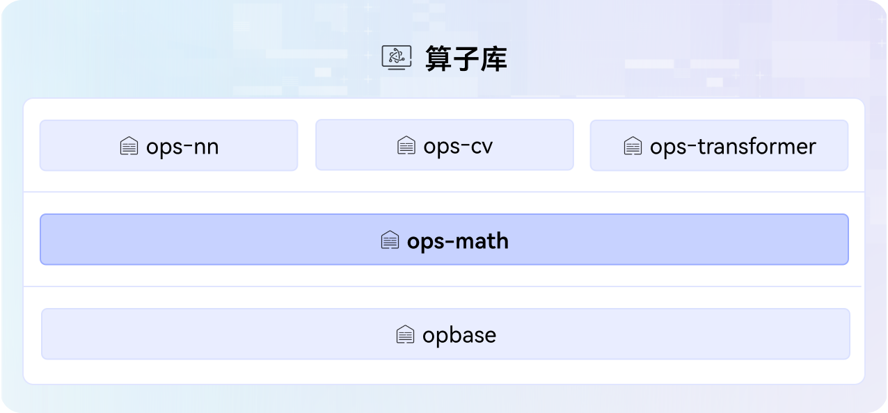

# ops-math

## 🔥Latest News
- [2026/01] 新增[QuickStart](QUICKSTART.md)，指导新手零基础入门算子项目部署（支持Docker环境）、算子开发和贡献流程。
- [2025/12] 开源算子支持Ascend 950PR/Ascend 950DT，可以通过CANN Simulator仿真工具开发调试；在add算子中增加了<<<>>>kernel异构调用示例，方便用户自定义使用；
在多个类别中新支持算子[concat](conversion/concat/)、[lerp](math/lerp/)、[drop_out_v3](random/drop_out_v3/)等。
- [2025/11] 完善多个算子README描述，改进算子开发实例文档及example。
- [2025/10] 新增experimental目录，完善[贡献指南](CONTRIBUTING.md)，支持开发者调试并贡献自定义算子。
- [2025/09] ops-math项目首次上线。

## 🚀概述

ops-math是[CANN](https://hiascend.com/software/cann) （Compute Architecture for Neural Networks）算子库中提供数学类计算的基础算子库，包括math类、conversion类等算子，算子库架构图如下：



## 📝版本配套

本项目源码会跟随CANN软件版本发布，关于CANN软件版本与本项目标签的对应关系请参阅[release仓库](https://gitcode.com/cann/release-management)中的相应版本说明。
请注意，为确保您的源码定制开发顺利进行，请选择配套的CANN版本与Gitcode标签源码，使用master分支可能存在版本不匹配的风险。

## ⚡️快速入门

若您希望**从零到一了解并快速体验项目**，请访问如下文档。可以先了解项目算子信息，再尝试算子调用、开发、贡献等操作。

1. [算子列表](docs/zh/op_list.md)：项目全量算子信息，方便快速查询。

2. [QuickStart](QUICKSTART.md)：端到端快速上手指南，包括搭建环境、编译部署、算子调用/开发/调试调优、贡献等过程。

## 📖学习教程

若您**已完成快速入门**学习，对本项目有了一定认知，并希望**深入了解和体验项目**，请访问如下文档。

这些文档提供了多样化的场景介绍和更全面的操作指导，方便您应用于各种AI业务场景。

1. [环境部署](docs/zh/context/quick_install.md)：搭建基础环境的指南，提供了多种场景下第三方依赖和软件包安装方法等。
2. [算子调用](docs/zh/invocation/quick_op_invocation.md)：编译部署并调用算子的指南，提供了多种编译算子包以及运行算子的方法（包括执行算子样例和UT）等。
3. [算子开发](docs/zh/develop/aicore_develop_guide.md)：基于本项目工程开发新算子的指南，提供了创建算子工程、实现Tiling和Kernel核心交付件等指导。
4. [算子调试调优](docs/zh/debug/op_debug_prof.md)：提供了常见的算子调试和调优方法，如DumpTensor、msProf、Simulator等。

除了上述指南，还提供了其他文档介绍，例如算子调用方式和流程、算子基本概念等，全量文档介绍请访问[docs](docs/README.md)。

## 🔍目录结构
关键目录如下，详细目录介绍参见[项目目录](./docs/zh/context/dir_structure.md)。
```
├── cmake                          # 项目工程编译目录
├── common                         # 项目公共头文件和公共源码
├── docs                           # 项目文档介绍
├── examples                       # 端到端算子开发和调用示例
├── experimental                   # 用户自定义算子存放目录
├── math                           # math类算子
│   ├── is_finite                  # is_finite算子所有交付件，如Tiling、Kernel等
│   │   ├── CMakeLists.txt         # 算子编译配置文件
│   │   ├── docs                   # 算子说明文档
│   │   ├── examples               # 算子使用示例
│   │   ├── op_graph               # 算子构图相关目录
│   │   ├── op_host                # 算子信息库、Tiling、InferShape相关实现目录
│   │   │   └── op_api             # 可选，算子aclnn接口实现目录，如未提供则表示此算子的aclnn接口会让工程自动生成
│   │   ├── op_kernel              # 算子kernel目录
│   │   └── README.md              # 算子介绍文档
│   ├── ...
│   └── CMakeLists.txt             # 算子编译配置文件
├── ...
├── conversion                     # conversion类算子
├── random                         # random类算子
├── scripts                        # 脚本目录，包含自定义算子、kernel构建相关配置文件
├── tests                          # 测试工程目录
├── CMakeLists.txt
├── README.md
├── build.sh                       # 项目工程编译脚本
├── install_deps.sh                # 安装依赖包脚本
└── requirements.txt               # 项目需要的第三方依赖包
```

## 💬相关信息

- [贡献指南](CONTRIBUTING.md)
- [安全声明](SECURITY.md)
- [许可证](LICENSE)
- [所属SIG](https://gitcode.com/cann/community/tree/master/CANN/sigs/ops-basic)

## 🤝联系我们

本项目功能和文档正在持续更新和完善中，欢迎您关注最新版本。

- **问题反馈**：通过GitCode[【Issues】](https://gitcode.com/cann/ops-math/issues)提交问题。
- **社区互动**：通过GitCode[【讨论】](https://gitcode.com/cann/ops-math/discussions)参与交流。
- **技术专栏**：通过GitCode[【Wiki】](https://gitcode.com/cann/ops-math/wiki)获取技术文章。
