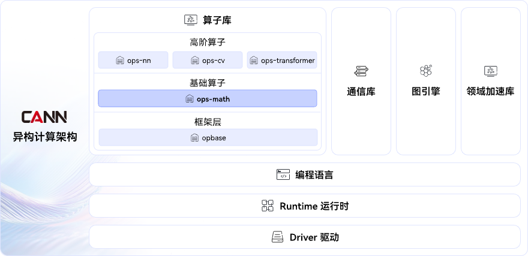

# ops-math

## 🔥Latest News

- [2025/09] ops-math项目首次上线。

## 🚀概述

ops-math是[CANN](https://hiascend.com/software/cann) （Compute Architecture for Neural Networks）算子库中提供数学类计算的基础算子库，包括math类、conversion类等，全量算子范围请参见[算子清单](docs/context/op_list.md)。

## ⚡️快速入门

若您希望快速体验项目，请访问[快速入门](docs/context/QuickStart.md)获取简易教程，包括版本配套关系、环境搭建、编译执行、本地验证等操作。

- [目录结构](docs/context/QuickStart.md#目录结构)：体验功能之前，建议先了解项目中关键的目录结构和对应的交付件含义。
- [版本配套](docs/context/QuickStart.md#版本配套)：环境搭建前，需注意项目的Tag版本与CANN软件版本间的配套关系。
- [环境准备](docs/context/QuickStart.md#环境准备)：完成基础环境搭建，包括对应版本CANN软件包安装、源码下载、第三方依赖等。
- [编译执行](docs/context/QuickStart.md#编译执行)：环境搭建后可对算子源码进行修改（如优化、新增、Bug修复等），并编译生成对应的算子包部署到AI业务中。
- [本地验证](docs/context/QuickStart.md#本地验证)：可通过根目录下build.sh脚本执行算子样例、UT用例等，快速验证项目功能。

## 📖学习教程

若您希望深入了解项目功能并修改算子源码，请访问[项目文档](./docs/README.md)获取详细介绍，包括算子清单、接口列表、算子开发指南、调用样例以及调试调优方法等。

- [算子开发](docs/README.md#算子开发)：介绍算子端到端开发流程，包括算子原型定义、Tiling策略、Kernel实现、框架适配等。
- [算子调用](docs/README.md#算子调用)：介绍不同调用算子的方式，方便快速应用于实际业务中。
- [算子调试调优](docs/README.md#算子调试调优)：介绍常见的算子调试和调优方法、工具，如DumpTensor、msProf等。

## 📝相关信息

- [贡献指南](CONTRIBUTING.md)
- [安全声明](SECURITY.md)
- [许可证](LICENSE)
