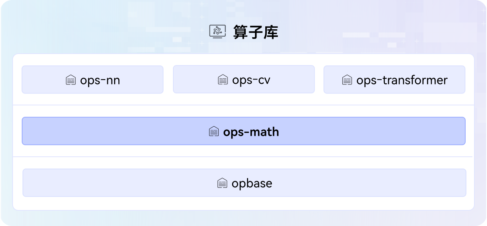

# ops-math

## 🔥Latest News

- [2026/01] 新增[QuickStart](docs/QUICKSTART.md)，指导新手零基础入门算子项目部署（支持Docker环境）、算子开发和贡献流程。
- [2025/12] 开源算子支持Ascend 950PR/Ascend 950DT，可以通过CANN Simulator仿真工具开发调试；在add算子中增加了<<<>>>kernel异构调用示例，方便用户自定义使用；在多个类别中新支持算子[concat](conversion/concat/)、[lerp](math/lerp/)、[drop_out_v3](random/drop_out_v3/)等。
- [2025/11] 完善多个算子README描述，改进算子开发实例文档及example。
- [2025/10] 新增experimental目录，完善[贡献指南](CONTRIBUTING.md)，支持开发者调试并贡献自定义算子。
- [2025/09] ops-math项目首次上线。

## 🚀概述

ops-math是[CANN](https://hiascend.com/software/cann) （Compute Architecture for Neural Networks）算子库中提供数值计算的基础算子库，包括conversion类、math类、random类等，覆盖张量形态变换、基础数学运算、随机数生成等场景，子库在架构图中的位置如下。



本仓已集成代码仓库智能体，点击 [![Zread](https://img.shields.io/badge/Zread-Ask_AI-_.svg?style=flat&color=0052D9&labelColor=000000&logo=data%3Aimage%2Fsvg%2Bxml%3Bbase64%2CPHN2ZyB3aWR0aD0iMTYiIGhlaWdodD0iMTYiIHZpZXdCb3g9IjAgMCAxNiAxNiIgZmlsbD0ibm9uZSIgeG1sbnM9Imh0dHA6Ly93d3cudzMub3JnLzIwMDAvc3ZnIj4KPHBhdGggZD0iTTQuOTYxNTYgMS42MDAxSDIuMjQxNTZDMS44ODgxIDEuNjAwMSAxLjYwMTU2IDEuODg2NjQgMS42MDE1NiAyLjI0MDFWNC45NjAxQzEuNjAxNTYgNS4zMTM1NiAxLjg4ODEgNS42MDAxIDIuMjQxNTYgNS42MDAxSDQuOTYxNTZDNS4zMTUwMiA1LjYwMDEgNS42MDE1NiA1LjMxMzU2IDUuNjAxNTYgNC45NjAxVjIuMjQwMUM1LjYwMTU2IDEuODg2NjQgNS4zMTUwMiAxLjYwMDEgNC45NjE1NiAxLjYwMDFaIiBmaWxsPSIjZmZmIi8%2BCjxwYXRoIGQ9Ik00Ljk2MTU2IDEwLjM5OTlIMi4yNDE1NkMxLjg4ODEgMTAuMzk5OSAxLjYwMTU2IDEwLjY4NjQgMS42MDE1NiAxMS4wMzk5VjEzLjc1OTlDMS42MDE1NiAxNC4xMTM0IDEuODg4MSAxNC4zOTk5IDIuMjQxNTYgMTQuMzk5OUg0Ljk2MTU2QzUuMzE1MDIgMTQuMzk5OSA1LjYwMTU2IDE0LjExMzQgNS42MDE1NiAxMy43NTk5VjExLjAzOTlDNS42MDE1NiAxMC42ODY0IDUuMzE1MDIgMTAuMzk5OSA0Ljk2MTU2IDEwLjM5OTlaIiBmaWxsPSIjZmZmIi8%2BCjxwYXRoIGQ9Ik0xMy43NTg0IDEuNjAwMUgxMS4wMzg0QzEwLjY4NSAxLjYwMDEgMTAuMzk4NCAxLjg4NjY0IDEwLjM5ODQgMi4yNDAxVjQuOTYwMUMxMC4zOTg0IDUuMzEzNTYgMTAuNjg1IDUuNjAwMSAxMS4wMzg0IDUuNjAwMUgxMy43NTg0QzE0LjExMTkgNS42MDAxIDE0LjM5ODQgNS4zMTM1NiAxNC4zOTg0IDQuOTYwMVYyLjI0MDFDMTQuMzk4NCAxLjg4NjY0IDE0LjExMTkgMS42MDAxIDEzLjc1ODQgMS42MDAxWiIgZmlsbD0iI2ZmZiIvPgo8cGF0aCBkPSJNNCAxMkwxMiA0TDQgMTJaIiBmaWxsPSIjZmZmIi8%2BCjxwYXRoIGQ9Ik00IDEyTDEyIDQiIHN0cm9rZT0iI2ZmZiIgc3Ryb2tlLXdpZHRoPSIxLjUiIHN0cm9rZS1saW5lY2FwPSJyb3VuZCIvPgo8L3N2Zz4K&logoColor=ffffff)](https://zread.ai/hicann/ops-math) 徽章，进入其专属页面，开启在线智能代码学习与知识问答体验！

## 📌版本配套

本项目源码会跟随CANN软件版本发布，关于CANN软件版本与本项目标签的对应关系请参阅[release仓库](https://gitcode.com/cann/release-management)中的相应版本说明。
请注意，为确保您的源码定制开发顺利进行，请选择配套的CANN版本与Gitcode标签源码，使用master分支可能存在版本不匹配的风险。

## 🛠️环境准备

[环境部署](docs/zh/install/quick_install.md)是体验本项目能力的前提，请先完成NPU驱动、CANN包安装等，确保环境正常。

## ⬇️源码下载

环境准备好后，根据环境中CANN版本下载与之配套的分支源码，\$\{tag\_version\}替换为配套的分支标签名。

```bash
git clone -b ${tag_version} https://gitcode.com/cann/ops-math.git
```
说明：对于WebIDE环境，已默认提供最新商发CANN版本配套的源码，如需获取其他版本源码，参考上述命令获取。

## 📖学习教程

- [快速入门](docs/QUICKSTART.md)：从零开始快速体验项目核心基础能力，涵盖源码编译、算子调用、开发与调试等操作。
- [进阶教程](docs/README.md)：如需深入了解项目编译部署、算子调用、开发、调试调优等能力，请查阅文档中心获取详细指引。

## 💬相关信息

- [目录结构](docs/zh/install/dir_structure.md)
- [贡献指南](CONTRIBUTING.md)
- [安全声明](SECURITY.md)
- [许可证](LICENSE)
- [所属SIG](https://gitcode.com/cann/community/tree/master/CANN/sigs/ops-basic)

-----
PS：本项目功能和文档正在持续更新和完善中，欢迎您关注最新版本。

- **问题反馈**：通过GitCode[【Issues】](https://gitcode.com/cann/ops-math/issues)提交问题。
- **社区互动**：通过GitCode[【讨论】](https://gitcode.com/cann/ops-math/discussions)参与交流。
- **技术专栏**：通过GitCode[【Wiki】](https://gitcode.com/cann/ops-math/wiki)获取技术文章。
