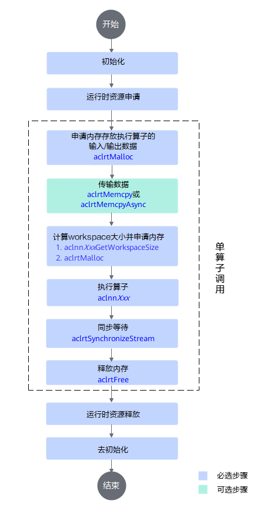

# 算子调用

## 概述

开发好的算子可通过如下多种方式调用，本章以`AddExample`算子调用为例，详细介绍算子调用和执行过程。

> 说明：优先推荐aclnn接口方式调用，若不支持该方式，可采用构图方式调用算子。

- aclnn调用 **（推荐）**：以算子aclnnXxx接口方式（一套基于C语言的API，无需IR定义）调用算子。
- 图模式调用：以IR（Intermediate Representation）构图方式调用算子。

## aclnn调用

### 调用流程



详细的aclnn接口调用流程介绍请参考[《应用开发（C&C++）》](https://hiascend.com/document/redirect/CannCommunityInferWizard)中”单算子调用 > 单算子调用流程“章节。

### 示例代码

`AddExample`算子以aclnn接口形式调用的示例代码如下（详细代码参见[test_aclnn_add_example.cpp](../../example/add_example/examples/test_aclnn_add_example.cpp)），**仅为参考**，其他算子的aclnn接口调用过程类似，请替换为实际aclnn接口。

注意：如需调用本项目其他算子，可访问对应算子`examples`目录下的test\_aclnn\_\$\{op\_name\}.cpp，\$\{op\_name\}表示算子名。

```Cpp
int main()
{
    // 1. 调用acl进行device/stream初始化
    int32_t deviceId = 0;
    aclrtStream stream;
    auto ret = Init(deviceId, &stream);
    CHECK_RET(ret == ACL_SUCCESS, LOG_PRINT("Init acl failed. ERROR: %d\n", ret); return ret);

    // 2. 构造输入与输出，需要根据API的接口自定义构造
    aclTensor* selfX = nullptr;
    void* selfXDeviceAddr = nullptr;
    std::vector<int64_t> selfXShape = {32, 4, 4, 4};
    std::vector<float> selfXHostData(2048, 1);
    ret = CreateAclTensor(selfXHostData, selfXShape, &selfXDeviceAddr, aclDataType::ACL_FLOAT, &selfX);
    CHECK_RET(ret == ACL_SUCCESS, return ret);

    aclTensor* selfY = nullptr;
    void* selfYDeviceAddr = nullptr;
    std::vector<int64_t> selfYShape = {32, 4, 4, 4};
    std::vector<float> selfYHostData(2048, 1);
    ret = CreateAclTensor(selfYHostData, selfYShape, &selfYDeviceAddr, aclDataType::ACL_FLOAT, &selfY);
    CHECK_RET(ret == ACL_SUCCESS, return ret);

    aclTensor* out = nullptr;
    void* outDeviceAddr = nullptr;
    std::vector<int64_t> outShape = {32, 4, 4, 4};
    std::vector<float> outHostData(2048, 1);
    ret = CreateAclTensor(outHostData, outShape, &outDeviceAddr, aclDataType::ACL_FLOAT, &out);
    CHECK_RET(ret == ACL_SUCCESS, return ret);

    // 3. 调用CANN算子库API，需要修改为具体的Api名称
    uint64_t workspaceSize = 0;
    aclOpExecutor* executor;

    // 4. 调用aclnnAddExample第一段接口
    ret = aclnnAddExampleGetWorkspaceSize(selfX, selfY, out, &workspaceSize, &executor);
    CHECK_RET(ret == ACL_SUCCESS, LOG_PRINT("aclnnAddExampleGetWorkspaceSize failed. ERROR: %d\n", ret); return ret);

    // 根据第一段接口计算出的workspaceSize申请device内存
    void* workspaceAddr = nullptr;
    if (workspaceSize > static_cast<uint64_t>(0)) {
        ret = aclrtMalloc(&workspaceAddr, workspaceSize, ACL_MEM_MALLOC_HUGE_FIRST);
        CHECK_RET(ret == ACL_SUCCESS, LOG_PRINT("allocate workspace failed. ERROR: %d\n", ret); return ret);
    }

    // 5. 调用aclnnAddExample第二段接口
    ret = aclnnAddExample(workspaceAddr, workspaceSize, executor, stream);
    CHECK_RET(ret == ACL_SUCCESS, LOG_PRINT("aclnnAddExample failed. ERROR: %d\n", ret); return ret);

    // 6. （固定写法）同步等待任务执行结束
    ret = aclrtSynchronizeStream(stream);
    CHECK_RET(ret == ACL_SUCCESS, LOG_PRINT("aclrtSynchronizeStream failed. ERROR: %d\n", ret); return ret);

    // 5. 获取输出的值，将device侧内存上的结果拷贝至host侧，需要根据具体API的接口定义修改
    PrintOutResult(outShape, &outDeviceAddr);

    // 7. 释放aclTensor，需要根据具体API的接口定义修改
    aclDestroyTensor(selfX);
    aclDestroyTensor(selfY);
    aclDestroyTensor(out);

    // 8. 释放device资源
    aclrtFree(selfXDeviceAddr);
    aclrtFree(selfYDeviceAddr);
    aclrtFree(outDeviceAddr);
    if (workspaceSize > static_cast<uint64_t>(0)) {
        aclrtFree(workspaceAddr);
    }
    aclrtDestroyStream(stream);
    aclrtResetDevice(deviceId);

    // 9. acl去初始化
    aclFinalize();
    return 0;
}
```

### 编译与运行

>说明：对于项目内已实现的算子（非自定义算子），可通过根目录下[build.sh](../../build.sh)直接运行算子，操作请参考[快速入门 > 本地验证](./QuickStart.md#本地验证)。

1. 前提条件。
   请参考本项目[快速入门 > 编译执行](./QuickStart.md#编译执行)完成目标算子的编译部署。

2. 创建CMakelist文件。

   在`AddExample`算子调用样例目录中创建用于构建的CMakelist文件，路径为本项目`example/add_example/examples/CMakeLists.txt` ，内容示例如下，请根据实际情况自行修改。

    ```bash
   cmake_minimum_required(VERSION 3.14)
   # 设置工程名
   project(ACLNN_EXAMPLE)

   # 设置C++编译标准
   add_compile_options(-std=c++11)

   # 设置编译输出目录为当前目录下的bin文件夹
   set(CMAKE_RUNTIME_OUTPUT_DIRECTORY  "./bin")    

   # 设置调试和发布模式的编译选项
   set(CMAKE_CXX_FLAGS_DEBUG "-fPIC -O0 -g -Wall")
   set(CMAKE_CXX_FLAGS_RELEASE "-fPIC -O2 -Wall")

   # 获取LD_LIBRARY_PATH环境变量
   if(NOT DEFINED ENV{LD_LIBRARY_PATH})
       message(FATAL_ERROR "LD_LIBRARY_PATH environment variable is not set")
   endif()
   set(LD_LIB_PATH "$ENV{LD_LIBRARY_PATH}")

   # 分割路径列表并找到包含/vendors/的路径（仅自定义算子需要）  
   string(REPLACE ":" ";" LD_LIB_LIST "${LD_LIB_PATH}")
   set(TARGET_PATH "")
   foreach(path ${LD_LIB_LIST})
       # 匹配包含/vendors/的路径（不区分位置）
       if(path MATCHES "/vendors/")
           set(TARGET_PATH "${path}")
           break()
       endif()
   endforeach()
   if(NOT TARGET_PATH)
       message(FATAL_ERROR "未在LD_LIBRARY_PATH中找到包含/vendors/的路径")
   endif()
   if(TARGET_PATH MATCHES "/vendors/([^/]+)")
       set(TARGET_SUBDIR "${CMAKE_MATCH_1}")
   else()
       message(FATAL_ERROR "在路径${TARGET_PATH}中未找到/vendors/的直接子目录")
   endif()

   # 添加可执行文件（请替换为实际算子可执行文件），指定算子调用的*.cpp文件
   add_executable(test_aclnn_add_example              
   test_aclnn_add_example.cpp)         

   # ASCEND_PATH（CANN软件包目录，请根据实际路径修改）
   if(NOT "$ENV{ASCEND_HOME_PATH}" STREQUAL "")      
       set(ASCEND_PATH $ENV{ASCEND_HOME_PATH})
   else()
       set(ASCEND_PATH "/usr/local/Ascend/ascend-toolkit/latest")
   endif()

   # 设置头文件路径
   set(INCLUDE_BASE_DIR "${ASCEND_PATH}/include")
   include_directories(
       ${INCLUDE_BASE_DIR}
       ${ASCEND_PATH}/opp/vendors/${TARGET_SUBDIR}/op_api/include    # 仅自定义算子需要
       # ${INCLUDE_BASE_DIR}/aclnn                                   # 仅内置算子需要
   )
   include_directories(
       ${INCLUDE_BASE_DIR}
   )

   # 链接所需的动态库
   target_link_libraries(test_aclnn_add_example PRIVATE             # 替换实际算子可执行文件
       ${ASCEND_PATH}/lib64/libascendcl.so
       ${ASCEND_PATH}/lib64/libnnopbase.so
       ${ASCEND_PATH}/opp/vendors/${TARGET_SUBDIR}/op_api/lib/libcust_opapi.so   # 仅自定义算子需要
       # ${ASCEND_PATH}/lib64/libopapi_math.so    # 仅内置算子需要
   )

   # 安装目标文件到bin目录  
   install(TARGETS test_aclnn_add_example DESTINATION ${CMAKE_RUNTIME_OUTPUT_DIRECTORY})
    ```

3. 创建编译执行脚本run.sh。
   
    在`AddExample`算子调用样例目录中创建用于编译执行的run.sh文件，路径为本项目`example/add_example/examples/run.sh` ，内容示例如下，请根据实际情况自行修改。
    
    ```bash
    if [ -n "$ASCEND_INSTALL_PATH" ]; then
        _ASCEND_INSTALL_PATH=$ASCEND_INSTALL_PATH
    elif [ -n "$ASCEND_HOME_PATH" ]; then
        _ASCEND_INSTALL_PATH=$ASCEND_HOME_PATH
    else
        _ASCEND_INSTALL_PATH="/usr/local/Ascend/latest"
    fi

    source ${_ASCEND_INSTALL_PATH}/bin/setenv.bash
    
    rm -rf build
    mkdir -p build 
    cd build
    cmake ../ -DCMAKE_CXX_COMPILER=g++ -DCMAKE_SKIP_RPATH=TRUE
    make
    cd bin
    ./test_aclnn_add_example            # 替换为实际算子可执行文件名
    ```
    
4. 运行run.sh。
    在`AddExample`算子的`example/add_example/examples/`目录下，执行如下命令：

   ```bash
    bash run.sh
   ```
    默认在当前执行路径 `/build/bin`下生成可执行文件test\_aclnn\_add\_example，运行后的结果打印如下：

   ```
    mean result[2046] is 2.000000
    mean result[2047] is 2.000000
   ```

## 图模式调用

### 调用流程


详细的IR构图流程介绍请参考[《Ascend Graph开发指南》](https://hiascend.com/document/redirect/CannCommunityAscendGraph)中”构建Graph> 通过算子原型构建Graph“章节。
### 示例代码

`AddExample`算子以图方式调用的示例代码如下（详细代码参见[test_geir_add_example.cpp](../../example/add_example/examples/test_geir_add_example.cpp)），**仅为参考**，其他算子的调用过程类似，请替换为实际的算子原型。

如需调用本项目其他算子，可访问对应算子`examples`目录下的test\_geir\_\$\{op\_name\}.cpp，$\{op\_name\}表示算子名。

```CPP
int main() {
    // 1. 创建图对象
    Graph graph(graphName);

    // 2. 图全局编译选项初始化
    Status ret = ge::GEInitialize(globalOptions);

    // 3. 创建AddExample算子实例
    auto add1 = op::AddExample("add1");

    // 4. 定义图输入输出向量
    std::vector<Operator> inputs{};
    std::vector<Operator> outputs{};

    // 5. 准备输入数据
    std::vector<int64_t> xShape = {32,4,4,4};
    // 宏展开方式处理变量赋值
    ADD_INPUT(1, x1, inDtype, xShape);
    ADD_INPUT(2, x2, inDtype, xShape);
    ADD_OUTPUT(1, y, inDtype, xShape);

    outputs.push_back(add1);

    // 6. 设置图对象的输入算子和输出算子
    graph.SetInputs(inputs).SetOutputs(outputs);

    // 7. 创建session对象
    ge::Session* session = new Session(buildOptions);

    // 8. session添加图
    ret = session->AddGraph(graphId, graph, graphOptions);

    // 9. 运行图
    ret = session->RunGraph(graphId, input, output);

    // 10. 释放资源
    GEFinalize();

    return 0;
}
```

### 编译与运行

>说明：对于项目内已实现的算子（非自定义算子），可通过根目录下[build.sh](../../build.sh)直接运行算子，操作请参考[快速入门 > 本地验证](./QuickStart.md#本地验证)。

1. 前提条件。
   请参考本项目[快速入门 > 编译执行](./QuickStart.md#编译执行)完成目标算子的编译部署。

2. 创建CMakelist文件。

   在`AddExample`算子调用样例目录中创建用于构建的CMakelist文件，路径为本项目`example/add_example/examples/CMakeLists.txt` ，内容示例如下，请根据实际情况自行修改。

    ```bash
   cmake_minimum_required(VERSION 3.14)
    
   # 设置工程名
   project(GE_IR_EXAMPLE)
   
   if(NOT "$ENV{ASCEND_OPP_PATH}" STREQUAL "")
       get_filename_component(ASCEND_PATH $ENV{ASCEND_OPP_PATH} DIRECTORY)
   elseif(NOT "$ENV{ASCEND_HOME_PATH}" STREQUAL "")
       set(ASCEND_PATH $ENV{ASCEND_HOME_PATH})
   else()
       set(ASCEND_PATH "/usr/local/Ascend/latest")
   endif()
   
   set(FWK_INCLUDE_DIR "${ASCEND_PATH}/compiler/include")
   
   message(STATUS "ASCEND_PATH: ${ASCEND_PATH}")
   
   file(GLOB files CONFIGURE_DEPENDS
        test_geir_add_example.cpp         
   )
   
   # 添加可执行文件（请替换为实际算子可执行文件）
   add_executable(test_geir_add_example ${files})      
   
   find_library(GRAPH_LIBRARY_DIR libgraph.so "${ASCEND_PATH}/compiler/lib64/stub")
   find_library(GE_RUNNER_LIBRARY_DIR libge_runner.so "${ASCEND_PATH}/compiler/lib64/stub")
   find_library(GRAPH_BASE_LIBRARY_DIR libgraph_base.so "${ASCEND_PATH}/compiler/lib64")
   
   # 链接所需的动态库
   target_link_libraries(test_geir_add_example PRIVATE      
        ${GRAPH_LIBRARY_DIR}
        ${GE_RUNNER_LIBRARY_DIR}
        ${GRAPH_BASE_LIBRARY_DIR}
   )
   
   # 设置头文件路径
   target_include_directories(test_geir_add_example PRIVATE       
        ${FWK_INCLUDE_DIR}/graph/
        ${FWK_INCLUDE_DIR}/ge/
        ${ASCEND_PATH}/opp/built-in/op_proto/inc/
        ${CMAKE_CURRENT_SOURCE_DIR}
        ${ASCEND_PATH}/compiler/include
   )
    ```

3. 创建编译执行脚本run.sh。

   在`AddExample`算子调用样例目录中创建用于编译执行的run.sh文件，路径为本项目`example/add_example/examples/run.sh` ，内容示例如下，请根据实际情况自行修改。

    ```bash
    if [ -n "$ASCEND_INSTALL_PATH" ]; then
        _ASCEND_INSTALL_PATH=$ASCEND_INSTALL_PATH
    elif [ -n "$ASCEND_HOME_PATH" ]; then
        _ASCEND_INSTALL_PATH=$ASCEND_HOME_PATH
    else
        _ASCEND_INSTALL_PATH="/usr/local/Ascend/latest"
    fi

    source ${_ASCEND_INSTALL_PATH}/bin/setenv.bash

    rm -rf build
    mkdir -p build 
    cd build
    cmake ../ -DCMAKE_CXX_COMPILER=g++ -DCMAKE_SKIP_RPATH=TRUE
    make
    ./test_geir_add_example                  # 替换为实际算子可执行文件名
    ```

4. 运行run.sh。
    在`AddExample`算子的`example/add_example/examples/`目录下，执行如下命令：
   
    ```bash
    bash run.sh
    ```
   
    默认在当前执行路径 `/build/bin`下生成可执行文件test\_aclnn\_add\_example，运行后的结果打印如下：
   
    ```
    INFO - [XIR]: Finalize ir graph session success
    ```