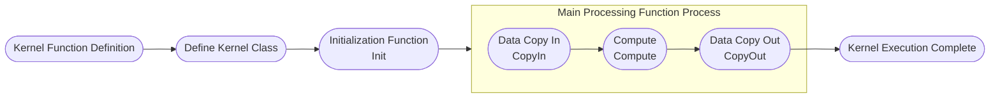

# AI Core Operator Development Guide

## Overview

### Usage Instructions

Operators can be classified into AI Core operators and AI CPU operators (minority) based on the hardware unit they run on. AI Core operators are developed using Ascend C language and run on AI Core hardware unit; AI CPU operators are developed using C++ language and run on AI CPU hardware unit.

This document aims to introduce how to develop AI Core operators based on standard engineering. If you want to contribute AI CPU operators, please refer to [AI CPU Operator Development Guide](./aicpu_develop_guide.md).

Before operator development, please first understand the following information:

- Basic Knowledge: Please first learn Ascend C programming language, understand basic syntax and principles, refer to [Ascend C Operator Development](https://hiascend.com/document/redirect/CannCommunityOpdevAscendC) to familiarize yourself with hardware architecture, operator Tiling/Kernel concepts.
- Development API: Interfaces used during operator development please refer to [Ascend C Operator Development Interface](https://hiascend.com/document/redirect/CannCommunityAscendCApi), [Basic Data Structures and Interfaces](https://hiascend.com/document/redirect/CannCommunitybasicopapi).
- Operator Project Migration: For operators already contributed in [Ascend/samples](https://gitee.com/ascend/samples/tree/master) repository, please refer to [Appendix > Operator Project Migration](#operator-project-migration) to complete existing operator migration to this project.
- Operator Cross-Platform Migration: For scenarios involving multi-platform operator implementation migration, such as migrating operator functionality already implemented on Atlas A2 to Ascend 950 platform, please refer to [Appendix > Operator Cross-Platform Migration](#operator-cross-platform-migration) to complete adaptation.

### Development Process

Taking `AddExample` operator as an example, introduce the full process and deliverables of standard AI Core operator development. For complete example, please visit project `examples` directory.

1. [Prerequisites](../../../README.md): Refer to project README to complete environment preparation and source code download. This will not be repeated here.
2. [Project Creation](#project-creation): Create standard operator project directory to facilitate subsequent operator compilation and deployment.
3. [Operator Definition](#operator-definition): Operator function description and prototype definition.
4. [Tiling Implementation](#tiling-implementation): Implement Host side operator Tiling function.
5. [Kernel Implementation](#kernel-implementation): Implement Device side operator kernel function.
6. [Graph Mode Adaptation](#graph-mode-adaptation): Custom operator implementation running graph mode.
7. [aclnn Adaptation](#aclnn-adaptation): Custom operator recommends aclnn interface invocation, need to complete binary release. If need to enter graph, please refer to [Appendix](#appendix).
8. [Compilation and Deployment](#compilation-and-deployment): Complete custom operator compilation and installation through project compilation script.
9. [Operator Verification](#operator-verification): Verify custom operator functionality through common operator invocation methods.

## Project Creation

Directory creation is an important step in operator development, providing unified directory structure and file organization for subsequent code writing, compilation building and debugging.

This project `build.sh` supports quick creation of operator directory. Enter project root directory and execute the following command:

```bash
# Create specified operator directory, such as bash build.sh --genop=examples/example_ops
# ${op_class} represents operator type, such as math class.
# ${op_name} represents operator name in lowercase underscore form, such as `ExampleOps` operator corresponds to example_ops, new operators are not allowed to have same name as existing operators.
bash build.sh --genop=${op_class}/${op_name}
```

If command executes successfully, you will see the following prompt:

```bash
Create the initial directory for ${op_name} under ${op_class} success
```

After creation, standard operator directory structure is as follows:

```text
${op_name}                              # Replace with actual operator name lowercase underscore form
├── examples                            # Operator invocation examples
│   ├── test_aclnn_${op_name}.cpp       # Operator aclnn invocation example
├── op_graph                            # Operator graph mode
│   ├── {op_name}_graph_infer.cpp       # InferDtype implementation, implements operator dtype inference, infers output dtype at runtime
│   └── {op_name}_proto.h               # Implements operator graph mode prototype
├── op_host                             # Host side implementation
│   ├── ${op_name}_def.cpp              # Operator information library, defines operator basic information, such as name, input/output, data type, etc.
│   ├── ${op_name}_infershape.cpp       # InferShape implementation, implements operator shape inference, infers output shape at runtime
│   └── ${op_name}_tiling.cpp           # Tiling implementation, divides tensor into multiple small blocks, distinguishes data types for parallel computing
├── op_kernel                           # Device side Kernel implementation
│   ├── ${op_name}_tiling_key.h         # TilingKey file, defines Key for Tiling strategy, identifies different partitioning methods
│   ├── ${op_name}_tiling_data.h        # TilingData file, stores configuration data related to Tiling strategy, such as block size, parallelism
│   ├── ${op_name}.cpp                  # Kernel entry file, contains main function and scheduling logic
│   └── ${op_name}.h                    # Kernel implementation file, defines Kernel header file, contains function declarations, structure definitions, logic implementation
└── CMakeLists.txt                      # Operator cmakelist entry
```

### Operator Directory Structure Based on atvoss Framework

Some operators in this project (such as `abs`, `sin`, `mul`, etc.) are developed based on [atvoss framework](https://gitcode.com/cann/atvoss). atvoss is an encapsulation of similar operators, making operator development more convenient. Operators based on atvoss framework have different directory structure from standard operators, mainly reflected in the following aspects:

1. **TilingKey**: atvoss operators usually reuse TilingKey definitions built into atvoss framework, therefore no separate `${op_name}_tiling_key.h` file is provided, but constants are defined directly in Tiling implementation (such as `constexpr uint64_t ABS_TILING_KEY_XXX = 101`).
2. **TilingData**: atvoss operators use `${op_name}_struct.h` to replace standard operator's `${op_name}_tiling_data.h`, internally inheriting base structures provided by atvoss framework (such as `EleBaseTilingData`).
3. **DAG Description**: atvoss operators use `${op_name}_dag.h` to describe operator's computation process (data flow graph), which is a file unique to atvoss framework, defining operator's computation logic by combining computation primitives provided by framework (such as `Vec::CopyIn`, `Vec::Abs`, `Vec::Cast`, etc.).
4. **Multi-Platform Support**: atvoss operator's Tiling implementation and DAG description are stored in directories by chip architecture, such as `op_host/arch35/` and `op_kernel/arch35/`.

Taking `abs` operator as an example, directory structure based on atvoss framework is as follows:

```text
abs                                     # Operator name
├── CMakeLists.txt                      # Operator cmakelist entry
├── README.md                           # Operator documentation
├── docs                                # Operator interface documentation
│   └── aclnnAbs.md                     # aclnn interface documentation
├── examples                            # Operator invocation examples
│   ├── test_aclnn_abs.cpp              # Operator aclnn invocation example
│   └── test_geir_abs.cpp               # Operator GE IR invocation example
├── op_api                              # Operator API layer
│   ├── abs.cpp                         # Operator API implementation
│   ├── abs.h                           # Operator API header file
│   ├── aclnn_abs.cpp                   # aclnn interface implementation
│   └── aclnn_abs.h                     # aclnn interface header file
├── op_graph                            # Operator graph mode
│   └── abs_proto.h                     # Operator graph mode prototype
├── op_host                             # Host side implementation
│   ├── abs_def.cpp                     # Operator information library
│   ├── abs_infershape.cpp              # InferShape implementation
│   ├── arch35                          # Directory by chip architecture
│   │   ├── abs_tiling_arch35.cpp       # Tiling implementation (arch35 architecture)
│   │   └── abs_tiling_arch35.h         # Tiling header file (arch35 architecture)
│   └── config                          # Compilation configuration
│       └── ascend950
│           ├── abs_binary.json         # Binary compilation configuration
│           └── abs_simplified_key.ini  # Simplified TilingKey configuration
├── op_kernel                           # Device side Kernel implementation
│   ├── abs_apt.cpp                     # Kernel entry file (apt means atvoss port), contains main function and scheduling logic
│   ├── abs_struct.h                    # TilingData structure, replaces standard operator's ${op_name}_tiling_data.h
│   └── arch35                          # Directory by chip architecture
│       ├── abs_dag.h                   # Operator computation process description (DAG), unique to atvoss framework
│       └── abs_complex_dag.h           # Complex type DAG description
└── tests                               # Test deliverables
    ├── assets
    │   └── golden.py                   # Golden data generation script
    ├── st                              # System test
    │   └── aclnnAbs
    │       └── *.json                  # ST test case configuration
    └── ut                              # Unit test
        ├── op_api
        │   └── test_aclnn_abs.cpp      # aclnn interface UT
        └── op_host
            ├── test_abs_infershape.cpp  # InferShape UT
            └── arch35
                └── test_abs_tiling_arch35.cpp  # Tiling UT (arch35 architecture)
```

> **Note:**
>
> 1. atvoss operator's `${op_name}_struct.h` is equivalent to standard operator's `${op_name}_tiling_data.h`, used to define TilingData structure;
> 2. atvoss operator's `${op_name}_dag.h` is operator computation process description file, describing data flow through DAG (Directed Acyclic Graph), which is a file unique to atvoss framework;
> 3. atvoss operator does not have independent `${op_name}_tiling_key.h` file, TilingKey is defined through constants in Tiling implementation;
> 4. For detailed usage of atvoss framework, please refer to [atvoss repository instructions](https://gitcode.com/cann/atvoss).

If `${op_class}` is a brand new operator classification, need to additionally add `add_subdirectory(${op_class})` in `CMakeLists.txt`, otherwise cannot compile normally.

```bash
if(ENABLE_EXPERIMENTAL)
    # genop adds new experimental operator classification
    # add_subdirectory(${op_class})
    add_subdirectory(experimental/math)
else()
    # genop adds new non-experimental operator classification
    # add_subdirectory(${op_class})
    add_subdirectory(math)
endif()
```

## Operator Definition

Operator definition needs to complete two deliverables: `README.md` and ```${op_name}_def.cpp```

**Deliverable 1: README.md**

Before developing operator, need to first determine target operator's function and computation logic.

Taking custom `AddExample` operator description as example, please refer to [AddExample Operator Description](../../../examples/add_example/README.md).

**Deliverable 2: ${op_name}_def.cpp**

Operator information library.

Taking custom `AddExample` operator description as example, please refer to [AddExample Operator Information Library](../../../examples/add_example/op_host/add_example_def.cpp).

## Tiling Implementation

### Tiling Introduction

Due to limited internal storage space in NPU AI Core, cannot load entire tensor data into computation unit for processing at once, therefore need to divide input tensor into multiple small blocks (Tile), process block by block, this process is called Tiling.

The algorithm used to guide data partitioning is called Tiling strategy or Tiling algorithm, which determines how to divide input data into multiple computation blocks, and guides Kernel how to allocate memory and schedule computation tasks. Tiling and Kernel communicate information through `TilingData` structure.

### Code Implementation

**Standard operator** Tiling requires three deliverables in total: ```${op_name}_tiling.cpp``` ```${op_name}_tiling_key.h``` ```${op_name}_tiling_data.h```

- `${op_name}_tiling.cpp` is placed in `${op_name}/op_host` directory;
- `${op_name}_tiling_key.h` and `${op_name}_tiling_data.h` are placed in `${op_name}/op_kernel` directory;
- If `${op_name}_tiling.cpp` needs to reference `${op_name}_tiling_data.h`, please use relative path, for example: `#include "../op_kernel/${op_name}_tiling_data.h"`.

> **atvoss operator** Tiling deliverables are different from standard operators, usually including:
>
> 1. `${op_name}_tiling_arch{xx}.cpp` and `${op_name}_tiling_arch{xx}.h`: Placed in `${op_name}/op_host/arch{xx}` directory, implementing Tiling logic separately by chip architecture;
> 2. `${op_name}_struct.h`: Placed in `${op_name}/op_kernel` directory, defines TilingData structure (equivalent to standard operator's `${op_name}_tiling_data.h`), internally inheriting base structures provided by atvoss framework;
> 3. No independent `${op_name}_tiling_key.h` file, TilingKey is defined through constants in Tiling implementation.

**Deliverable 1: ${op_name}_tiling.cpp**

Tiling main partitioning logic.

For detailed implementation, please refer to [add_example_tiling.cpp](../../../examples/add_example/op_host/add_example_tiling.cpp).

> **Note on empty function implementation in example:**
>
> 1. **TilingParse**: Graph mode standard deliverable, retain function definition to meet framework invocation specification, can be left empty when no actual logic.
> 2. **CompileInfo**: Graph mode standard deliverable, retain function definition to meet framework invocation specification, can be left empty when no actual logic.

```CPP
// ${op_name}_tiling.cpp
// 1.Tiling needs to obtain runtime environment information, including available core count, UB (Unified Buffer) size, and pass obtained information to CompileInfo. Auto-generated aclnn does not call this function, can directly return ge::GRAPH_SUCCESS.
static ge::graphStatus TilingParse(gert::TilingParseContext* context)
{
    return ge::GRAPH_SUCCESS;
    // If writing aclnn interface manually, can complete parse function according to following steps
    // // 1.1 Get environment information
    // auto compileInfo = context->GetCompiledInfo<CompileInfo>();
    // OP_CHECK_NULL_WITH_CONTEXT(context, compileInfo);
    // auto platformInfo = context->GetPlatformInfo();
    // auto ascendcPlatform = platform_ascendc::PlatformAscendC(platformInfo);
    // // 1.2 Get available core count
    // compileInfo->totalCoreNum = ascendcPlatform.GetCoreNumAiv();
    // // 1.3 Get UB size
    // uint64_t ubSizePlatForm;
    // ascendcPlatform.GetCoreMemSize(platform_ascendc::CoreMemType::UB, ubSizePlatForm);
    // compileInfo->ubSize = static_cast<int64_t>(ubSizePlatForm);
    // ...
    // return ge::GRAPH_SUCCESS;
}

// 2.Tiling computation main entry
static ge::graphStatus TilingFunc(gert::TilingContext* context){
    // 2.1 Get platform information
    uint64_t ubSize;
    int64_t coreNum;
    OP_CHECK_IF(
        GetPlatformInfo(context, ubSize, coreNum) != ge::GRAPH_SUCCESS, OP_LOGE(context, "GetPlatformInfo error"),
        return ge::GRAPH_FAILED);

    // 2.2 Get input information
    // Get input tensor shape information
    auto inputX = context->GetInputShape(0);
    OP_CHECK_NULL_WITH_CONTEXT(context, inputX);

    // If input shape is scalar, convert to {1}, otherwise keep original shape unchanged
    auto inputShapeX = EnsureNotScalar(inputX->GetStorageShape());

    // Get input tensor description information
    auto inputDesc = context->GetInputDesc(0);
    OP_CHECK_NULL_WITH_CONTEXT(context, inputDesc);

    // Get data type
    dataType = inputDesc->GetDataType();

    // 2.3 Calculate Tiling parameters (design yourself according to different operator functions)
    ...

    // 2.4 Set TilingData information
    ${op_name}TilingData* tiling = context->GetTilingData<${op_name}TilingData>();
    OP_CHECK_NULL_WITH_CONTEXT(context, tiling);
    OP_CHECK_IF(
        memset_s(tiling, sizeof(${op_name}TilingData), 0, sizeof(${op_name}TilingData)) != EOK,
        OP_LOGE(context, "set tiling data error"), return ge::GRAPH_FAILED);
    tiling->totalLength = totalIdx;
    tiling->tileNum = TILE_NUM;

    // 2.5 Set WorkspaceSize (optional)
    size_t* currentWorkspace = context->GetWorkspaceSizes(1);
    OP_CHECK_NULL_WITH_CONTEXT(context, currentWorkspace);
    currentWorkspace[0] = WS_SYS_SIZE;
}

// 3.Tiling registration entry
IMPL_OP_OPTILING(${op_name}).Tiling(TilingFunc).TilingParse<CompileInfo>(TilingParse);
```

**Deliverable 2: ${op_name}_tiling_key.h**

TilingKey is a method to distinguish different implementations within an operator by distinguishing kernel code. Kernel side can select different algorithm logic through TilingKey.

For detailed implementation, please refer to [add_example_tiling_key.h](../../../examples/add_example/op_kernel/add_example_tiling_key.h).

> **Note:** If need to implement complex parameter combination to complete branch selection (involving multi-TilingKey scenarios), please refer to [Ascend C Operator Development Interface](https://hiascend.com/document/redirect/CannCommunityAscendCApi) "Utils API > Tiling Template Programming > Template Parameter Meaning".

```CPP
// ${op_name}_tiling_key.h
ASCENDC_TPL_ARGS_DECL(
    ${op_name},
    ASCENDC_TPL_UINT_DECL(schMode, 1, ASCENDC_TPL_UI_LIST, ELEMENTWISE_TPL_SCH_MODE_0, ELEMENTWISE_TPL_SCH_MODE_1));

ASCENDC_TPL_SEL(ASCENDC_TPL_ARGS_SEL(
    ASCENDC_TPL_UINT_SEL(schMode, ASCENDC_TPL_UI_LIST, ELEMENTWISE_TPL_SCH_MODE_0, ELEMENTWISE_TPL_SCH_MODE_1)));
```

**Deliverable 3: ${op_name}_tiling_data.h**

Parameters related to partitioning algorithm, such as total data size, data block count per core, stored through structure.

For detailed implementation, please refer to [add_example_tiling_data.h](../../../examples/add_example/op_kernel/add_example_tiling_data.h).

```CPP
// ${op_name}_tiling_data.h
struct ${op_name}TilingData {
    int64_t totalLength;
    int64_t tileNum;
};
```

## Kernel Implementation

### Kernel Introduction

Kernel is the core part of operator execution on NPU, responsible for tensor data loading, computation and storage, and is the final carrier of operator function implementation. Kernel implementation needs to work closely with Tiling strategy, performing memory allocation and computation scheduling according to `TilingData` and `TilingKey` information provided by Tiling.

Kernel implementation includes the following steps. The entire process is connected through `Process` function, implementing complete operator flow.



### Code Implementation

**Standard operator** Kernel requires two deliverables in total: ```${op_name}.cpp``` ```${op_name}.h```

- `${op_name}.cpp` as kernel entry function can only be placed in `${op_name}/op_kernel` directory;
- `${op_name}.h` file can be placed in corresponding directory according to different SoC or templates, for example: `${op_name}/op_kernel/arch32`, `${op_name}/op_kernel/arch35` or `${op_name}/op_kernel/impl` directories;

> **atvoss operator** Kernel deliverables are different from standard operators, usually including:
>
> 1. `${op_name}_apt.cpp`: Placed in `${op_name}/op_kernel` directory, as Kernel entry file (apt means atvoss port), contains kernel function definition and scheduling logic, uses schedulers provided by atvoss framework such as `ElementwiseSch`;
> 2. `${op_name}_struct.h`: Placed in `${op_name}/op_kernel` directory, defines TilingData structure;
> 3. `${op_name}_dag.h`: Placed in `${op_name}/op_kernel/arch{xx}` directory, describes operator's computation process through DAG, uses computation primitives provided by atvoss framework (such as `Vec::CopyIn`, `Vec::Abs`, etc.) to combine and define operator's data flow graph.

**Deliverable 1: ${op_name}.cpp**

Kernel entry file, contains main function and scheduling logic.

For detailed implementation, please refer to [add_example.cpp](../../../examples/add_example/op_kernel/add_example.cpp).

```CPP
// 1. Kernel function definition
// schMode is a template parameter used to support computation paths for different data types (such as float and int32)
// __global__ __aicore__ indicates this function is a global function that can execute on AI Core
template <uint32_t schMode>
__global__ __aicore__ void add_example(GM_ADDR x, GM_ADDR y, GM_ADDR z, GM_ADDR workspace, GM_ADDR tiling){
    ....
    // Tiling registration entry
    REGISTER_TILING_DEFAULT(AddExampleTilingData);

    // Macro method to get TilingData
    GET_TILING_DATA_WITH_STRUCT(AddExampleTilingData, tilingData, tiling);

    // Instantiate Kernel object according to TilingKey and complete computation
    if constexpr (schMode == static_cast<uint32_t>(AddExampleTilingKey::TILING_KEY_EXAMPLE_FLOAT)) { // float data type takes this branch
        NsAddExample::AddExample<float> op;     // Operator Kernel instance acquisition
        op.Init(x, y, z, &tilingData);          // Operator Kernel instance initialization
        op.Process();                           // Operator Kernel instance execution
    }
    ....
}
```

**Deliverable 2: ${op_name}.h**

Define Kernel header file, contains function declarations, structure definitions, logic implementation, etc.

For detailed implementation, please refer to [add_example.h](../../../examples/add_example/op_kernel/add_example.h).

```C++
// 2. Define Kernel Class
template <typename T>
class AddExample
{
public:
    // Default constructor, __aicore__ indicates this function runs on AI Core
    __aicore__ inline AddExample(){};
    // Initialization function, used to set input/output addresses and Tiling partitioning information calculation
    __aicore__ inline void Init(GM_ADDR x, GM_ADDR y, GM_ADDR z, const AddExampleTilingData* tilingData);
    // Main processing function, executes data copy and computation
    __aicore__ inline void Process();

private:
    // Function to copy data from GM to LM
    __aicore__ inline void CopyIn(int32_t progress);
```

## Graph Mode Adaptation

Custom operators need to implement graph mode adaptation to run in graph mode. For detailed content, please refer to [Graph Mode Development Guide](./graph_develop_guide.md).

## aclnn Adaptation

Custom operators recommend aclnn interface invocation, need to complete binary release. For detailed content, please refer to [Operator Invocation](../invocation/quick_op_invocation.md).

## Compilation and Deployment

After operator development is complete, need to compile operator project to generate custom operator installation package. Specific operations are as follows:

1. **Preparation.**

    Refer to [Project Creation](#project-creation) to complete basic environment setup, and check whether operator development deliverables are complete and whether they are in corresponding operator classification directory.

2. **Compile custom operator package.**

    Taking `AddExample` operator as example, assuming development deliverables are in `examples` directory. For complete code, see [add_example](../../../examples/add_example) directory.

    ```bash
    # Compile specified operator, such as bash build.sh --pkg --ops=add_example -j16
    bash build.sh --pkg --soc=${soc_version} --vendor_name=${vendor_name} --ops=${op_list} [--experimental] [-j${n}]
    ```

    - --soc: $\$\{soc\_version\}$ represents NPU model. Atlas A2 series products use "ascend910b" (default), Atlas A3 series products use "ascend910_93", Ascend 950PR/Ascend 950DT products use "ascend950".
    - --vendor_name (optional): $\$\{vendor\_name\}$ represents built custom operator package name, default name is custom.
    - --ops (optional): $\$\{op\_list\}$ represents operators to compile, default compiles all operators when not specified. Format like "--ops=add_example".
    - --experimental (optional): If compiled operator is contributed operator, need to configure --experimental.
    - -j (optional): Specify compilation thread count to speed up compilation.

    If following message appears, compilation is successful:

    ```bash
    Self-extractable archive "cann-ops-math-${vendor_name}_linux-${arch}.run" successfully created.
    ```

3. **Install custom operator package.**

    Execute the following command to install:

    ```bash
    # Install run package
    ./build_out/cann-ops-math-${vendor_name}_linux-${arch}.run
    ```

    Custom operator package is installed in ```${ASCEND_HOME_PATH}/opp/vendors``` path. ```${ASCEND_HOME_PATH}``` represents CANN software installation directory, can be configured in environment variable in advance.

4. **(Optional) Uninstall custom operator package.**

    After custom operator package installation, `uninstall.sh` will be generated in ```${ASCEND_HOME_PATH}/opp/vendors/custom_math/scripts``` directory. Can uninstall custom operator package through this script. Command as follows:

    ```bash
    bash ${ASCEND_HOME_PATH}/opp/vendors/custom_math/scripts/uninstall.sh
    ```

## Operator Verification

During operator development process, can verify through the following methods:

1. [UT Verification](#ut-verification): Verify whether deliverable code can run normally. UT verification does not require NPU environment.

2. [aclnn Invocation Verification](#aclnn-invocation-verification): Verify operator functionality on NPU environment. aclnn invocation verification requires NPU environment.

### UT Verification

During main deliverable code development process, can quickly verify through UT verification method, no need to compile and deploy operator package.

UT directory structure is as follows, need to be created manually by user:

```bash
${op_name}
...                                                     # Other deliverables
└── tests                                               # Test deliverables
    └── ut                                              # UT implementation
        ├── op_host
        │   └── test_${op_name}_tiling.cpp              # Tiling UT implementation
        │   └── test_${op_name}_infershape.cpp          # Infershape UT implementation
        └── op_kernel
            └── test_${op_name}.cpp                     # Kernel UT implementation
```

For commands to execute UT verification, please refer to [Operator Invocation](../invocation/quick_op_invocation.md). Below will introduce each UT deliverable writing in turn.

#### Infershape UT

Infershape UT is used to verify whether host side Infershape logic is correct. After given operator input, whether Infershape can execute correctly and whether output meets expectations. Recommend completing during operator development stage.

UT writing guide is as follows. For detailed implementation, please refer to example UT implementation [test_add_example_infershape.cpp](../../../examples/add_example/tests/ut/op_host/test_add_example_infershape.cpp).

**1. Organization Structure and Naming Suggestions**

- **Header files**: Uniformly include `iostream`, `gtest/gtest.h`, `infershape_context_faker.h`, `infershape_case_executor.h`.
- **Test class**: Inherit `testing::Test`, implement `SetUpTestCase/TearDownTestCase` to uniformly do data preparation and cleanup.
- **Naming**: Test class suggested as `${OpName}InfershapeTest`, case name suggested as `test_case_xxx`, higher readability.

Test class example:

```CPP
class ${OpName}InfershapeTest : public testing::Test {
protected:
    static void SetUpTestCase()
    {
        std::cout << "${OpName}InfershapeTest SetUp" << std::endl;
    }
    static void TearDownTestCase()
    {
        std::cout << "${OpName}InfershapeTest TearDown" << std::endl;
    }
};
```

**2. Case Basic Flow**

1) Call interface to construct case context. Main parameters needed are input and output shape/format/dtype.
    - shape/format/dtype can refer to `${op_name}_def.cpp` operator information library
    - If certain input is marked as `ValueDepend` in information library, UT needs to also prepare **real data value** for that input.
2) Set expected result.
3) Call interface to execute case.

Simplified example:

```CPP
TEST_F(${OpName}InfershapeTest, test_case_xxx)
{
    // 1.Construct case context
    gert::InfershapeContextPara infershapeContextPara(
        "${OpName}",
        {
            {{{1, -1, -1, 64}, {1, -1, -1, 64}}, ge::DT_FLOAT16, ge::FORMAT_ND},  // input tensor1
            {{{1, -1, -1, 64}, {1, -1, -1, 64}}, ge::DT_FLOAT16, ge::FORMAT_ND},  // input tensor2
            // If input is ValueDepend, need to additionally pass true and constValue parameters
            // Where constValue is self-defined variable, such as int constValue[2] = {2, 2}
            // {{{32, 4, 4, 4}, {32, 4, 4, 4}}, ge::DT_FLOAT, ge::FORMAT_ND, true, constValue}
        },
        {
            {{{}, {}}, ge::DT_FLOAT16, ge::FORMAT_ND},  // output tensor
        }
    );
    // 2.Set expected result
    std::vector<std::vector<int64_t>> expectOutputShape = {
        {1, -1, -1, 64},
    };
    // 3.Call interface to execute case
    ExecuteTestCase(infershapeContextPara, ge::GRAPH_SUCCESS, expectOutputShape);
}
```

#### Tiling UT

Tiling UT is used to verify whether host side Tiling logic is correct. After given operator input, whether Tiling can execute correctly and whether output meets expectations. Recommend completing during operator development stage.

UT writing guide is as follows. For detailed implementation, please refer to example UT implementation [test_add_example_tiling.cpp](../../../examples/add_example/tests/ut/op_host/test_add_example_tiling.cpp).

**1. Organization Structure and Naming Suggestions**

- **Header files**: Uniformly include `iostream`, `gtest/gtest.h`, `tiling_context_faker.h`, `tiling_case_executor.h`.
  - If tiling header file has already defined CompileInfo structure, also need to include.
- **Test class**: Inherit `testing::Test`, implement `SetUpTestCase/TearDownTestCase` to uniformly do data preparation and cleanup.
- **Naming**: Test class suggested as `${OpName}TilingTest`, case name suggested as `test_case_xxx`, higher readability.

Test class example:

```CPP
class ${OpName}TilingTest : public testing::Test {
protected:
    static void SetUpTestCase()
    {
        std::cout << "${OpName}TilingTest SetUp" << std::endl;
    }

    static void TearDownTestCase()
    {
        std::cout << "${OpName}TilingTest TearDown" << std::endl;
    }
};
```

**2. Case Basic Flow**

1) Call interface to construct case context. Main parameters needed are input and output shape/format/dtype, attributes and compileInfo, can refer to `${op_name}_def.cpp` operator information library.
    - shape/format/dtype and attributes can refer to `${op_name}_def.cpp` operator information library.
    - If certain input is marked as `ValueDepend` in information library, UT needs to also prepare **real data value** for that input.
    - compileInfo preferentially uses structure declared in tiling header file. If tiling header file does not declare, then declare in case.
2) Set expected result.
3) Call interface to execute case.

Simplified example:

```CPP
TEST_F(${OpName}TilingTest, test_case_xxx)
{
    // Declare structure and initialize a structure variable
    struct ${OpName}CompileInfo {
    } compileInfo;
    // 1.Construct case context
    gert::TilingContextPara tilingContextPara(
        "${OpName}",
        {
            {{{32, 4, 4, 4}, {32, 4, 4, 4}}, ge::DT_FLOAT, ge::FORMAT_ND}, // input tensor1
            {{{32, 4, 4, 4}, {32, 4, 4, 4}}, ge::DT_FLOAT, ge::FORMAT_ND}, // input tensor2
            // If input is ValueDepend, need to additionally pass true and constValue parameters
            // Where constValue is self-defined variable, such as int constValue[2] = {2, 2}
            // {{{32, 4, 4, 4}, {32, 4, 4, 4}}, ge::DT_FLOAT, ge::FORMAT_ND, true, constValue}
        },
        {
            {{{32, 4, 4, 4}, {32, 4, 4, 4}}, ge::DT_FLOAT, ge::FORMAT_ND}, // output tensor
        },
        {
            // Attributes
            gert::TilingContextPara::OpAttr("${attr_name}", AnyValue::CreateFrom<std::string>("${attr_value}"))
        },
        &compileInfo,
        64,     // Core count obtained in tiling stage
        262144, // UB size obtained in tiling stage, but actual obtained value is 256 bytes less than specified value
        4096    // Specify maximum value of tiling data in tiling stage
    );
    // 2.Set expected result
    uint64_t expectTilingKey = 0;
    string expectTilingData = "2048 32 10912 ";
    std::vector<size_t> expectWorkspaces = {0};
    // 3.Call interface to execute case
    ExecuteTestCase(tilingContextPara, ge::GRAPH_SUCCESS, expectTilingKey, expectTilingData, expectWorkspaces);
}
```

#### Kernel UT

Kernel UT is used to verify whether Device side Kernel logic is correct. After given input/Tiling parameters, whether Kernel can execute correctly and whether output meets expectations. Recommend completing during operator development stage.

UT writing guide is as follows. For detailed implementation, please refer to example UT implementation [test_add_example.cpp](../../../examples/add_example/tests/ut/op_kernel/test_add_example.cpp).

**1. Organization Structure and Naming Suggestions**

- **Header files**: Suggest uniformly including `gtest/gtest.h`, `tikicpulib.h`, `data_utils.h` and Tiling header file.
  - Directly reference `op_host/${op_name}_tiling.h`
  - Or provide lightweight adaptation header in UT directory (such as `examples/add_example/tests/ut/op_kernel/add_example_tiling.h`)
  - If Kernel is template function, can directly `#include "../../../op_kernel/${op_name}.cpp"` in UT to trigger instantiation (refer to `AddExample`)
- **Test class**: Inherit `testing::Test`, implement `SetUpTestCase/TearDownTestCase` to uniformly do data preparation and cleanup (such as copying data directory, chmod, generating bin).
- **Naming**: Test class suggested as `${OpName}KernelTest`, case name suggested as `test_case_xxx`, higher readability.

Test class example:

```CPP
class ${OpName}KernelTest : public testing::Test {
protected:
    static void SetUpTestCase()
    {
        std::cout << "${OpName}KernelTest SetUp" << std::endl;
        // Uniformly prepare test data here
    }
    static void TearDownTestCase()
    {
        std::cout << "${OpName}KernelTest TearDown" << std::endl;
    }
};
```

**2. Case Basic Flow**

1) Set input shape/format/dtype, for first-time use can refer to `${op_name}_def.cpp` operator information library.
    - If certain input is marked as `ValueDepend` in information library, UT needs to also prepare **real data value** for that input.
2) Prepare input/output/Workspace/Tiling buffer (`AscendC::GmAlloc`).
3) Prepare Tiling data (manually construct or generated by Tiling function).
4) Set `ICPU_SET_TILING_KEY` and `AscendC::SetKernelMode`.
5) Use `ICPU_RUN_KF` to execute Kernel.
6) Result verification and release resources (`AscendC::GmFree`).

Simplified example:

```CPP
extern "C" __global__ __aicore__ void ${op_name}(GM_ADDR x, GM_ADDR y, GM_ADDR z,
                                                GM_ADDR workspace, GM_ADDR tiling);

TEST_F(${OpName}KernelTest, test_case_basic)
{
    // 1.Set input shape/format/dtype, prepare ValueDepend input value if necessary
    // 2.Allocate input/output/workspace/tiling memory
    uint8_t* x = (uint8_t*)AscendC::GmAlloc(...);
    uint8_t* y = (uint8_t*)AscendC::GmAlloc(...);
    uint8_t* z = (uint8_t*)AscendC::GmAlloc(...);
    uint8_t* workspace = (uint8_t*)AscendC::GmAlloc(...);
    uint8_t* tiling = (uint8_t*)AscendC::GmAlloc(sizeof(${op_name}TilingData));

    // 3.Prepare tiling data (manually construct or generated by tiling function)
    auto* tilingData = reinterpret_cast<${op_name}TilingData*>(tiling);
    tilingData->... = ...;

    // 4.Set tiling key and execute kernel
    ICPU_SET_TILING_KEY(tilingKey);
    AscendC::SetKernelMode(KernelMode::AIV_MODE);
    ICPU_RUN_KF(${op_name}, blockDim, x, y, z, workspace, tiling);

    // 5.Result verification
    EXPECT_EQ(..., ...);

    // 6.Release resources
    AscendC::GmFree(x);
    AscendC::GmFree(y);
    AscendC::GmFree(z);
    AscendC::GmFree(workspace);
    AscendC::GmFree(tiling);
}
```

**3. Tiling Data Preparation Method**

- **Manual construction**: Suitable for few fields, simple logic.
- **Call Tiling function auto-generation**: Suitable for many fields, complex dependency on attributes/shape. Can reuse `tests/ut/common/tiling_context_faker.h` and `tiling_case_executor.h`. Example:

```CPP
gert::TilingContextPara para("OpName",
    {{{{2, 2, 2, 1}, {2, 2, 2, 1}}, ge::DT_FLOAT, ge::FORMAT_ND}},
    {{{{2, 1, 2, 2}, {2, 1, 2, 2}}, ge::DT_FLOAT, ge::FORMAT_ND}},
    {gert::TilingContextPara::OpAttr("attr", AnyValue::CreateFrom<int64_t>(1))},
    &compileInfo);

TilingInfo tilingInfo;
ASSERT_TRUE(ExecuteTiling(para, tilingInfo));
uint8_t* tiling = (uint8_t*)AscendC::GmAlloc(tilingInfo.tilingDataSize);
std::memcpy(tiling, tilingInfo.tilingData.get(), tilingInfo.tilingDataSize);
ICPU_SET_TILING_KEY(tilingInfo.tilingKey);
uint32_t blockDim = tilingInfo.blockNum;
```

**4. Data Generation and Result Comparison**

- Can use `ReadFile/WriteFile` in `tests/ut/op_kernel/data_utils.h` to read/write binary.
- Combine `gen_data.py`/`compare_data.py` scripts to generate and compare data, can refer to `add_example`'s `add_example_data` directory:
  [gen_data.py](../../../examples/add_example/tests/ut/op_kernel/add_example_data/gen_data.py),
  [compare_data.py](../../../examples/add_example/tests/ut/op_kernel/add_example_data/compare_data.py).
- Simple operators can directly calculate expected values in UT and compare.
  - Floating point comparison suggest using `EXPECT_NEAR/ASSERT_NEAR` and setting reasonable tolerance.

### aclnn Invocation Verification

```bash
# Need to import environment variables before execution
export LD_LIBRARY_PATH=${ASCEND_HOME_PATH}/opp/vendors/${vendor_name}_math/op_api/lib:${LD_LIBRARY_PATH}
```

After developed operator completes compilation and deployment, can verify functionality through aclnn method. Method please refer to [Operator Invocation Method](../invocation/quick_op_invocation.md).

## Appendix

Custom operators do not need aclnn adaptation if they need to run graph mode. For detailed content, please refer to [Graph Mode Development Guide](./graph_develop_guide.md).

### Operator Project Migration

Due to differences between Ascend/samples project and this project, after creating project in this project (refer to [Project Creation](#project-creation)), please refer to migration methods in table below for migration.

<table border="1">
  <tr>
    <th>cann-ops</th>
    <th>gitcode</th>
    <th>Migration Method</th>
    <th>Code Example</th>
  </tr>
  <tr>
    <td rowspan="4">op_host/{op_name}.cpp</td>
    <td>op_host/{op_name}_def.cpp</td>
    <td>Independently extract operator prototype description part from original op_host/{op_name}.cpp</td>
    <td><a href="#op_host/{op_name}_def.cpp">op_host/{op_name}_def.cpp</a>
    </td>
  </tr>
  <tr>
    <td>op_host/{op_name}_infershape.cpp</td>
    <td>(Optional) Independently extract shape inference part from original op_host/{op_name}.cpp</td>
    <td><a href="#op_host/{op_name}_infershape.cpp">op_host/{op_name}_infershape.cpp</a>
    </td>
  </tr>
  <tr>
    <td>op_host/{op_name}_tiling.cpp</td>
    <td>Only retain TilingFunc in original op_host/{op_name}.cpp</td>
    <td><a href="#op_host/{op_name}_tiling.cpp">op_host/{op_name}_tiling.cpp</a></td>
  </tr>
  <tr>
    <td>op_graph/{op_name}_graph_infer.cpp</td>
    <td>(Optional) Independently extract type inference part from original op_host/{op_name}.cpp</td>
    <td><a href="#op_graph/{op_name}_graph_infer.cpp">op_graph/{op_name}_graph_infer.cpp</a></td>
  </tr>
  <tr>
    <td>op_host/{op_name}_tiling.h</td>
    <td>op_kernel/{op_name}_tiling_data.h</td>
    <td>Change macro-defined Tiling structure definition in original op_host directory to C++ standard definition</td>
    <td><a href="#op_kernel/{op_name}_tiling_data.h">op_kernel/{op_name}_tiling_data.h</a></td>
  </tr>
  <tr>
    <td rowspan="2">op_kernel/{op_name}.cpp</td>
    <td>op_kernel/{op_name}.h</td>
    <td>Retain operator class definition part of kernel implementation in original op_host/{op_name}.cpp</td>
    <td><a href="#op_kernel/{op_name}.h">op_kernel/{op_name}.h</a></td>
  </tr>
  <tr>
    <td>op_kernel/{op_name}.cpp</td>
    <td>Migrate kernel implementation's kernel function implementation from original op_host/{op_name}.cpp to cpp file, meanwhile:
      <br>.Add REGISTER_TILING_DEFAULT call to register Tiling structure, use GET_TILING_DATA_WITH_STRUCT to get TilingData
      <br>.Add tiling template, support template parameter passing, select different kernel side implementation according to template parameter branch judgment
    </td>
    <td><a href="#op_kernel/{op_name}.cpp">op_kernel/{op_name}.cpp</a></td>
  </tr>
  <tr>
    <td>op_kernel/tiling_key_{op_name}.h</td>
    <td>op_kernel/{op_name}_tiling_key.h</td>
    <td>Retain operator's template parameter definition in original op_kernel/tiling_key_{op_name}.h. If op_kernel/tiling_key_{op_name}.h does not exist, add definition of template parameters and template parameter combinations</td>
    <td><a href="#op_kernel/{op_name}_tiling_key.h">op_kernel/{op_name}_tiling_key.h</a></td>
  </tr>
</table>

<div id="op_host/{op_name}_def.cpp">
<p style="font-size:18px;"><b>op_host/{op_name}_def.cpp</b></p>
</div>

Independently migrate operator information library content from original ${op_name}.cpp to this file. Need to remove SetInferShape and SetTiling content.

```CPP
// Operator information library content in original ${op_name}.cpp
namespace ops {
class AddCustom : public OpDef {
public:
    explicit AddCustom(const char *name) : OpDef(name)
    {
        this->Input("x")
        ....
        this->Output("z")
            .ParamType(REQUIRED)
            .DataType({ge::DT_FLOAT16, ge::DT_FLOAT})
            .Format({ge::FORMAT_ND, ge::FORMAT_ND});

        this->SetInferShape(ge::InferShape).SetInferDataType(ge::InferDataType);   // Need to remove SetInferShape
        this->AICore()
            .SetTiling(optiling::TilingFunc)                                       // Need to remove SetTiling
            .AddConfig("ascend910")
            .AddConfig("ascend310p")
            .AddConfig("ascend310b")
            .AddConfig("ascend910b");
    }
};
OP_ADD(AddCustom);
} // namespace ops

// After migrating to op_host/{op_name}_def.cpp, code does not have SetInferShape and SetTiling content
namespace ops {
class AddCustom : public OpDef {
public:
    explicit AddCustom(const char *name) : OpDef(name)
    {
        this->Input("x")
        ....
        this->Output("z")
            .ParamType(REQUIRED)
            .DataType({ge::DT_FLOAT16, ge::DT_FLOAT})
            .Format({ge::FORMAT_ND, ge::FORMAT_ND});

        this->AICore()
            .AddConfig("ascend910")
            .AddConfig("ascend310p")
            .AddConfig("ascend310b")
            .AddConfig("ascend910b");
    }
};
OP_ADD(AddCustom);
} // namespace ops
```

<div id="op_host/{op_name}_infershape.cpp">
<p style="font-size:18px;"><b>op_host/{op_name}_infershape.cpp</b></p>
</div>

Graph mode scenario needs to adapt this file. Independently migrate shape inference part from original ${op_name}.cpp to this file. Call interface IMPL_OP_INFERSHAPE to complete InferShape registration.

```CPP
// InferShape in original ${op_name}.cpp
namespace ge {
static graphStatus InferShape(gert::InferShapeContext *context)
{
    const gert::Shape *x1_shape = context->GetInputShape(0);
    gert::Shape *y_shape = context->GetOutputShape(0);
    *y_shape = *x1_shape;
    return GRAPH_SUCCESS;
}
} // namespace ge

// After migrating to op_host/{op_name}_infershape.cpp, call interface IMPL_OP_INFERSHAPE to complete InferShape registration
namespace ge {
static graphStatus InferShape(gert::InferShapeContext *context)
{
    const gert::Shape *x1_shape = context->GetInputShape(0);
    gert::Shape *y_shape = context->GetOutputShape(0);
    *y_shape = *x1_shape;
    return GRAPH_SUCCESS;
}
IMPL_OP_INFERSHAPE(AddCustom).InferShape(InferShape);   // Complete InferShape registration in this file
} // namespace ge
```

<div id="op_host/{op_name}_tiling.cpp">
<p style="font-size:18px;"><b>op_host/{op_name}_tiling.cpp</b></p>
</div>

After migrating TilingFunc from original ${op_name}.cpp to this file, call interface IMPL_OP_OPTILING to complete TilingFunc registration.
After changing macro-defined TilingData structure to standard C++ structure, TilingFunc no longer uses tiling.set_xxx method for assignment, but directly assigns to structure member variables.
If adding definition of template parameters and template parameter combinations, TilingFunc needs to also configure template parameter tilingKey.
Can refer to [add_example_tiling.cpp](../../../examples/add_example/op_host/add_example_tiling.cpp).

```CPP
// TilingFunc in original ${op_name}.cpp
namespace optiling {
const uint32_t BLOCK_DIM = 8;
const uint32_t DEFAULT_TILE_NUM = 8;
constexpr int MIN_LENGTH_FOR_SPLIT = 2048;
static ge::graphStatus TilingFunc(gert::TilingContext *context)
{
    TilingData tiling;
    uint32_t totalLength = context->GetInputShape(0)->GetOriginShape().GetShapeSize();
    ge::DataType dtype_x = context->GetInputDesc(0)->GetDataType();
    ge::DataType dtype_y = context->GetInputDesc(1)->GetDataType();
    ge::DataType dtype_z = context->GetOutputDesc(0)->GetDataType();
    ....
    tiling.set_totalLength(totalLength);
    tiling.SaveToBuffer(context->GetRawTilingData()->GetData(), context->GetRawTilingData()->GetCapacity());
    context->GetRawTilingData()->SetDataSize(tiling.GetDataSize());
    const uint64_t tilingKey = GET_TPL_TILING_KEY(D_T_X, D_T_Y, D_T_Z, TILE_NUM, IS_SPLIT); // Template parameter tilingkey configuration
    context->SetTilingKey(tilingKey);
    size_t *currentWorkspace = context->GetWorkspaceSizes(1);
    currentWorkspace[0] = 0;
    return ge::GRAPH_SUCCESS;
}
} // namespace optiling

// After migrating to op_host/{op_name}_tiling.cpp, call interface IMPL_OP_OPTILING to complete TilingFunc registration, directly assign to structure member variables,
namespace optiling {
const uint32_t BLOCK_DIM = 8;
const uint32_t DEFAULT_TILE_NUM = 8;
constexpr int MIN_LENGTH_FOR_SPLIT = 2048;
static ge::graphStatus TilingFunc(gert::TilingContext *context)
{
    // TilingData tiling;
    TilingData* tiling = context->GetTilingData<TilingData>();
    uint32_t totalLength = context->GetInputShape(0)->GetOriginShape().GetShapeSize();
    ge::DataType dtype_x = context->GetInputDesc(0)->GetDataType();
    ge::DataType dtype_y = context->GetInputDesc(1)->GetDataType();
    ge::DataType dtype_z = context->GetOutputDesc(0)->GetDataType();
    ....
    tiling->totalLength = totalLength;   // Directly assign to structure member variable
    // tiling.set_totalLength(totalLength);   // No longer use tiling.set_xxx method for assignment
    // tiling.SaveToBuffer(context->GetRawTilingData()->GetData(), context->GetRawTilingData()->GetCapacity());
    // context->GetRawTilingData()->SetDataSize(tiling.GetDataSize());
    const uint64_t tilingKey = GET_TPL_TILING_KEY(D_T_X, D_T_Y, D_T_Z, TILE_NUM, IS_SPLIT); // Template parameter tilingkey configuration
    context->SetTilingKey(tilingKey);
    size_t *currentWorkspace = context->GetWorkspaceSizes(1);
    currentWorkspace[0] = 0;
    return ge::GRAPH_SUCCESS;
}
IMPL_OP_OPTILING(AddCustom).Tiling(TilingFunc);   // Complete TilingFunc registration in this file
} // namespace optiling
```

<div id="op_graph/{op_name}_graph_infer.cpp">
<p style="font-size:18px;"><b>op_graph/{op_name}_graph_infer.cpp</b></p>
</div>
Graph mode scenario needs to adapt this file. After independently migrating type inference from original ${op_name}.cpp to this file, call interface IMPL_OP to complete InferDataType registration.

```CPP
// InferDataType in original ${op_name}.cpp
namespace ge {
static graphStatus InferDataType(gert::InferDataTypeContext *context)
{
    const auto inputDataType = context->GetInputDataType(0);
    context->SetOutputDataType(0, inputDataType);
    return ge::GRAPH_SUCCESS;
}
} // namespace ge

// After migrating to op_graph/{op_name}_graph_infer.cpp, call interface IMPL_OP to complete InferDataType registration
namespace ge {
static graphStatus InferDataType(gert::InferDataTypeContext *context)
{
    const auto inputDataType = context->GetInputDataType(0);
    context->SetOutputDataType(0, inputDataType);
    return ge::GRAPH_SUCCESS;
}
IMPL_OP(AddCustom).InferDataType(InferDataType);   // Complete InferDataType function registration in this file
} // namespace ge
```

<div id="op_kernel/{op_name}_tiling_data.h">
<p style="font-size:18px;"><b>op_kernel/{op_name}_tiling_data.h</b></p>
</div>

```CPP
// Macro-defined TilingData structure in original op_host/{op_name}_tiling.h
namespace optiling {
BEGIN_TILING_DATA_DEF(TilingData)
TILING_DATA_FIELD_DEF(uint32_t, totalLength);
END_TILING_DATA_DEF;

REGISTER_TILING_DATA_CLASS(XXX, TilingData)
} // namespace optiling

// After migrating to op_kernel/{op_name}_tiling_data.h, change to C++ standard structure
struct TilingData {
    uint32_t  totalLength;
};
```

<div id="op_kernel/{op_name}.h">
<p style="font-size:18px;"><b>op_kernel/{op_name}.h</b></p>
</div>

Retain operator class definition part of kernel implementation in original op_host/{op_name}.cpp.

<div id="op_kernel/{op_name}.cpp">
<p style="font-size:18px;"><b>op_kernel/{op_name}.cpp</b></p>
</div>

```CPP
// Kernel function implementation in original op_kernel/{op_name}.cpp
template<int D_T_X, int D_T_Y, int D_T_Z, int TILE_NUM, int IS_SPLIT>
 __global__ __aicore__ void add_custom(GM_ADDR x, GM_ADDR y, GM_ADDR z, GM_ADDR workspace, GM_ADDR tiling)
{
    GET_TILING_DATA(tiling_data, tiling);
    if(D_T_X == ADD_TPL_FP32 && D_T_Y == ADD_TPL_FP32 && D_T_Z == ADD_TPL_FP32){
        KernelAdd<float, float, float> op;
        op.Init(x, y, z, tiling_data.totalLength, TILE_NUM);
        op.Process1();
    }else if(D_T_X == ADD_TPL_FP16 && D_T_Y == ADD_TPL_FP16 && D_T_Z == ADD_TPL_FP16){
        KernelAdd<half, half, half> op;
        if(IS_SPLIT == 0){
            op.Init(x, y, z, tiling_data.totalLength, TILE_NUM);
            op.Process1();
        }else if(IS_SPLIT == 1){
            op.Init(x, y, z, tiling_data.totalLength, TILE_NUM);
            op.Process2();
        }
    }
}

// After migrating to op_kernel/{op_name}.cpp, add REGISTER_TILING_DEFAULT call to register Tiling structure, use GET_TILING_DATA_WITH_STRUCT to get TilingData
template<int D_T_X, int D_T_Y, int D_T_Z, int TILE_NUM, int IS_SPLIT>
 __global__ __aicore__ void add_custom(GM_ADDR x, GM_ADDR y, GM_ADDR z, GM_ADDR workspace, GM_ADDR tiling)
{
    // GET_TILING_DATA(tiling_data, tiling);
    REGISTER_TILING_DEFAULT(TilingData);   // Add REGISTER_TILING_DEFAULT call to register TilingData structure
    GET_TILING_DATA_WITH_STRUCT(TilingData, tiling_data, tiling);   // Macro GET_TILING_DATA_WITH_STRUCT gets TilingData
    if(D_T_X == ADD_TPL_FP32 && D_T_Y == ADD_TPL_FP32 && D_T_Z == ADD_TPL_FP32){
        KernelAdd<float, float, float> op;
        op.Init(x, y, z, tiling_data.totalLength, TILE_NUM);
        op.Process1();
    }else if(D_T_X == ADD_TPL_FP16 && D_T_Y == ADD_TPL_FP16 && D_T_Z == ADD_TPL_FP16){
        KernelAdd<half, half, half> op;
        if(IS_SPLIT == 0){
            op.Init(x, y, z, tiling_data.totalLength, TILE_NUM);
            op.Process1();
        }else if(IS_SPLIT == 1){
            op.Init(x, y, z, tiling_data.totalLength, TILE_NUM);
            op.Process2();
        }
    }
}
```

<div id="op_kernel/{op_name}_tiling_key.h">
<p style="font-size:18px;"><b>op_kernel/{op_name}_tiling_key.h</b></p>
</div>

Retain operator's template parameter definition in original op\_kernel/tiling\_key\_{op\_name}.h. If op\_kernel/tiling\_key\_{op\_name}.h does not exist, please refer to [add_example_tiling_key.h](../../../examples/add_example/op_kernel/add_example_tiling_key.h) to add definition of template parameters and template parameter combinations.

### Operator Cross-Platform Migration

After completing operator code development, if need to implement operator code migration between multiple platforms (such as Atlas A2/A3, etc.), need to consider software implementation changes caused by hardware structure differences.

You can refer to [Operator Cross-Platform Migration Guide](./cross_platform_migration_guide.md). This document provides common adaptation points and methodology, and provides adaptation examples for relevant operators.
