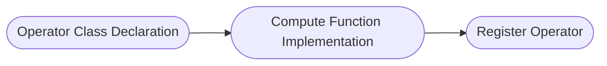

# AI CPU Operator Development Guide

## Usage Instructions

Operators can be classified into AI Core operators and AI CPU operators (minority) based on the hardware unit they run on. The former are developed using Ascend C language and run on AI Core hardware unit; the latter are developed using C++ language and run on AI CPU hardware unit.

This document focuses on how to develop AI CPU operators based on standard engineering. If you want to contribute AI Core operators, please refer to [AI Core Operator Development Guide](./aicore_develop_guide.md).

Before operator development, please first understand the following information:

- Basic Knowledge: Please first learn C++ programming language, understand basic syntax and principles, refer to [TBE & AI CPU Operator Development](https://hiascend.com/document/redirect/CannCommunityOpdevWizard) to familiarize yourself with hardware architecture, development API, etc.

### Development Process

Taking `AddExample` operator as an example, introduce the full process and deliverables of standard AI CPU operator development. For complete example, please visit project `examples` directory.

1. [Prerequisites](../../../README.md): Refer to project README to complete environment preparation and source code download. This will not be repeated here.
2. [Project Creation](#project-creation): Create standard operator project directory to facilitate subsequent operator compilation and deployment.
3. [Operator Definition](#operator-definition): Determine operator function and prototype definition.

4. [Kernel Implementation](#kernel-implementation): Implement Device side operator kernel function.

5. [aclnn Adaptation](#aclnn-adaptation): Custom operator recommends aclnn interface invocation, need to complete binary release in advance. **If using graph mode to invoke operator**, please refer to [Graph Mode Adaptation Guide](./graph_develop_guide.md).

6. [Compilation and Deployment](#compilation-and-deployment): Complete custom operator compilation and installation through project compilation script.

7. [Operator Verification](#operator-verification): Verify custom operator functionality through common operator invocation methods.

## Project Creation

Directory creation is an important step in operator development, providing unified directory structure and file organization for subsequent code writing, compilation building and debugging.

Can quickly create operator directory through `build.sh`. Enter project root directory and execute the following command:

```bash
# Create specified operator directory, such as bash build.sh --genop_aicpu=examples/add_example
# ${op_class} represents operator type, such as math class.
# ${op_name} represents operator name in lowercase underscore form, such as `AddExample` operator corresponds to add_example, new operators are not allowed to have same name as existing operators.
bash build.sh --genop_aicpu=${op_class}/${op_name}
```

If command executes successfully, you will see the following prompt:

```bash
Create the AI CPU initial directory for ${op_name} under ${op_class} success
```

After creation, directory structure is as follows:

```text
${op_name}                              # Replace with actual operator name lowercase underscore form
├── examples                            # Operator invocation examples
│   └── test_aclnn_${op_name}.cpp       # Operator aclnn invocation example
├── op_host                             # Host side implementation
│   └── ${op_name}_infershape.cpp       # InferShape implementation, implements operator shape inference, infers output shape at runtime
├── op_kernel_aicpu                     # Device side Kernel implementation
│   ├── ${op_name}_aicpu.cpp            # Kernel entry file, contains main function and scheduling logic
│   ├── ${op_name}_aicpu.h              # Kernel header file, contains function declarations, structure definitions, logic implementation
│   └── ${op_name}.json                 # Operator information library, defines operator basic information, such as name, input/output, data type, etc.
├── tests                               # UT implementation
│   └── ut                              # kernel/aclnn UT implementation
└── CMakeLists.txt                      # Operator cmakelist entry
```

 If ```${op_class}``` is a brand new operator classification, need to additionally add ```add_subdirectory(${op_class})``` in `CMakeLists`, otherwise cannot compile normally.

  ```text
  if(ENABLE_EXPERIMENTAL)
    # genop adds new experimental operator classification
    # add_subdirectory(${op_class})
    add_subdirectory(experimental/math)
  else()
    # genop adds new non-experimental operator classification
    # add_subdirectory(${op_class})
    add_subdirectory(math)
  endif()
  ```

## Operator Definition

Operator definition needs to complete two deliverables: `README.md` ```${op_name}.json```

**Deliverable 1: README.md**

Before developing operator, need to first determine target operator's function and computation logic.

Taking custom `AddExample` operator description as example, please refer to [AddExample Operator Description](../../../examples/add_example_aicpu/README.md).

**Deliverable 2: ${op_name}.json**

Operator information library.

Taking custom `AddExample` operator description as example, please refer to [AddExample Operator Information Library](../../../examples/add_example_aicpu/op_kernel_aicpu/add_example.json).

## Kernel Implementation

### Kernel Introduction

Kernel is the core part of operator execution on NPU. Kernel implementation includes the following steps:



### Code Implementation

Kernel requires two deliverables in total: ```${op_name}_aicpu.cpp``` ```${op_name}_aicpu.h```

**Deliverable 1: ${op_name}_aicpu.h**

Operator class declaration

The first step of Kernel implementation, need to declare operator class in header file ```op_kernel_aicpu/${op_name}_aicpu.h```. Operator class needs to inherit CpuKernel base class.
For detailed implementation, please refer to [add_example_aicpu.h](../../../scripts/opgen/template/add_example_aicpu/op_kernel_aicpu/add_example_aicpu.h).

```CPP
// 1. Operator class declaration
// Include AI CPU base library header file
#include "cpu_kernel.h"
// Define namespace aicpu (fixed, not allowed to modify), and define operator Compute implementation function
namespace aicpu {
// Operator class inherits CpuKernel base class
class AddExampleCpuKernel : public CpuKernel {
 public:
  ~AddExampleCpuKernel() = default;
  // Declare function Compute (needs to be overridden), parameter CpuKernelContext is CPUKernel context, including operator input, output and attribute information
  uint32_t Compute(CpuKernelContext &ctx) override;
};
}  // namespace aicpu
```

**Deliverable 2: ${op_name}_aicpu.cpp**

Compute function implementation and AI CPU operator registration

Get input/output Tensor information and perform validity check, then implement core computation logic (such as addition operation), and set computation result to output Tensor.

For detailed implementation, please refer to [add_example_aicpu.cpp](../../../scripts/opgen/template/add_example_aicpu/op_kernel_aicpu/add_example_aicpu.cpp).

```C++
// 2. Compute function implementation
#include "add_example_aicpu.h"

namespace {
// Operator name
const char* const kAddExample = "AddExample";
const uint32_t kParamInvalid = 1;
}  // namespace

// Define namespace aicpu
namespace aicpu {
// Implement custom operator class Compute function
uint32_t AddExampleCpuKernel::Compute(CpuKernelContext& ctx) {
  // Get input tensor from CpuKernelContext
  Tensor* input0 = ctx.Input(0);
  Tensor* input1 = ctx.Input(1);
  // Get output tensor from CpuKernelContext
  Tensor* output = ctx.Output(0);

  // Perform basic check on tensor, determine if null pointer
  if (input0 == nullptr || input1 == nullptr || output == nullptr) {
    return kParamInvalid;
  }

  // Get input tensor data type
  auto data_type = static_cast<DataType>(input0->GetDataType());
  // Get input tensor data address, for example input data type is int32
  auto input0_data = reinterpret_cast<int32_t*>(input0->GetData());
  // Get tensor shape
  auto GetTensorShape()_shape = input->GetTensorShape();

  // Get output tensor data address, for example output data type is int32
  auto y = reinterpret_cast<int32_t*>(output->GetData());

  // AddCompute function executes corresponding computation according to input type.
  // Since C++ itself does not support half-precision floating point type, can use third-party library Eigen (recommended version 3.3.9) to represent.
  switch (data_type) {
    case DT_FLOAT:
      return AddCompute<float>(...);
    case DT_INT32:
      return AddCompute<int32>(...);
      ....
    default : return PARAM_INVALID;
  }
}

// 3. Register operator Kernel implementation, used for framework to get operator Kernel Compute function.
REGISTER_CPU_KERNEL(kAddExample, AddExampleCpuKernel);
}  // namespace aicpu
```

## aclnn Adaptation

aicpu operators do not support auto-generating aclnn interface. During operator development, can refer to aclnn code under [math/cross/op_api/](../../../math/cross/op_api/) path to develop operator completion. After compilation, invoke aclnn interface in application to call the operator.

## Compilation and Deployment

After operator development is complete, need to compile operator project to generate custom operator installation package \*\.run. Specific operations are as follows:

1. **Preparation.**

    Refer to [Project Creation](#project-creation) to complete basic environment setup, and check whether operator development deliverables are complete and whether they are in corresponding operator classification directory.

2. **Compile custom operator package.**

    Taking `AddExample` operator as example, assuming development deliverables are in `examples` directory. For complete code, see [add_example](../../../examples/add_example_aicpu) directory.

    ```bash
    # Compile specified operator, such as bash build.sh --pkg --ops=add_example -j16
    bash build.sh --pkg --soc=${soc_version} --vendor_name=${vendor_name} --ops=${op_list} [--experimental] [-j${n}]
    ```

    - --soc: $\$\{soc\_version\}$ represents NPU model. Atlas A2 series products use "ascend910b" (default), Atlas A3 series products use "ascend910_93", Ascend 950PR/Ascend 950DT products use "ascend950".
    - --vendor_name (optional): $\$\{vendor\_name\}$ represents built custom operator package name, default name is custom.
    - --ops (optional): $\$\{op\_list\}$ represents operators to compile, default compiles all operators when not specified. Format like "--ops=add_example".
    - --experimental (optional): If compiled operator is contributed operator, need to configure --experimental.
    - -j (optional): Specify compilation thread count to speed up compilation.

    If following message appears, compilation is successful:

    ```bash
    Self-extractable archive "cann-ops-math-${vendor_name}_linux-${arch}.run" successfully created.
    ```

3. **Install custom operator package.**

    ```bash
    # Install run package
    ./build_out/cann-ops-math-${vendor_name}_linux-${arch}.run
    ```

    Custom operator package is installed in ```${ASCEND_HOME_PATH}/opp/vendors``` path. ```${ASCEND_HOME_PATH}``` represents CANN software installation directory, can be configured in environment variable in advance.

4. **(Optional) Uninstall custom operator package.**

    After custom operator package installation, `uninstall.sh` will be generated in ```${ASCEND_HOME_PATH}/opp/vendors/custom_math/scripts``` directory. Can uninstall custom operator package through this script. Command as follows:

    ```bash
    bash ${ASCEND_HOME_PATH}/opp/vendors/custom_math/scripts/uninstall.sh
    ```

## Operator Verification

Before verifying operator, need to ensure environment variables are configured. Command as follows:

```bash
export LD_LIBRARY_PATH=${ASCEND_HOME_PATH}/opp/vendors/${vendor_name}_math/op_api/lib:${LD_LIBRARY_PATH}
export ASCEND_CUSTOM_OPP_PATH=${ASCEND_HOME_PATH}/opp/vendors/${vendor_name}_math
```

- **UT Verification**

  During operator development process, can quickly verify through UT verification (such as Kernel) method. For detailed implementation, please refer to [Kernel UT](../../../examples/add_example/tests/ut/op_kernel/test_add_example.cpp).

- **aclnn Invocation Verification**

  After developed operator completes compilation and deployment, can verify functionality through aclnn method. Method please refer to [Operator Invocation Method](../invocation/quick_op_invocation.md).
