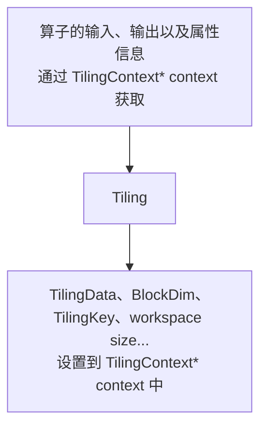

# AI Core算子开发进阶指南

> 本文档是《AI Core算子开发指南》的详细内容补充，提供算子开发中各模块的深入说明和进阶用法。建议先阅读[主文档](./aicore_develop_guide.md)了解整体开发流程。

## 目录

- [算子定义](#算子定义)
  - [算子输入/输出/属性定义](#算子输入输出属性定义)
  - [AI处理器上相关实现信息](#ai处理器上相关实现信息)
  - [注册Tiling实现、Shape推导等函数](#注册tiling实现shape推导等函数)
  - [多硬件平台注册差异化的算子原型](#多硬件平台注册差异化的算子原型)
- [Tiling实现](#tiling实现)
  - [基本流程](#基本流程)
  - [使用标准C++语法定义Tiling结构体](#使用标准c语法定义tiling结构体)
  - [Tiling模板编程](#tiling模板编程)
- [Kernel实现](#kernel实现)
  - [核函数定义](#核函数定义)
  - [GET_TILING_DATA获取Tiling参数](#get_tiling_data获取tiling参数)
  - [核函数内推导输入数据类型和格式](#核函数内推导输入数据类型和格式)
- [图模式适配](#图模式适配)
- [aclnn适配](#aclnn适配)
- [附录](#附录)
  - [代际隔离说明](#代际隔离说明)

---

## 算子定义

算子原型主要描述了算子的输入输出、属性等信息以及算子在AI处理器上相关实现信息，并关联tiling实现等函数。算子原型通过自定义的算子类来承载，该算子类继承自OpDef类。完成算子的原型定义等操作后，需要调用OP_ADD接口，传入算子类型（自定义算子类的类名），进行算子原型注册。下面是一个简单的Add算子原型定义和注册的例子。

```c++
namespace ops {
class AddCustom : public OpDef {
public:
    AddCustom(const char* name) : OpDef(name)
    {
        this->Input("x")
            .ParamType(REQUIRED)
            .DataType({ge::DT_FLOAT16, ge::DT_FLOAT, ge::DT_INT32})
            .Format({ge::FORMAT_ND, ge::FORMAT_ND, ge::FORMAT_ND});
        this->Input("y")
            .ParamType(REQUIRED)
            .DataType({ge::DT_FLOAT16, ge::DT_FLOAT, ge::DT_INT32})
            .Format({ge::FORMAT_ND, ge::FORMAT_ND, ge::FORMAT_ND});
        this->Output("z")
            .ParamType(REQUIRED)
            .DataType({ge::DT_FLOAT16, ge::DT_FLOAT, ge::DT_INT32})
            .Format({ge::FORMAT_ND, ge::FORMAT_ND, ge::FORMAT_ND});
        // 如下的shape/datatype推导函数仅在算子入图场景使用
        this->SetInferShape(ge::InferShape);
        this->SetInferDataType(ge::InferDataType);  
        this->AICore()
            .SetTiling(optiling::TilingFunc);
        // 请替换为实际的昇腾AI处理器型号
        this->AICore().AddConfig("ascendxxx");
    }
};
OP_ADD(AddCustom);
} // namespace ops
```

> 说明
>
> - 基于算子原型定义，自定义算子工程可以实现如下自动化能力：
>   - 自动生成单算子API调用的实现和接口，开发者可以直接使用生成的API实现单算子调用。
>   - 自动生成图模式场景使用的[算子原型定义REG_OP](###GE图模式原型定义)，开发者可以使用生成的算子原型进行构图、图编译、图执行等操作。
> - 注册算子类型后，框架会根据算子类型获取算子注册信息，同时在编译和运行时按照一定的规则匹配算子实现文件名称和kernel侧核函数名称。为了保证正确匹配，算子类型、算子实现文件名称和核函数名称需要遵循如下定义规则。通常情况下，开发者只需要保证创建算子工程时原型定义json文件中算子类型op的参数值为大驼峰命名方式即可，工程创建后自动生成的代码即满足该规则。在手动编写算子原型定义和算子实现文件时需要按照如下规则定义。
>   - 算子类型需要采用**大驼峰**的命名方式，即采用大写字符区分不同的语义。
>   - 算子实现文件名称、核函数名称需相同，均为算子类型转换为**下划线**命名方式后的值。下文描述了通过算子类型转换成算子实现文件名称和核函数名称的过程：
>     - 首字符的大写字符转换为小写字符。例如：Abc -> abc。
>     - 大写字符的前一个字符为小写字符或数字，则在大写字符前插一个下划线“_”，并将该字符转换为小写字符。例如：AbcDef -> abc_def。
>     - 大写字符前一个字符为大写字符且后一个字符是小写字符，则在大写字符前插一个下划线“_”，并将该字符转换为小写字符。例如：AbcAAc -> abc_a_ac。
>     - 其他大写字符转换为小写字符，小写字符保持不变。

### 算子输入/输出/属性定义

算子原型定义描述了算子的输入输出、属性等信息。输入输出支持的datatype、format格式的数量需要一致，并保持一一对应的关系。

如下的代码片段呈现了Add算子输入x的描述信息。

        this->Input("x")
            .ParamType(REQUIRED)
            .DataType({ge::DT_FLOAT16, ge::DT_FLOAT, ge::DT_INT32})
            .Format({ge::FORMAT_ND, ge::FORMAT_ND, ge::FORMAT_ND});

表1 输入输出参数说明

| 原型定义     | 参数      | 具体描述                                                     |
| ------------ | --------- | ------------------------------------------------------------ |
| Input/Output | ParamType | 参数类型，Option取值为：OPTIONAL（可选）、REQUIRED（必选）、DYNAMIC（动态输入）。类似于上文中的Add样例，其输入输出是必选的。有些算子的输入或者输出个数是动态的，例如AddN，将N个输入Tensor累加到一起，输出一个Tensor；SplitV，将一个Tensor在某个轴上，拆分为N个Tensor输出。有些算子的输入/输出是可选的，例如BatchNorm算子，在训练的时候没有均值和方差输入，在推理的时候有均值和方差的输入。 |
|              | DataType  | 算子输入输出支持的datatype。                                 |
|              | Format    | 算子输入输出支持的format。                                   |

从上文的原型定义中可以看出，列出了输入输出所有datatype和format的组合，保持一一对应。使用如下接口，可以达到简化这种代码逻辑的目的。

- 在指定输入/输出的datatype信息时，如果某个输入/输出的datatype支持和其他所有输入/输出的datatype/format组合使用，其datatype可以通过DataTypeList来表达；在指定输入/输出的format信息时，如果某个输入/输出的format支持和其他所有输入/输出的datatype/format组合使用，其format可以通过FormatList来表达。示例如下，以下两种代码表达含义相同。

```c++
// 列出所有一一对应的组合
class XxxCustom : public OpDef {
public:
    XxxCustom(const char* name) : OpDef(name)
    {
        this->Input("x")
            .ParamType(REQUIRED)
            .DataType({ge::DT_FLOAT16, ge::DT_FLOAT16, ge::DT_FLOAT16})
            .Format({ge::FORMAT_ND, ge::FORMAT_ND, ge::FORMAT_ND});
        this->Input("y")
            .ParamType(REQUIRED)
            .DataType({ge::DT_FLOAT16, ge::DT_FLOAT, ge::DT_INT32})
            .Format({ge::FORMAT_ND, ge::FORMAT_ND, ge::FORMAT_ND});
        this->Output("z")
            .ParamType(REQUIRED)
            .DataType({ge::DT_FLOAT16, ge::DT_FLOAT, ge::DT_INT32})
            .Format({ge::FORMAT_ND, ge::FORMAT_ND, ge::FORMAT_ND});
        ...
    }
};
// 通过DataTypeList和FormatList来表达，无需重复列出
class XxxCustom : public OpDef {
public:
    XxxCustom(const char* name) : OpDef(name)
    {
        this->Input("x")
            .ParamType(REQUIRED)
            .DataTypeList({ge::DT_FLOAT16})
            .FormatList({ge::FORMAT_ND});
        this->Input("y")
            .ParamType(REQUIRED)
            .DataType({ge::DT_FLOAT16, ge::DT_FLOAT, ge::DT_INT32})
            .Format({ge::FORMAT_ND, ge::FORMAT_ND, ge::FORMAT_ND});
        this->Output("z")
            .ParamType(REQUIRED)
            .DataType({ge::DT_FLOAT16, ge::DT_FLOAT, ge::DT_INT32})
            .Format({ge::FORMAT_ND, ge::FORMAT_ND, ge::FORMAT_ND});
        ...
    }
};

```

- 通过Follow接口指定当前输入/输出的datatype/format/shape信息与之前定义过的某个输入一致。示例如下：输出“y1”Follow输入“x1”场景，此时“y1”的datatype、format以及shape都将会和“x1”保持一致。使用Follow接口指定shape一致时通常比shape推导函数逻辑更加简单，能用Follow表达的逻辑，建议使用Follow接口，则无需再编写注册InferShape函数。

```c++
this->Input("x1")
    .ParamType(REQUIRED)
    .DataType({ge::DT_FLOAT, ge::DT_FLOAT})
    .Format({ge::FORMAT_ND, ge::FORMAT_ND});
this->Input("x2")
    .ParamType(REQUIRED)
    .DataType({ge::DT_FLOAT, ge::DT_FLOAT})
    .Format({ge::FORMAT_ND, ge::FORMAT_ND});
this->Output("y1")
    .ParamType(REQUIRED)
    .Follow("x1")
    .OutputShapeDependOnCompute();
```

原型定义中还包括算子属性信息，如下的代码片段呈现了ReduceMax算子的属性reduceDim和isKeepDim的描述信息。

```c++
        this->Attr("reduceDim")
            .AttrType(REQUIRED)
            .Int();
        this->Attr("isKeepDim")
            .AttrType(OPTIONAL)
            .Int(1);
```

具体参数说明如下：

| 原型定义 | 注册方式          | 具体描述                                                     |
| -------- | ----------------- | ------------------------------------------------------------ |
| Attr     | AttrType          | 设置算子属性类型，取值为：OPTIONAL（可选）、REQUIRED（必选）。 |
|          | Bool/Float/Int... | 设置算子属性数据类型为Bool/Float/Int...。                    |

### AI处理器上相关实现信息

通过AddConfig注册算子支持的AI处理器型号以及相关的配置信息。AddConfig接口原型如下：soc参数表示AI处理器型号，aicore_config表示其他配置信息。

```c++
void AddConfig(const char *soc);
void AddConfig(const char *soc, OpAICoreConfig &aicore_config);
```

通过该接口注册AI处理器型号的样例如下，ascendxxx填写规则请参考算子工程目录下编译配置项文件CMakePresets.json中的ASCEND_COMPUTE_UNIT字段。

```c++
        this->AICore().AddConfig("ascendxxx");
```

其他AI Core配置信息的配置方式请参考OpAICoreConfig。

### 注册Tiling实现、Shape推导等函数

通过SetInferShape、SetInferDataType、SetTiling接口来注册对应的Tiling实现和Shape推导等函数，样例如下。注册的Tiling实现等函数由框架侧进行调用，并在调用时传入对应的Context上下文，供开发者使用。Tiling函数的实现方法请参考Host侧Tiling实现，入图相关的Shape推导等函数实现请参考算子入图（GE图）开发。

```c++
        // 如下的shape/datatype推导函数仅在算子入图场景使用       
        this->SetInferShape(ge::InferShape);
        this->SetInferDataType(ge::InferDataType);
        this->AICore()
            .SetTiling(optiling::TilingFunc);
```

### 多硬件平台注册差异化的算子原型

算子类继承基类OpDef，使用Input、Output、Attr等注册算子原型信息，硬件平台支持相同的算子原型的情况下，直接通过AICore().AddConfig添加支持的AI处理器型号即可；不同的硬件形态算子原型定义不同的情况，可以通过新增OpAICoreConfig的方式，针对不同的AI处理器型号注册差异化的算子原型。

差异化的算子原型生效规则如下：

- 对于算子类的输入输出原型信息，OpAICoreConfig未配置的会继承OpDef定义的原型，比如算子类中定义了输出y，OpAICoreConfig中没有定义输出y，OpAICoreConfig会继承y的原型定义；
- 对于算子类和新增OpAICoreConfig中定义的算子原型相同的情况，新增OpAICoreConfig中定义的算子原型信息会覆盖OpDef定义的原型信息，比如算子类中定义了输入x支持DT_FLOAT16数据类型，新增OpAICoreConfig中也定义了输入x，但是支持DT_FLOAT16、DT_BF16数据类型，则以OpAICoreConfig新增定义为准。

如下样例中ascendxxx1、ascendxxx2（AI处理器型号）使用相同的算子原型，算子类通过继承基类OpDef，使用Input、Output、Attr等注册算子原型信息，再通过AICore().AddConfig添加支持的AI处理器型号；对于ascendxxx3支持的算子原型需要定制化处理，新增了DT_BF16的类型，通过新增OpAICoreConfig的方式进行注册，x，y，z的定义会覆盖算子类中对应定义的原型信息。

```c++
namespace ops {
class MyAdd : public OpDef {
public:
    MyAdd(const char* name) : OpDef(name)
    {
        // ascendxxx1 ascendxxx2 AI处理器型号原型定义
        this->Input("x")
            .ParamType(REQUIRED)
            .DataType({ge::DT_FLOAT16})
            .Format({ge::FORMAT_ND});
        this->Input("y")
            .ParamType(OPTIONAL)
            .DataType({ge::DT_INT64})
            .Format({ge::FORMAT_ND});
        this->Output("z")
            .ParamType(REQUIRED)
            .DataType({ge::DT_FLOAT16})
            .Format({ge::FORMAT_ND});
        this->AICore()
            .SetTiling(optiling::TilingFunc);
        this->AICore().AddConfig("ascendxxx1");
        this->AICore().AddConfig("ascendxxx2");
        // ascendxxx3 AI处理器定义OpAICoreConfig变量，定制化原型
        OpAICoreConfig config;
        config.Input("x")
            .ParamType(REQUIRED)
            .DataType({ge::DT_FLOAT16, ge::DT_BF16})
            .Format({ge::FORMAT_ND, ge::FORMAT_ND});
        config.Input("y")
            .ParamType(REQUIRED)
            .DataType({ge::DT_FLOAT16, ge::DT_BF16})
            .Format({ge::FORMAT_ND, ge::FORMAT_ND});
        config.Output("z")
            .ParamType(REQUIRED)
            .DataType({ge::DT_FLOAT16, ge::DT_BF16})
            .Format({ge::FORMAT_ND, ge::FORMAT_ND});
        this->AICore().AddConfig("ascendxxx3", config);
    }
};
OP_ADD(MyAdd);
}
```

如下的样例中，只有几个参数原型信息在不同硬件平台不一致，开发者也可以通过OpAICoreConfig定制部分算子原型信息，复用OpDef定义的其他算子原型信息，达到部分原型信息硬件平台定制化的目的。

```c++
class AddCustom : public OpDef {
public:
    AddCustom(const char* name) : OpDef(name)
    {
        this->Input("x").DataType({ ge::DT_FLOAT16 }).ParamType(OPTIONAL);
        this->Output("y").DataType({ ge::DT_FLOAT16 });
        OpAICoreConfig aicConfig1;
        OpAICoreConfig aicConfig2;
        aicConfig1.Input("x")
            .ParamType(OPTIONAL)
            .DataType({ ge::DT_FLOAT })
            .Format({ ge::FORMAT_ND });
        aicConfig2.Input("x")
            .ParamType(REQUIRED)
            .DataType({ ge::DT_INT32 })
            .Format({ ge::FORMAT_ND });
        this->AICore().AddConfig("ascendxxx1", aicConfig1);
        this->AICore().AddConfig("ascendxxx2", aicConfig2);
    }
};
```

## Tiling实现

### 基本流程

本章节侧重于介绍接入CANN框架时编程模式和API的使用。

大多数情况下，Local Memory的存储，无法完整的容纳算子的输入与输出，需要每次搬运一部分输入进行计算然后搬出，再搬运下一部分输入进行计算，直到得到完整的最终结果，这个数据切分、分块计算的过程称之为**Tiling**。根据算子的shape等信息来确定数据切分算法相关参数（比如每次搬运的块大小，以及总共循环多少次）的计算程序，称之为**Tiling实现**。

Tiling实现完成后，获取到的Tiling切分算法相关参数，会传递给kernel侧，用于指导并行数据的切分。由于Tiling实现中完成的均为标量计算，AI Core并不擅长，所以我们将其独立出来放在host CPU上执行。

**图1** Tiling实现的输入输出



如上图所示，Tiling实现即为根据算子shape等信息来确定切分算法相关参数的过程，这里的算子shape等信息可以理解为是**Tiling实现的****输入**，切分算法相关参数可以理解为是**Tiling实现的输出**。输入和输出都通过Tiling函数的参数（TilingContext* context上下文结构）来承载。也就是说，开发者可以从上下文结构中获取算子的输入、输出以及属性信息，也就是**Tiling实现的****输入**，经过Tiling计算后，获取到TilingData数据结构（切分算法相关参数）、blockDim变量、用于选择不同的kernel实现分支的TilingKey、算子workspace的大小，也就是**Tiling实现的输出**，并将这些输出设置到上下文结构中。

TilingData、blockDim、TilingKey、workspace这些概念的具体解释如下：

- **TilingData：**切分算法相关参数，比如每次搬运的块大小，以及总共循环多少次，通过结构体存储，由开发者自行设计。

- **blockDim：**规定了核函数将会在几个核上执行。例如，需要计算8M的数据，每个核上计算1M的数据，blockDim设置为8，但是为了充分利用硬件资源，一般将blockDim设置为硬件平台的核数，根据核数进行数据切分。

  > 说明
  >
  > blockDim是逻辑核的概念，取值范围为[1,65535]。为了充分利用硬件资源，一般设置为物理核的核数或其倍数。
  >
  > - 对于耦合模式和分离模式，blockDim在运行时的意义和设置规则有一些区别，具体说明如下：
  >   - 耦合模式：由于其Vector、Cube单元是集成在一起的，blockDim用于设置启动多个AI Core核实例执行，不区分Vector、Cube。AI Core的核数可以通过`GetCoreNumAiv`或者`GetCoreNumAic`获取。
  >   - 分离模式
  >     - 针对仅包含Vector计算的算子，blockDim用于设置启动多少个Vector（AIV）实例执行，比如某款AI处理器上有40个Vector核，建议设置为40。
  >     - 针对仅包含Cube计算的算子，blockDim用于设置启动多少个Cube（AIC）实例执行，比如某款AI处理器上有20个Cube核，建议设置为20。
  >     - 针对Vector/Cube融合计算的算子，启动时，按照AIV和AIC组合启动，blockDim用于设置启动多少个组合执行，比如某款AI处理器上有40个Vector核和20个Cube核，一个组合是2个Vector核和1个Cube核，建议设置为20，此时会启动20个组合，即40个Vector核和20个Cube核。**注意：该场景下，设置的blockDim逻辑核的核数不能超过物理核（2个Vector核和1个Cube核组合为1个物理核）的核数。**
  >     - AIC/AIV的核数分别通过`GetCoreNumAi`和`GetCoreNumAiv`接口获取。
  > - 如果开发者使用了Device资源限制特性，那么算子设置的blockDim不应超过`PlatformAscendC`提供核数的API（GetCoreNum/GetCoreNumAic/GetCoreNumAiv等）返回的核数。例如，使用`aclrtSetStreamResLimit`设置Stream级别的Vector核数为8，那么GetCoreNumAiv接口返回值为8，针对Vector算子设置的blockDim不应超过8，否则会抢占其他Stream的资源，导致资源限制失效。

- **TilingKey（可选）**：TilingKey是一个算子内为了区分不同的实现而将kernel代码进行区分的方法，该方法类似于C++的Template模板机制，可减少不必要的icache miss以及scalar耗时，有助于优化单次调用kernel的性能。不同的kernel实现分支可以通过TilingKey来标识，host侧设置TilingKey后，可以选择对应的分支。例如，一个算子在不同的shape下，有不同的算法逻辑，kernel侧可以通过TilingKey来选择不同的算法逻辑，在host侧Tiling算法也有差异，host/kernel侧通过相同的TilingKey进行关联。

  假如有如下kernel代码：

  ```c++
  if (condition) {
    ProcessA();
  } else {
    ProcessB();
  }
  ```

  如果函数ProcessA、ProcessB两个函数是个非常大的函数，那么上述代码在编译后会变得更大，而每次kernel运行只会选择1个分支，条件的判断和跳转在代码大到一定程度（16-32K，不同芯片存在差异）后会出现icache miss。通过TilingKey可以对这种情况进行优化，给2个kernel的处理函数设置不同的TilingKey 1和2：

  ```c++
  if (TILING_KEY_IS(1)) {
    ProcessA();
  } else if (TILING_KEY_IS(2)) {
    ProcessB();
  }
  ```

  这样device kernel编译时会自动识别到2个TilingKey并编译2个kernel入口函数，将条件判断进行常量折叠。同时需要和host tiling函数配合，判断走ProcessA的场景设置TilingKey为1，走ProcessB的场景设置TilingKey为2：

  ```c++
  static ge::graphStatus TilingFunc(gert::TilingContext* context)
  {
      // some code
      if (condition) {
          context->SetTilingKey(1);
      } else {
          context->SetTilingKey(2);
      }
      return ge::GRAPH_SUCCESS;
  }
  ```

  > 说明
  >
  > 编译时，可以通过设置`--tiling_key`编译选项指定TilingKey，编译时只编译指定TilingKey相关的kernel代码，用于加速编译过程。

- **WorkspaceSize**：workspace是设备侧Global Memory上的一块内存。在Tiling函数中可以设置workspace的大小。设置后：单算子API执行场景，可以通过单算子API调用第一段接口获取workspace的大小，然后由开发者申请对应大小的Global Memory；入图场景，框架会根据设置的大小自动申请对应大小的Global Memory。申请workspace后，在算子Kernel实现时，可以使用这块workspace内存。

  workspace内存分为两部分：Ascend C API需要的workspace内存和算子实现使用到的workspace内存（按需）。

  - Ascend C API需要预留workspace内存

    API在计算过程需要一些workspace内存作为缓存，因此算子Tiling函数需要为API预留workspace内存，预留内存大小通过`GetLibApiWorkSpaceSize`接口获取。

    

  - 算子实现使用到的workspace内存（按需）

    算子内部需要通过额外的device内存进行数据交换或者缓存的时候才需要分配，根据算子计算的空间自行分配。

  整体的workspace内存就是上述两部分之和，在Tiling函数中设置方法如下：

  ```c++
  auto workspaceSizes = context->GetWorkspaceSizes(1); // 只使用1块workspace
  workspaceSizes[0] = sysWorkspaceSize + usrWorkspaceSize;
  ```

### 使用标准C++语法定义Tiling结构体

#### 具体步骤

在定义Tiling结构体时，可以使用标准C++语法定义一个**POD类型（Plain Old Data）**，即与C语言兼容的数据类型。具体步骤如下。

- 使用C++语法定义Tiling结构体。

  该结构体定义所在的头文件应放置在算子工程的op_kernel目录下。由于只有该目录下的文件会被打包进算子包，供在线编译场景中使用，若将文件放置在其他目录中，可能导致在线编译因找不到相关文件而失败。

  用户在使用高阶API的Tiling结构体时，通过AscendC::tiling命名空间引用"kernel_tiling/kernel_tiling.h"中预定义的Tiling结构体，如下代码所示。

  ```c++
  #ifndef MATMUL_CUSTOM_TILING_H
  #define MATMUL_CUSTOM_TILING_H
  #include <cstdint>
  #include "kernel_tiling/kernel_tiling.h"    // for TCubeTiling
  
  struct MatmulCustomTilingData {
      uint64_t localMemSize;
      AscendC::tiling::TCubeTiling cubeTilingData;
  };
  #endif  // MATMUL_CUSTOM_TILING_H
  ```

- Host侧Tiling函数中对Tiling结构体赋值。

  - 需要包含Tiling结构体定义头文件。
  - 通过`GetTilingData`获取Tiling结构体指针，并对其成员变量进行赋值。

  ```c++
  #include "../op_kernel/matmul_custom_tiling.h"  // 包含Tiling结构体定义头文件
  ...
  
  namespace optiling {
  static ge::graphStatus TilingFunc(gert::TilingContext *context)
  {
      ...
      MultiCoreMatmulTiling cubeTiling(ascendcPlatform);
      ...
      // 获取Tiling结构体指针
      MatmulCustomTilingData *tiling = context->GetTilingData<MatmulCustomTilingData>();
      // 对tiling的成员变量赋值
      if (cubeTiling.GetTiling(tiling->cubeTilingData) == -1) {
          return ge::GRAPH_FAILED;
      }
      uint64_t localMemSize;
      ascendcPlatform.GetCoreMemSize(platform_ascendc::CoreMemType::UB, localMemSize);
      tiling->localMemSize = localMemSize;
      ...
      return ge::GRAPH_SUCCESS;
  }
  } // namespace optiling
  ```

- Kernel侧注册Tiling结构体，解析Tiling数据至TilingData结构并使用。

  - 需要包含Tiling结构体定义头文件。
  - 通过`REGISTER_TILING_DEFAULT`或者`REGISTER_TILING_FOR_TILINGKEY`注册Tiling结构体；通过`GET_TILING_DATA`解析Tiling数据至TilingData结构并使用。其中`REGISTER_TILING_DEFAULT`同时也用于标识使用标准C++语法定义TilingData结构体。

  ```c++
  #include "kernel_operator.h"
  #include "matmul_custom_tiling.h"  // 包含Tiling结构体定义头文件
  
  extern "C" __global__ __aicore__ void matmul_custom(GM_ADDR a, GM_ADDR b, GM_ADDR bias, GM_ADDR c, GM_ADDR workspace, GM_ADDR tiling)
  {
      REGISTER_TILING_DEFAULT(MatmulCustomTilingData);
      GET_TILING_DATA(tilingData, tiling);
      MatmulKernel<half, half, float, float> matmulKernel;
      AscendC::TPipe pipe;
      REGIST_MATMUL_OBJ(&pipe, GetSysWorkSpacePtr(), matmulKernel.matmulObj, &tilingData.cubeTilingData); // Initialize the matmul object.
      matmulKernel.Init(a, b, bias, c, workspace, tilingData.localMemSize, tilingData.cubeTilingData);
      ...
  }
  ```

### 使用标准C++语法定义Tiling结构体的优势

相比较使用BEGIN_TILING_DATA_DEF等宏进行定义的方式，该方式不仅更符合C++开发者的开发习惯，并且提供了强大的灵活性。

- 支持bool类型，支持数组、结构体数组及列表初始化。

  ```c++
  class A {
  public:
      bool xxx;
      uint32_t xxx[2][128] = {0};
  };
  
  class B {
  public:
      bool xxx = false;
      uint8_t xxx[2][2]{0};
      A[10];
  };
  ```

- 不同算子可以支持定义同名但结构不同的Tiling结构体，通过算子引用对应的头文件即可实现区分。这种方式允许每个算子使用符合自身需求的Tiling结构定义，而不会与其他算子产生冲突。

  相比之下，使用BEGIN_TILING_DATA_DEF等宏方式定义同名但结构不同的Tiling结构体时，由于这些结构体会被注册到全局的Tiling结构体管理变量中，可能导致后续通过结构体名称访问时，无法准确获取当前算子实际使用的Tiling结构体，从而引发未定义行为。

  算子A：

  ```c++
  class TilingData {
  public:
      uint32_t length;
  };
  ```

  算子B：

  ```c++
  class TilingData {
  public:
      uint32_t length;
      uint16_t coreNum;
  };
  ```

- 支持自定义Tiling赋值，用户可以通过访问Tiling结构体成员变量直接赋值，或自定义Tiling赋值函数（宏定义方式下，用户仅可通过框架生成的set_xx/get_xx方法赋值/访问）

  Tiling结构体定义：

  ```c++
  class TilingData {
  public:
      uint32_t xxx1;
      uint32_t xxx2;
      uint8_t xxx3;
      bool xxx4;
  };
  ```

  Host侧Tiling函数：

  ```c++
  #include "../op_kernel/xxx_custom_tiling.h"  // 包含Tiling结构体定义头文件
  ...
  
  namespace optiling {
  static void ComputeTiling(TilingData* tiling, ...)
  {
      // 计算Tiling逻辑
      ...
      tiling->xxx1 = xxx;
      tiling->xxx2 = xxx;
      tiling->xxx3 = xxx;
      tiling->bool = xxx;
  }
  static ge::graphStatus TilingFunc(gert::TilingContext *context)
  {    
      ...
      TilingData *tiling = context->GetTilingData<TilingData>();
      ...
      ComputeTiling(tiling, ...)
      ...
  
      return ge::GRAPH_SUCCESS;
  }
  } // namespace optiling
  ```

### 使用约束

使用标准C++语法定义Tiling结构体时存在如下约束限制：

- Tiling结构体内不支持定义成员函数，因为成员函数存在Device侧和Host侧的差异（Device侧的函数需要__aicore__修饰符），而Tiling结构体Device侧和Host侧共用，所以会在编译或执行时出现问题：

  ```c++
  class TilingData {
  public:
      uint32_t xxx;
  
      __aicore__ funcA() { ... }  // 错误，host侧编译时不支持__aicore__修饰符，会出现编译错误
      void func() { ... }         // 错误，device侧缺少__aicore__修饰符，无法执行
  };
  ```

- Tiling结构体成员变量不支持指针、引用类型，此类数据类型会导致Host侧到Device侧数据解析异常：

  ```c++
  class TilingData {
  public:
      uint32_t* totalLength; // 指针场景不支持，Host无法传递指针到Device
      uint32_t& tileNum;       // 引用场景不支持，Host无法传递指针到Device
  };
  ```

- Tiling结构体仅支持POD类型，没有虚函数、虚继承等面向对象特性，也不支持模板类：

  ```c++
  class A {
  public:
      uint32_t totalLength;
      uint32_t tileNum;
  };
  class B: public A {
  public:
      uint32_t xxx;
      uint32_t xxx;
  };
  static ge::graphStatus TilingFunc(gert::TilingContext* context)
  {
      // 错误用法
      B *tiling = context->GetTilingData<A>(); // 不支持，会触发未知问题
      // 正确用法
      B *tiling = context->GetTilingData<B>();
      ......
      return ge::GRAPH_SUCCESS;
  }
  ```

- GetTilingData获取的Tiling不包含初值，需显式赋值或在Tiling结构体定义并调用Tiling赋值函数；

  ```c++
  static ge::graphStatus TilingFunc(gert::TilingContext* context)
  {
      TilingData *tiling = context->GetTilingData<TilingData>(); //获取Tiling结构体，此时totalLength、tileNum为0，并不会带入初始值
      ......
      // 需显式赋值
      tiling->totalLength = totalLength;  // 赋值Tiling结构体成员变量
      tiling->tileNum = TILE_NUM;         // 赋值Tiling结构体成员变量
      ......
      return ge::GRAPH_SUCCESS;
  }
  ```

### Tiling模板编程

在涉及多个TilingKey的场景中，开发者依赖TilingKey来管理kernel的实现，无论是在管理还是使用上都会遇到相当大的复杂性。为了简化这一过程，可以采用模板编程的方法来替代传统的TilingKey编程，从而减少对TilingKey数值标识的依赖，使kernel的管理更加直观和高效。使用步骤如下：

- 在op_kernel目录下，新增定义模板参数和模板参数组合的头文件，本示例中头文件命名为tiling_key_add_custom.h。

  - 该头文件中需要包含模板头文件ascendc/host_api/tiling/template_argument.h。
  - 定义模板参数ASCENDC_TPL_ARGS_DECL和模板参数组合ASCENDC_TPL_ARGS_SEL（即可使用的模板）。具体API参考见[模板参数定义](####模板参数定义)。

  ```c++
  #include "ascendc/host_api/tiling/template_argument.h"
  
  // 模板参数
  ASCENDC_TPL_ARGS_DECL(AddCustomTemplate, // 算子OpType
  ASCENDC_TPL_DATATYPE_DECL(D_T_X, C_DT_FLOAT, C_DT_FLOAT16, ASCENDC_TPL_INPUT(0)),  // DataType类型的模板参数定义：输入参数x的数据类型，取值范围为float16/float32, ASCENDC_TPL_INPUT(0)说明对应Kernel侧第0个输入
  ASCENDC_TPL_DATATYPE_DECL(D_T_Y, C_DT_FLOAT, C_DT_FLOAT16, ASCENDC_TPL_INPUT(1)),  // DataType类型的模板参数定义：输入参数y的数据类型，取值范围为float16/float32, ASCENDC_TPL_INPUT(1)说明对应Kernel侧第1个输入
  ASCENDC_TPL_DATATYPE_DECL(D_T_Z, C_DT_FLOAT, C_DT_FLOAT16, ASCENDC_TPL_OUTPUT(0)), // DataType类型的模板参数定义：输入参数z的数据类型，取值范围为float16/float32, ASCENDC_TPL_OUTPUT(0)说明对应Kernel侧第0个输出
  ASCENDC_TPL_UINT_DECL(TILE_NUM, ASCENDC_TPL_8_BW, ASCENDC_TPL_UI_MIX, 2, 0, 2, 3, 5, 10, 12, 13, 9, 8),// 自定义UINT类型（无符号整形）的模板参数定义：模板参数为切分的块数，编码位宽为ASCENDC_TPL_8_BW即8比特，表示该模板参数的个数不超过8比特能表达的范围；ASCENDC_TPL_UI_MIX表示通过混合模式表达取值范围，有2组的数据{0-2}、{3-5}和穷举值10、12、13、9、8，最后结果为{0, 1, 2, 3, 4, 5, 10, 12, 13, 9, 8}
  ASCENDC_TPL_BOOL_DECL(IS_SPLIT, 0, 1), // 自定义bool类型的模板参数定义：模板参数为是否切分标志位，取值范围为0和1，1表示切分，0表示不切分
  );
  
  // 模板参数组合
  // 用于调用GET_TPL_TILING_KEY获取TilingKey时，接口内部校验TilingKey是否合法
  ASCENDC_TPL_SEL(
      ASCENDC_TPL_ARGS_SEL(
      ASCENDC_TPL_KERNEL_TYPE_SEL(ASCENDC_TPL_AIV_ONLY), // Kernel类型选择，无需在模板参数声明中定义，在SEL中直接配置，所有ASCENDC_TPL_ARGS_SEL是否配置需要保持统一，如不配置将走自动推导流程
      ASCENDC_TPL_DATATYPE_SEL(D_T_X, C_DT_FLOAT16),
      ASCENDC_TPL_DATATYPE_SEL(D_T_Y, C_DT_FLOAT16),
      ASCENDC_TPL_DATATYPE_SEL(D_T_Z, C_DT_FLOAT16),
      ASCENDC_TPL_UINT_SEL(TILE_NUM, ASCENDC_TPL_UI_LIST, 1, 8),
      ASCENDC_TPL_BOOL_SEL(IS_SPLIT, 0, 1)
      ),
      ASCENDC_TPL_ARGS_SEL(
      ASCENDC_TPL_KERNEL_TYPE_SEL(ASCENDC_TPL_AIV_ONLY),
      ASCENDC_TPL_DATATYPE_SEL(D_T_X, C_DT_FLOAT),
      ASCENDC_TPL_DATATYPE_SEL(D_T_Y, C_DT_FLOAT),
      ASCENDC_TPL_DATATYPE_SEL(D_T_Z, C_DT_FLOAT),
      ASCENDC_TPL_UINT_SEL(TILE_NUM, ASCENDC_TPL_UI_LIST, 1, 8),
      ASCENDC_TPL_BOOL_SEL(IS_SPLIT, 0, 1)
      ),
  );
  ```

- host侧调用ASCENDC_TPL_SEL_PARAM接口自动生成并配置TilingKey。

  - host实现文件中包含[步骤1](https://www.hiascend.com/document/detail/zh/CANNCommunityEdition/850/opdevg/Ascendcopdevg/atlas_ascendc_10_00025.html#ZH-CN_TOPIC_0000002534495765__li1949014102516)中定义模板参数和模板参数组合的头文件。
  - 调用ASCENDC_TPL_SEL_PARAM接口自动生成并配置TilingKey，ASCENDC_TPL_SEL_PARAM输入参数为模板参数的具体值，传入时需要与定义模板参数和模板参数组合的头文件中的模板参数顺序保持一致。

  ```c++
  #include "tiling_key_add_custom.h"
  static ge::graphStatus TilingFunc(gert::TilingContext *context)
  {
      TilingData tiling;
      uint32_t totalLength = context->GetInputShape(0)->GetOriginShape().GetShapeSize();
      ge::DataType dtype_x = context->GetInputDesc(0)->GetDataType();
      ge::DataType dtype_y = context->GetInputDesc(1)->GetDataType();
      ge::DataType dtype_z = context->GetOutputDesc(1)->GetDataType();
      uint32_t D_T_X = static_cast<int>(dtype_x), D_T_Y = static_cast<int>(dtype_y), D_T_Z = static_cast<int>(dtype_z), TILE_NUM = 1, IS_SPLIT = 0;
      if(totalLength< MIN_LENGTH_FOR_SPLIT){
          IS_SPLIT = 0;
          TILE_NUM = 1;
      }else{
          IS_SPLIT = 1;
          TILE_NUM = DEFAULT_TILE_NUM;
      }
      context->SetBlockDim(BLOCK_DIM);
      tiling.set_totalLength(totalLength);
      tiling.SaveToBuffer(context->GetRawTilingData()->GetData(), context->GetRawTilingData()->GetCapacity());
      context->GetRawTilingData()->SetDataSize(tiling.GetDataSize());
      ASCENDC_TPL_SEL_PARAM(context, D_T_X, D_T_Y, D_T_Z, TILE_NUM, IS_SPLIT);
      size_t *currentWorkspace = context->GetWorkspaceSizes(1);
      currentWorkspace[0] = 0;
      return ge::GRAPH_SUCCESS;
  }
  ```

- kernel侧实现

  - kernel实现文件中包含[步骤1](https://www.hiascend.com/document/detail/zh/CANNCommunityEdition/850/opdevg/Ascendcopdevg/atlas_ascendc_10_00025.html#ZH-CN_TOPIC_0000002534495765__li1949014102516)中定义模板参数和模板参数组合的头文件。
  - 核函数添加template模板，以便支持模板参数的传入，参数顺序需要与定义模板参数和模板参数组合的头文件中的模板参数顺序保持一致。
  - 通过对模板参数的分支判断，选择不同的kernel侧实现。

  ```c++
  #include "tiling_key_add_custom.h"
  ...
  ...
  template<typename D_T_X, typename D_T_Y, typename D_T_Z, int TILE_NUM, int IS_SPLIT>
   __global__ __aicore__ void add_custom_template(GM_ADDR x, GM_ADDR y, GM_ADDR z, GM_ADDR workspace, GM_ADDR tiling)
  {
      GET_TILING_DATA(tiling_data, tiling);
      KernelAdd<D_T_X, D_T_Y, D_T_Z> op;
      op.Init(x, y, z, tiling_data.totalLength, TILE_NUM);
      if constexpr (std::is_same_v<D_T_X, float> && std::is_same_v<D_T_Y, float> && std::is_same_v<D_T_Z, float>) {
          op.Process1();
      } else if constexpr (std::is_same_v<D_T_X, half> && std::is_same_v<D_T_Y, half> && std::is_same_v<D_T_Z, half>){
          if (IS_SPLIT == 0) {
              op.Process1();
          } else if(IS_SPLIT == 1) {
              op.Process2();
          }
      }
  }
  ```

### 模板参数定义

#### 功能说明

通过以下函数原型进行模板参数ASCENDC_TPL_ARGS_DECL和模板参数组合ASCENDC_TPL_ARGS_SEL（即可使用的模板）的定义。

#### 函数原型

```c++
// ParamStruct是存放用户设置的模板参数ASCENDC_TPL_ARGS_DECL和模板参数组合ASCENDC_TPL_ARGS_SEL的结构体，用作后续的Tilingkey与模板参数之间的编解码，用户无需关注
struct ParamStruct {
    const char* name;
    uint32_t paramType;
    uint8_t bitWidth;
    std::vector<uint64_t> vals;
    const char* macroType;
    ParamStruct(const char* inName, uint32_t inParamType, uint8_t inBitWidth, std::vector<uint64_t> inVals,
        const char* inMacroType):
        name(inName), paramType(inParamType), bitWidth(inBitWidth), vals(std::move(inVals)),
        macroType(inMacroType) {}
};
using TilingDeclareParams = std::vector<ParamStruct>;
using TilingSelectParams = std::vector<std::vector<ParamStruct>>;

// 模板参数定义相关接口
#define ASCENDC_TPL_DTYPE_DECL(x, ...) ParamStruct{#x, ASCENDC_TPL_DTYPE, ASCENDC_TPL_8_BW, {__VA_ARGS__}, "DECL"}
#define ASCENDC_TPL_DATATYPE_DECL(x, ...) ParamStruct{#x, ASCENDC_TPL_DTYPE, ASCENDC_TPL_8_BW, {__VA_ARGS__}, "DECL"}
#define ASCENDC_TPL_FORMAT_DECL(x, ...) ParamStruct{#x, ASCENDC_TPL_FORMAT, ASCENDC_TPL_8_BW, {__VA_ARGS__}, "DECL"}
#define ASCENDC_TPL_UINT_DECL(x, bw, ...) ParamStruct{#x, ASCENDC_TPL_UINT, bw, {__VA_ARGS__}, "DECL"}
#define ASCENDC_TPL_BOOL_DECL(x, ...) ParamStruct{#x, ASCENDC_TPL_BOOL, ASCENDC_TPL_1_BW, {__VA_ARGS__}, "DECL"}
#define ASCENDC_TPL_KERNEL_TYPE_DECL(x, ...) ParamStruct{#x, ASCENDC_TPL_SHARED_KERNEL_TYPE, ASCENDC_TPL_8_BW, {__VA_ARGS__}, "DECL"}

#define ASCENDC_TPL_DTYPE_SEL(x, ...) ParamStruct{#x, ASCENDC_TPL_DTYPE, ASCENDC_TPL_8_BW, {__VA_ARGS__}, "SEL"}
#define ASCENDC_TPL_DATATYPE_SEL(x, ...) ParamStruct{#x, ASCENDC_TPL_DTYPE, ASCENDC_TPL_8_BW, {__VA_ARGS__}, "SEL"}
#define ASCENDC_TPL_FORMAT_SEL(x, ...) ParamStruct{#x, ASCENDC_TPL_FORMAT, ASCENDC_TPL_8_BW, {__VA_ARGS__}, "SEL"}
#define ASCENDC_TPL_UINT_SEL(x, ...) ParamStruct{#x, ASCENDC_TPL_UINT, 0, {__VA_ARGS__}, "SEL"}
#define ASCENDC_TPL_BOOL_SEL(x, ...) ParamStruct{#x, ASCENDC_TPL_BOOL, ASCENDC_TPL_1_BW, {__VA_ARGS__}, "SEL"}
#define ASCENDC_TPL_KERNEL_TYPE_SEL(...) ParamStruct{"kernel_type", ASCENDC_TPL_KERNEL_TYPE, ASCENDC_TPL_8_BW, {__VA_ARGS__}, "SEL"}
#define ASCENDC_TPL_DETERMINISTIC_SEL(...) ParamStruct{"deterministic", ASCENDC_TPL_DETERMINISTIC, ASCENDC_TPL_1_BW, {__VA_ARGS__}, "SEL"}
#define ASCENDC_TPL_SHARED_KERNEL_TYPE_SEL(x, ...) ParamStruct{#x, ASCENDC_TPL_SHARED_KERNEL_TYPE, ASCENDC_TPL_8_BW, {__VA_ARGS__}, "SEL"}

#define ASCENDC_TPL_ARGS_DECL(x, ...) static TilingDeclareParams g_tilingDeclareParams{ __VA_ARGS__ }
#define ASCENDC_TPL_ARGS_SEL(...) { __VA_ARGS__}
#define ASCENDC_TPL_SEL(...) static TilingSelectParams g_tilingSelectParams{ __VA_ARGS__ }
```

#### 参数说明

-  Tiling模板参数定义说明

  | 宏                                              | 功能描述                                                     | 参数解释                                                     |
  | ----------------------------------------------- | ------------------------------------------------------------ | ------------------------------------------------------------ |
  | ASCENDC_TPL_ARGS_DECL(args0, ...)               | 用于定义算子的模板参数。                                     | args0：表示算子Optype。args1-argsn：后续为若干个DTYPE、FORMAT、UINT、BOOL、KERNEL_TYPE的模板参数定义，分别通过ASCENDC_TPL_DTYPE_DECL、ASCENDC_TPL_DATATYPE_DECL、ASCENDC_TPL_FORMAT_DECL、ASCENDC_TPL_UINT_DECL、ASCENDC_TPL_BOOL_DECL，ASCENDC_TPL_KERNEL_TYPE_DECL进行定义。 |
  | ASCENDC_TPL_DTYPE_DECL(args0, ...)              | 自定义DataType类型的模板参数定义。                           | args0：参数名。args1-argsn：后续若干个参数为穷举的自定义DataType枚举值。 |
  | ASCENDC_TPL_DATATYPE_DECL(args0, ...)           | 原生DataType类型的模板参数定义。                             | args0：参数名。args1-argsn：存在两种情况，后续若干个参数为穷举的原生DataType选项；或者为对应的输入参数的索引值（使用ASCENDC_TPL_INPUT(x)进行指定，其中x为对应数值）或对应输出参数的索引值（使用ASCENDC_TPL_OUTPUT(x)进行指定，其中x为对应数值），注意：存在多个时，仅第一个生效。支持设置的原生DataType取值如下，数据类型的具体介绍请参考`C_DataType`。`C_DT_FLOAT C_DT_FLOAT16 C_DT_INT8 C_DT_INT32 C_DT_UINT8 C_DT_INT16 C_DT_UINT16 C_DT_UINT32 C_DT_INT64 C_DT_UINT64 C_DT_DOUBLE C_DT_BOOL C_DT_COMPLEX64 C_DT_BF16 C_DT_INT4 C_DT_UINT1 C_DT_INT2 C_DT_COMPLEX32 C_DT_HIFLOAT8 C_DT_FLOAT8_E5M2 C_DT_FLOAT8_E4M3FN C_DT_FLOAT4_E2M1 C_DT_FLOAT4_E1M2` |
  | ASCENDC_TPL_FORMAT_DECL(args0, ...)             | 支持两种模式：1. 均为自定义Format类型的模板参数定义。2. 均为原生Format类型的模板参数定义。 | args0：参数名。args1-argsn：存在两种模式1. 后续若干个参数为穷举的自定义Format枚举值。2. 该模式存在两种情况：后续若干个参数为穷举的原生Format选项；或者对应的输入参数的索引值（使用ASCENDC_TPL_INPUT(x)进行指定，其中x为对应数值）或对应输出参数的索引值（使用ASCENDC_TPL_OUTPUT(x)进行指定，其中x为对应数值），注意：存在多个时，仅第一个生效。支持设置的原生Format选项如下，数据格式的具体介绍请参考`C_Format`。`C_FORMAT_NCHW C_FORMAT_NHWC C_FORMAT_ND C_FORMAT_NC1HWC0 C_FORMAT_FRACTAL_Z C_FORMAT_NC1C0HWPAD C_FORMAT_NHWC1C0 C_FORMAT_FSR_NCHW C_FORMAT_FRACTAL_DECONV C_FORMAT_C1HWNC0 C_FORMAT_FRACTAL_DECONV_TRANSPOSE C_FORMAT_FRACTAL_DECONV_SP_STRIDE_TRANS C_FORMAT_NC1HWC0_C04 C_FORMAT_FRACTAL_Z_C04 C_FORMAT_CHWN C_FORMAT_FRACTAL_DECONV_SP_STRIDE8_TRANS C_FORMAT_HWCN C_FORMAT_NC1KHKWHWC0 C_FORMAT_BN_WEIGHT C_FORMAT_FILTER_HWCK C_FORMAT_HASHTABLE_LOOKUP_LOOKUPS C_FORMAT_HASHTABLE_LOOKUP_KEYS C_FORMAT_HASHTABLE_LOOKUP_VALUE C_FORMAT_HASHTABLE_LOOKUP_OUTPUT C_FORMAT_HASHTABLE_LOOKUP_HITS C_FORMAT_C1HWNCoC0 C_FORMAT_MD C_FORMAT_NDHWC C_FORMAT_FRACTAL_ZZ C_FORMAT_FRACTAL_NZ C_FORMAT_NCDHW C_FORMAT_DHWCN C_FORMAT_NDC1HWC0 C_FORMAT_FRACTAL_Z_3D C_FORMAT_CN C_FORMAT_NC C_FORMAT_DHWNC C_FORMAT_FRACTAL_Z_3D_TRANSPOSE C_FORMAT_FRACTAL_ZN_LSTM C_FORMAT_FRACTAL_Z_G C_FORMAT_RESERVED C_FORMAT_ALL C_FORMAT_NULL C_FORMAT_ND_RNN_BIAS C_FORMAT_FRACTAL_ZN_RNN C_FORMAT_NYUV C_FORMAT_NYUV_A C_FORMAT_NCL C_FORMAT_FRACTAL_Z_WINO C_FORMAT_C1HWC0 C_FORMAT_FRACTAL_NZ_C0_16 C_FORMAT_FRACTAL_NZ_C0_32 C_FORMAT_FRACTAL_NZ_C0_2 C_FORMAT_FRACTAL_NZ_C0_4 C_FORMAT_FRACTAL_NZ_C0_8` |
  | ASCENDC_TPL_UINT_DECL(args0, args1, args2, ...) | 自定义UINT类型（无符号整形）的模板参数定义。                 | args0：参数名。args1：最大位宽，模板参数的个数不能超过最大位宽。args2：参数定义的模式。支持以下三种模式：ASCENDC_TPL_UI_RANGE：范围模式，设置该模式，后续紧跟着第一个值表示范围个数，第一个值后面的每两个数值为一组分别表示该范围的起、终位置；注意定义的范围个数要和后续的组数保持一致。**举例：**ASCENDC_TPL_UINT_DECL(args0, args1,ASCENDC_TPL_UI_RANGE,2,0,2,3,5)表示2组参数，这2组参数范围为{0, 2}，{3, 5}，因此该参数定义的UINT参数合法值为{0, 1, 2, 3, 4, 5}。ASCENDC_TPL_UI_LIST：穷举模式，设置该模式，则表示后续将穷举出所有的参数值。**举例：**ASCENDC_TPL_UINT_DECL(args0, args1,ASCENDC_TPL_UI_LIST,10,12,13,9,8,7,6)表示1组穷举参数，[10, 12, 13, 9, 8, 7, 6]为穷举值，因此该参数定义的UINT参数合法值为{10, 12, 13, 9, 8, 7, 6}。ASCENDC_TPL_UI_MIX：混合模式，设置该模式，则表示前n个数值为范围模式的参数定义，后m个数值为穷举模式的参数定义。**举例**：ASCENDC_TPL_UINT_DECL(args0, args1,ASCENDC_TPL_UI_MIX,2,0,2,3, 5, 10, 12, 13, 9, 8)表示2组穷举参数，这2组范围为{0, 2}, {3, 5}，[10, 12, 13, 9, 8]为穷举值，因此该参数定义的UINT参数合法值为{0, 1, 2, 3, 4, 5, 10, 12, 13, 9, 8}。args3-argsn：对应不同范围模式的参数数值。 |
  | ASCENDC_TPL_BOOL_DECL(args0, ...)               | 自定义bool类型的模板参数定义。                               | args0：参数名。args1-args2：取值范围0，1。                   |
  | ASCENDC_TPL_KERNEL_TYPE_DECL(args0, ...)        | 定义算子模板参数的kernel类型                                 | args0：参数名args1-argsn：后续为若干kernel类型。当前支持的Kernel类型如下：ASCENDC_TPL_AIV_ONLY // 算子执行时仅启动AI Core上的Vector核ASCENDC_TPL_AIC_ONLY // 算子执行时仅启动AI Core上的Cube核ASCENDC_TPL_MIX_AIV_1_0 // AIC、AIV混合场景下，算子执行时仅会启动AI Core上的Vector核ASCENDC_TPL_MIX_AIC_1_0 // AIC、AIV混合场景下，算子执行时仅会启动AI Core上的Cube核ASCENDC_TPL_MIX_AIC_1_1 // AIC、AIV混合场景下，算子执行时会同时启动AI Core上的Cube核和Vector核，比例为1：1ASCENDC_TPL_MIX_AIC_1_2 // AIC、AIV混合场景下，算子执行时会同时启动AI Core上的Cube核和Vector核，比例为1：2ASCENDC_TPL_AICORE // 算子执行时仅会启动AI CoreASCENDC_TPL_VECTORCORE // 该参数为预留参数，当前版本暂不支持ASCENDC_TPL_MIX_AICORE // 该参数为预留参数，当前版本暂不支持ASCENDC_TPL_MIX_VECTOR_CORE // 算子执行时会同时启动AI Core和Vector Core本接口只允许与ASCENDC_TPL_SHARED_KERNEL_TYPE_SEL(args0, ...)配合使用。 |

- Tiling模板参数组合定义

  | 宏                                             | 功能描述                                                     | 参数解释                                                     |
  | ---------------------------------------------- | ------------------------------------------------------------ | ------------------------------------------------------------ |
  | ASCENDC_TPL_SEL(...)                           | 算子的模板参数整体组合。                                     | 包含多个算子的模板参数组合。                                 |
  | ASCENDC_TPL_ARGS_SEL(...)                      | 算子的模板参数组合。                                         | 一个算子的模板参数组合。                                     |
  | ASCENDC_TPL_KERNEL_TYPE_SEL(args0)             | 用于设置算子模板参数组合的Kernel类型，但该参数并不能作为核函数的模板参数传入。 | args0：该模板参数组合下，算子的Kernel类型。如不选择将走自动推导流程，ASCENDC_TPL_SEL下的所有算子对于是否选择Kernel类型需要保持一致。当前支持的Kernel类型如下：ASCENDC_TPL_AIV_ONLY // 算子执行时仅启动AI Core上的Vector核ASCENDC_TPL_AIC_ONLY // 算子执行时仅启动AI Core上的Cube核ASCENDC_TPL_MIX_AIV_1_0 // AIC、AIV混合场景下，算子执行时仅会启动AI Core上的Vector核ASCENDC_TPL_MIX_AIC_1_0 // AIC、AIV混合场景下，算子执行时仅会启动AI Core上的Cube核ASCENDC_TPL_MIX_AIC_1_1 // AIC、AIV混合场景下，算子执行时会同时启动AI Core上的Cube核和Vector核，比例为1：1ASCENDC_TPL_MIX_AIC_1_2 // AIC、AIV混合场景下，算子执行时会同时启动AI Core上的Cube核和Vector核，比例为1：2ASCENDC_TPL_AICORE // 算子执行时仅会启动AI CoreASCENDC_TPL_VECTORCORE // 该参数为预留参数，当前版本暂不支持ASCENDC_TPL_MIX_AICORE // 该参数为预留参数，当前版本暂不支持ASCENDC_TPL_MIX_VECTOR_CORE // 算子执行时会同时启动AI Core和Vector Core通过本接口配置Kernel类型，Kernel类型的取值范围同KERNEL_TASK_TYPE_DEFAULT接口一。 |
  | ASCENDC_TPL_DTYPE_SEL(args0, ...)              | 自定义DataType类型的模板参数组合。                           | args0：表示参数名。args1-argsn ：后续若干个参数为ASCENDC_TPL_DTYPE_DECL中定义的参数范围子集。 |
  | ASCENDC_TPL_DATATYPE_SEL(args0, ...)           | 原生DataType类型的模板参数组合                               | args0：表示参数名。args1-argsn ：后续若干个参数为ASCENDC_TPL_DATATYPE_DECL中定义的参数选项范围的子集。 |
  | ASCENDC_TPL_FORMAT_SEL(args0, ...)             | Format类型的模板参数组合。                                   | args0：表示参数名。args1-argsn：后续若干个参数为ASCENDC_TPL_FORMAT_DECL中定义的参数选项范围子集。 |
  | ASCENDC_TPL_UINT_SEL(args0, args1, args2, ...) | UINT类型的模板参数组合。                                     | args0：表示参数名。args1：参数定义的模式。支持如下取值：ASCENDC_TPL_UI_RANGE：范围模式。ASCENDC_TPL_UI_LIST：穷举模式。ASCENDC_TPL_UI_MIX：混合模式。args2-argsn：后续若干个参数为ASCENDC_TPL_UINT_DECL中定义的参数范围子集。模式和参数的配置方式参考ASCENDC_TPL_UINT_DECL(args0, args1, args2, ...)。 |
  | ASCENDC_TPL_BOOL_SEL(args0, ...)               | bool类型的模板参数组合。                                     | args0：表示参数名。args1-args2 ：后续若干个参数为ASCENDC_TPL_BOOL_DECL定义的参数范围子集。 |
  | ASCENDC_TPL_DETERMINISTIC_SEL(args0)           | 该组模板参数组合用于配置是否使能确定性计算。                 | args0: 表示参数名， 可选值范围[true, false, 1, 0]，其中[true/1]表示该组模板参数组合使能确定性计算，[false/0]表示不使能确定性计算。需要注意，该值不作为算子的模板参数入参，在使能该值编译时，会添加"-DDETERMINISTIC_MODE=1", 同时会生成以"_deterministic"结尾的json与.o文件，例如："AddCustomTemplate_816f04e052850554f4b3cacb35f8e8c6_deterministic.json"/"AddCustomTemplate_816f04e052850554f4b3cacb35f8e8c6_deterministic.o"。备注：若通过ASCENDC_TPL_DETERMINISTIC_SEL(true)接口编译出了确定性计算的版本，在算子调用时，通常需要打开确定性计算的的开关，例如通过aclnn单算子调用时，需要使用aclrtCtxSetSysParamOpt接口进行相关配置。该参数仅支持如下型号：Atlas A3 训练系列产品 / Atlas A3 推理系列产品 Atlas A2 训练系列产品 / Atlas A2 推理系列产品 |
  | ASCENDC_TPL_SHARED_KERNEL_TYPE_SEL(args0, ...) | 设置算子模板参数组合的Kernel类型，该参数可以作为核函数的模板参数传入。 | args0: 参数名args1-argsn: 该模板参数组合下，算子的Kernel类型，后续参数为若干Kernel类型。该接口不能与ASCENDC_TPL_KERNEL_TYPE_SEL接口同时使用。若同时使用KERNEL_TASK_TYPE_DEFAULT(value)接口，本接口优先级更高。 |

#### 返回值说明

无。

#### 约束说明

对模板参数定义的取值进行修改或新增后，需要重新编译自定义算子包，不能再继续使用之前的算子二进制。

### GET_TPL_TILING_KEY

#### 功能说明

Tiling模板编程时，开发者通过调用此接口自动生成TilingKey。该接口将传入的模板参数通过定义的位宽，转成二进制，按照顺序组合后转成uint64数值，即TilingKey。

使用该接口需要包含定义模板参数和模板参数组合的头文件。

#### 函数原型

```c++
namespace AscendC {
    uint64_t EncodeTilingKey(TilingDeclareParams declareParams,
                             TilingSelectParams selectParamsVec,
                             std::vector<uint64_t> tilingParams);
}

#define GET_TPL_TILING_KEY(...) \
    AscendC::EncodeTilingKey(g_tilingDeclareParams, g_tilingSelectParams, {__VA_ARGS__}) // GET_TPL_TILING_KEY通过调用EncodeTilingKey接口生成TilingKey， EncodeTilingKey属于内部关联接口，开发者无需关注
```

#### 参数说明

| 参数 | 输入/输出 | 说明                                                         |
| ---- | --------- | ------------------------------------------------------------ |
| ...  | 输入      | 可变长参数，模板参数的具体值，传入时需要与定义模板参数和模板参数组合的头文件中的模板参数顺序保持一致。 |

#### 返回值说明

TilingKey数值。

#### 约束说明

无。

#### 调用示例

```c++
#include "tiling_key_add_custom.h"
static ge::graphStatus TilingFunc(gert::TilingContext *context)
{
    TilingDataTemplate tiling;
    uint32_t totalLength = context->GetInputShape(0)->GetOriginShape().GetShapeSize();
    ge::DataType dtype_x = context->GetInputDesc(0)->GetDataType();
    ge::DataType dtype_y = context->GetInputDesc(1)->GetDataType();
    ge::DataType dtype_z = context->GetOutputDesc(0)->GetDataType();
    uint32_t D_T_X = static_cast<int>(dtype_x), D_T_Y = static_cast<int>(dtype_y), D_T_Z = static_cast<int>(dtype_z), TILE_NUM = 1, IS_SPLIT = 0;
    if (totalLength < MIN_LENGTH_FOR_SPLIT) {
        IS_SPLIT = 0;
        TILE_NUM = 1;
    } else {
        IS_SPLIT = 1;
        TILE_NUM = DEFAULT_TILE_NUM;
    }
    context->SetBlockDim(BLOCK_DIM);
    tiling.set_totalLength(totalLength);
    tiling.SaveToBuffer(context->GetRawTilingData()->GetData(), context->GetRawTilingData()->GetCapacity());
    context->GetRawTilingData()->SetDataSize(tiling.GetDataSize());
    const uint64_t tilingKey = GET_TPL_TILING_KEY(D_T_X, D_T_Y, D_T_Z, TILE_NUM, IS_SPLIT);  // 模板参数tilingkey配置
    context->SetTilingKey(tilingKey);
    size_t *currentWorkspace = context->GetWorkspaceSizes(1);
    currentWorkspace[0] = 0;
    return ge::GRAPH_SUCCESS;
}
```

### ASCENDC_TPL_SEL_PARAM

#### 功能说明

Tiling模板编程时，开发者通过调用此接口自动生成并配置TilingKey。

使用该接口需要包含定义模板参数和模板参数组合的头文件。

#### 函数原型

```c++
#define ASCENDC_TPL_SEL_PARAM(context, ...)           \
do {                                                  \
    uint64_t key = GET_TPL_TILING_KEY({__VA_ARGS__}); \
    context->SetTilingKey(key);                       \
} while(0)
// context指代TilingFunc(gert::TilingContext *context)中的context
```

#### 参数说明

| 参数    | 输入/输出 | 说明                                                         |
| ------- | --------- | ------------------------------------------------------------ |
| context | 输入      | TilingFunc注册上下文。                                       |
| ...     | 输入      | 可变长参数，模板参数的具体值，传入时需要与定义模板参数和模板参数组合的头文件中的模板参数顺序保持一致。 |

#### 返回值说明

无

#### 约束说明

无

#### 调用示例

```c++
#include "tiling_key_add_custom.h"
static ge::graphStatus TilingFunc(gert::TilingContext *context)
{
    TilingDataTemplate tiling;
    uint32_t totalLength = context->GetInputShape(0)->GetOriginShape().GetShapeSize();
    ge::DataType dtype_x = context->GetInputDesc(0)->GetDataType();
    ge::DataType dtype_y = context->GetInputDesc(1)->GetDataType();
    ge::DataType dtype_z = context->GetOutputDesc(0)->GetDataType();
    uint32_t D_T_X = static_cast<int>(dtype_x), D_T_Y = static_cast<int>(dtype_y), D_T_Z = static_cast<int>(dtype_z), TILE_NUM = 1, IS_SPLIT = 0;
    if (totalLength < MIN_LENGTH_FOR_SPLIT) {
        IS_SPLIT = 0;
        TILE_NUM = 1;
    } else {
        IS_SPLIT = 1;
        TILE_NUM = DEFAULT_TILE_NUM;
    }
    context->SetBlockDim(BLOCK_DIM);
    tiling.set_totalLength(totalLength);
    tiling.SaveToBuffer(context->GetRawTilingData()->GetData(), context->GetRawTilingData()->GetCapacity());
    context->GetRawTilingData()->SetDataSize(tiling.GetDataSize());
    ASCENDC_TPL_SEL_PARAM(context, D_T_X, D_T_Y, D_T_Z, TILE_NUM, IS_SPLIT);
    size_t *currentWorkspace = context->GetWorkspaceSizes(1);
    currentWorkspace[0] = 0;
    return ge::GRAPH_SUCCESS;
}
```


## Kernel实现

### 核函数定义

在算子工程目录下的“op_kernel/xxx.cpp”文件中实现算子的核函数。核函数的定义样例如下所示。**注意这里参数的顺序按照“输入、输出、workspace、tiling”的顺序排布，开发者不要调整其顺序。**

```c++
#include "kernel_operator.h"
extern "C" __global__ __aicore__ void add_custom(GM_ADDR x, GM_ADDR y, GM_ADDR z, GM_ADDR workspace, GM_ADDR tiling) {
    GET_TILING_DATA(tiling_data, tiling);// 获取Tiling参数，详见下文介绍
    // TODO: user kernel impl
}
```

> 说明
> 算子原型定义中的输入和输出同名的情况下，输出参数增加ref后缀予以区分。示例如下：
>
> ```c++
> extern "C" __global__ __aicore__ void add_custom(GM_ADDR x, GM_ADDR y, GM_ADDR x_ref, GM_ADDR workspace, GM_ADDR tiling) {
>     ...
> }
> ```

### GET_TILING_DATA获取Tiling参数

提供`GET_TILING_DATA`，用于获取算子kernel入口函数传入的tiling信息，并填入注册的Tiling结构体中，此函数会以宏展开的方式进行编译。注意，对应的算子host实现中需要定义TilingData结构体，实现并注册计算TilingData的Tiling函数。具体请参考Host侧Tiling实现。

核函数中调用`GET_TILING_DATA`获取TilingData的样例如下：

```c++
extern "C" __global__ __aicore__ void add_custom(GM_ADDR x, GM_ADDR y, GM_ADDR z, GM_ADDR workspace, GM_ADDR tiling)
{
    GET_TILING_DATA(tilingData, tiling);
    KernelAdd op;
    op.Init(x, y, z, tilingData.totalLength, tilingData.tileNum);
    if (TILING_KEY_IS(1)) {
        op.Process();
    }
}
```

### 核函数内推导输入数据类型和格式

算子工程在核函数内提供了DTYPE\_\<Arg>、ORIG_DTYPE\_\<Arg>、FORMAT_\<Arg>三种宏用于推导核函数入参的数据类型、原始数据类型和数据格式。其中\<Arg>会自动大写。样例如下：

```c++
template<class T> func() {}
extern "C" __global__ __aicore__ void add_custom(GM_ADDR x, GM_ADDR y, GM_ADDR z, GM_ADDR workspace, GM_ADDR tiling)
{
    DTYPE_X temp;
    func<DTYPE_Z>();
    if (FORMAT_Y == FORMAT_ND) {
        ...
    }
}
```

## 图模式适配


### 头文件

```c++
#include <graph/operator_reg.h>
```

### 功能说明

定义算子的原型，包括算子的输入、输出、属性以及对应的数据类型。

进行如上算子原型定义后，即相当于向GE注册了该算子的原型，告知GE对应类型的算子应该具备哪些输入、输出与属性；同时相当于定义了一个op::xxx的Class，开发者可以include该原型头文件，然后实例化该Class进行IR模型构建，如下所示：

```c++
conv = op::Conv2D()
conv.set_input_x(feature_map_data)
conv.set_input_filter(weight_data)
```

### 函数原型

函数原型定义示例如下：

```c++
REG_OP(xxx)
    .INPUT(x1, type)
    .OPTIONAL_INPUT(x2, type)
    .DYNAMIC_INPUT(x3, type)
    .OUTPUT(y1, type)
    .DYNAMIC_OUTPUT(y3, type)
    .REQUIRED_ATTR(a, type)
    .ATTR(b, type, default_value)
    .GRAPH(z1)
    .DYNAMIC_GRAPH(z2)
    .OP_END_FACTORY_REG(xxx)
```

### 接口说明

| **接口名称**                  | **接口说明**                                                 |
| ----------------------------- | ------------------------------------------------------------ |
| REG_OP(xxx)                   | 定义一个算子原型，算子类型为xxx。                            |
| .INPUT(x, type)               | 定义输入名称（x）和类型(type)。类型为TensorType类型，例如：TensorType{DT_FLOAT}TensorType({DT_FLOAT, DT_INT8})TensorType::ALL()关于TensorType类，请参见[TensorType类说明]()。 |
| .OPTIONAL_INPUT(x, type)      | 定义可选输入的名称（x）和类型（type）。类型为TensorType类型，例如：TensorType{DT_FLOAT}TensorType({DT_FLOAT, DT_INT8})TensorType::ALL()关于TensorType类，请参见[TensorType类说明](####TensorType)。 |
| .DYNAMIC_INPUT(x, type)       | 定义动态输入的名称（x）和类型（type）。类型为TensorType类型，例如：TensorType{DT_FLOAT}TensorType({DT_FLOAT, DT_INT8})TensorType::ALL()关于TensorType类，请参见[TensorType类说明](####TensorType)。 |
| .OUTPUT(x, type)              | 定义输出的名称（x）和类型（type）。类型为TensorType类型，例如：TensorType{DT_FLOAT}TensorType({DT_FLOAT, DT_INT8})TensorType::ALL()关于TensorType类，请参见[TensorType类说明](####TensorType)。 |
| .DYNAMIC_OUTPUT(x, type)      | 定义动态输出的名称（x）和类型（type）。类型为TensorType类型，例如：TensorType{DT_FLOAT}TensorType({DT_FLOAT, DT_INT8})TensorType::ALL()关于TensorType类，请参见[TensorType类说明](####TensorType)。 |
| .REQUIRED_ATTR(x, type)       | 定义必备属性的名称（x）和类型（type）。type的可选值包括：Int，属性类型为int64_tFloat，属性类型为floatString，属性类型为stringBool，属性类型为boolTensor，属性类型为TensorType，属性为Type枚举定义NamedAttrs，属性类型为NamedAttrsAscendString，属性类型为AscendStringListInt，属性类型为vector<int64_t>，int64_t列表ListFloat，属性类型为vector\<float>，float列表ListString，属性类型为vector\<string>，string列表ListBool，属性类型为vector\<bool>，bool列表ListTensor，属性类型为vector\<Tensor>，Tensor列表Bytes，属性类型为BufferListType，属性类型为vector\<Type>，Type列表ListListInt，属性类型为vector\<vector\<int64_t>>，2维列表ListAscendString，属性类型为vector\<AscendString>，AscendString列表ListNamedAttrs，属性类型为vector\<NamedAttrs>，NamedAttrs列表 |
| .ATTR(x, type, default_value) | 定义可选属性的名称、类型以及默认值。当用户不设置算子对象的属性时，会使用此处设置的默认值。type的可选值包括：Int，属性类型为int64_tFloat，属性类型为floatString，属性类型为stringBool，属性类型为boolTensor，属性类型为TensorType，属性为Type枚举定义NamedAttrs，属性类型为NamedAttrsAscendString，属性类型为AscendStringListInt，属性类型为vector\<int64_t>，int64_t列表ListFloat，属性类型为vector\<float>，float列表ListString，属性类型为vector\<string>，string列表ListBool，属性类型为vector\<bool>，bool列表ListTensor，属性类型为vector\<Tensor>，Tensor列表Bytes，属性类型为BufferListType，属性类型为vector\<Type>，Type列表ListListInt，属性类型为vector\<vector\<int64_t>>，2维列表ListAscendString，属性类型为vector\<AscendString>，AscendString列表ListNamedAttrs，属性类型为vector\<NamedAttrs>，NamedAttrs列表定义示例：.ATTR(mode, Int, 1).ATTR(pad, ListInt, {0, 0, 0, 0}) |
| .GRAPH(z1)                    | 注册算子中包含的子图信息，输入z1为子图名称。例如If算子注册的子图为：.GRAPH(then_branch) .GRAPH(else_branch)对于同一个算子，注册的算子子图名称需要保持唯一。 |
| .DYNAMIC_GRAPH(z2)            | 注册动态算子子图信息，输入z2为子图名称。例如Case算子注册的子图为：.DYNAMIC_GRAPH(branches)对于同一个算子，注册的算子子图名称需要保持唯一。 |
| .INFER_SHAPE_AND_TYPE()       | 该接口为历史遗留兼容性接口，当前版本用户无需使用。           |
| .OP_END_FACTORY_REG(x)        | 与REG_OP配对，结束算子原型定义。算子类型（x）与REG_OP(x)中的类型相同。 |

> 说明
>
> OpReg类中的OpReg &N()接口的功能是为了用户进行算子注册的时候，使用`.`的方式调用OpReg类的接口，例如`.INPUT(x, type)`、`.OUTPUT(x, type)`，无其他含义。

### 返回值说明

无

### 约束说明

- REG_OP的算子类型必须全局唯一。
- 同一个算子的输入名称之间不能重复。
- 同一个算子的输出名称之间不能重复。
- 同一个算子的属性名称之间不能重复。

### 调用示例和相关API

动态输入的算子原型定义示例：

```c++
REG_OP(AddN)
    .DYNAMIC_INPUT(x, TensorType({NumberType(), DT_VARIANT}))
    .OUTPUT(y, TensorType({NumberType(), DT_VARIANT}))
    .REQUIRED_ATTR(N, Int)
    .OP_END_FACTORY_REG(AddN)
```

多输入的算子原型定义示例：

```c++
REG_OP(GreaterEqual)
    .INPUT(x1, TensorType::RealNumberType())
    .INPUT(x2, TensorType::RealNumberType())
    .OUTPUT(y, TensorType({DT_BOOL}))
    .OP_END_FACTORY_REG(GreaterEqual)
```

注册子图的算子原型定义示例：

```c++
REG_OP(If)
    .INPUT(cond, TensorType::ALL())
    .DYNAMIC_INPUT(input, TensorType::ALL())
    .DYNAMIC_OUTPUT(output, TensorType::ALL())
    .GRAPH(then_branch)
    .GRAPH(else_branch)
    .OP_END_FACTORY_REG(If)
```

### TensorType

TensorType类用以定义输入或者输出支持的数据类型，TensorType提供以下接口指定支持的数据类型：

```c++
struct TensorType {
  explicit TensorType(DataType dt);

  TensorType(const std::initializer_list<DataType> &initial_types);

  static TensorType ALL() {
    return TensorType{DT_BOOL,   DT_COMPLEX128, DT_COMPLEX64, DT_DOUBLE, DT_FLOAT,  DT_FLOAT16, DT_INT16,
                      DT_INT32,  DT_INT64,      DT_INT8,      DT_QINT16, DT_QINT32, DT_QINT8,   DT_QUINT16,
                      DT_QUINT8, DT_RESOURCE,   DT_STRING,    DT_UINT16, DT_UINT32, DT_UINT64,  DT_UINT8,
                      DT_BF16, DT_COMPLEX32};
  }

  static TensorType QuantifiedType() { return TensorType{DT_QINT16, DT_QINT32, DT_QINT8, DT_QUINT16, DT_QUINT8}; }

  static TensorType OrdinaryType() {
    return TensorType{DT_BOOL,  DT_COMPLEX128, DT_COMPLEX64, DT_DOUBLE, DT_FLOAT,  DT_FLOAT16, DT_INT16,
                      DT_INT32, DT_INT64,      DT_INT8,      DT_UINT16, DT_UINT32, DT_UINT64,  DT_UINT8,
                      DT_BF16, DT_COMPLEX32};
  }

  static TensorType BasicType() {
    return TensorType{DT_COMPLEX128, DT_COMPLEX64, DT_DOUBLE, DT_FLOAT,  DT_FLOAT16, DT_INT16,
                      DT_INT32,      DT_INT64,     DT_INT8,   DT_QINT16, DT_QINT32,  DT_QINT8,
                      DT_QUINT16,    DT_QUINT8,    DT_UINT16, DT_UINT32, DT_UINT64,  DT_UINT8,
                      DT_BF16, DT_COMPLEX32};
  }

  static TensorType NumberType() {
    return TensorType{DT_COMPLEX128, DT_COMPLEX64, DT_DOUBLE, DT_FLOAT,  DT_FLOAT16, DT_INT16,  DT_INT32,  DT_INT64,
                      DT_INT8,       DT_QINT32,    DT_QINT8,  DT_QUINT8, DT_UINT16,  DT_UINT32, DT_UINT64, DT_UINT8,
                      DT_BF16, DT_COMPLEX32};
  }

  static TensorType RealNumberType() {
    return TensorType{DT_DOUBLE, DT_FLOAT,  DT_FLOAT16, DT_INT16,  DT_INT32, DT_INT64,
                      DT_INT8,   DT_UINT16, DT_UINT32,  DT_UINT64, DT_UINT8, DT_BF16};
  }

  static TensorType ComplexDataType() { return TensorType{DT_COMPLEX128, DT_COMPLEX64, DT_COMPLEX32}; }

  static TensorType IntegerDataType() {
    return TensorType{DT_INT16, DT_INT32, DT_INT64, DT_INT8, DT_UINT16, DT_UINT32, DT_UINT64, DT_UINT8};
  }

  static TensorType SignedDataType() { return TensorType{DT_INT16, DT_INT32, DT_INT64, DT_INT8}; }

  static TensorType UnsignedDataType() { return TensorType{DT_UINT16, DT_UINT32, DT_UINT64, DT_UINT8}; }

  static TensorType FloatingDataType() { return TensorType{DT_DOUBLE, DT_FLOAT, DT_FLOAT16}; }

  static TensorType IndexNumberType() { return TensorType{DT_INT32, DT_INT64}; }

  static TensorType UnaryDataType() {
    return TensorType{DT_COMPLEX128, DT_COMPLEX64, DT_DOUBLE, DT_FLOAT, DT_FLOAT16, DT_BF16, DT_COMPLEX32};
  }

  static TensorType FLOAT() { return TensorType{DT_FLOAT, DT_FLOAT16, DT_BF16}; }

  std::shared_ptr<TensorTypeImpl> tensor_type_impl_;
};
```

## aclnn适配

> Aclnn有自动生成和手写两种方式，可根据算子实际情况进行选择。

### 自动生成Aclnn接口配置方式

在 `${op_name}/CMakeLists.txt` 中配置：

```cmake
ACLNNTYPE aclnn
```

### 自动生成内容

- 自动生成两个ACLNN接口

  ```c++
  /*
   * calution: this file was generated automaticlly donot change it.
  */
  
  #ifndef ACLNN_SOFTMAX_H_
  #define ACLNN_SOFTMAX_H_
  
  #include "aclnn/acl_meta.h"
  
  #ifdef __cplusplus
  extern "C" {
  #endif
  
  /* funtion: aclnnSoftmaxGetWorkspaceSize
   * parameters :
   * x : required
   * out : required
   * workspaceSize : size of workspace(output).
   * executor : executor context(output).
   */
  __attribute__((visibility("default")))
  aclnnStatus aclnnSoftmaxGetWorkspaceSize(
      const aclTensor *x,
      const aclTensor *out,
      uint64_t *workspaceSize,
      aclOpExecutor **executor);
  
  /* funtion: aclnnSoftmax
   * parameters :
   * workspace : workspace memory addr(input).
   * workspaceSize : size of workspace(input).
   * executor : executor context(input).
   * stream : acl stream.
   */
  __attribute__((visibility("default")))
  aclnnStatus aclnnSoftmax(
      void *workspace,
      uint64_t workspaceSize,
      aclOpExecutor *executor,
      aclrtStream stream);
  
  #ifdef __cplusplus
  }
  #endif
  
  #endif
  ```

- 生成代码位置：`build/autogen/` 目录

- 自动编入自定义算子包

### 动态库路径

```bash
export LD_LIBRARY_PATH=${ASCEND_HOME_PATH}/cann-{version}/opp/vendors/custom_math/op_api/lib/:${LD_LIBRARY_PATH}
```

### 头文件位置

```
${ASCEND_HOME_PATH}/cann-{version}/opp/vendors/custom_math/op_api/include/
```

`${ASCEND_HOME_PATH}`表示CANN软件安装目录。

## 附录

### 代际隔离说明

> 当某个算子需要同时支持多款芯片且Tiling或kernel实现不同则需要考虑代际隔离问题。

#### 芯片架构映射

| 架构目录 | 对应芯片系列                             |
| -------- | ---------------------------------------- |
| `arch35` | Ascend950DT / Ascend950PR                |
| `arch32` | Ascend910B / Ascend910_93                |

#### 隔离位置清单

| 位置               | 是否隔离 | 说明             |
| ------------------ | -------- | ---------------- |
| ACLNN接口          | ❌ 不隔离 | 多代际共用       |
| IR                 | ❌ 不隔离 | 多代际共用       |
| 算子CMakeLists.txt | ✅ 需隔离 | 芯片号列表要准确 |
| op_host/arch35     | ✅ 隔离   | Ascend950系列    |
| op_host/arch32     | ✅ 隔离   | Ascend910B系列   |
| op_kernel/arch35   | ✅ 隔离   | Ascend950系列    |
| op_kernel/arch32   | ✅ 隔离   | Ascend910B系列   |

**注意**:

1. 严格按照架构关系规划目录
2. 高架构芯片可以参考低架构芯片代码，低架构芯片不能照抄高架构芯片的代码!!!
3. arch35以上才支持MicroAPI微指令编程

#### Kernel入口配置

kernel入口函数文件配置在 `${op_name}_def.cpp` 中：

```cpp
// 默认配置（第一代芯片）
ExtendCfgInfo("opFile.value", "{op_name_snake}");

// 第二代芯片隔离（最多支持两代）
ExtendCfgInfo("opFile.value", "{op_name_snake}_apt");
```

#### 对应文件关系

| 配置值                | 对应Kernel文件            |
| --------------------- | ------------------------- |
| `{op_name_snake}`     | `{op_name_snake}.cpp`     |
| `{op_name_snake}_apt` | `{op_name_snake}_apt.cpp` |

#### 编译隔离实现

在 `.cpp` 文件中分别include对应的 `.h` 文件：

```cpp
// {op_name_snake}.cpp (arch32/Ascend910B)
#include "{op_name_snake}_impl.h"

// {op_name_snake}_apt.cpp (arch35/Ascend950)
#include "{op_name_snake}_apt_impl.h"
```

