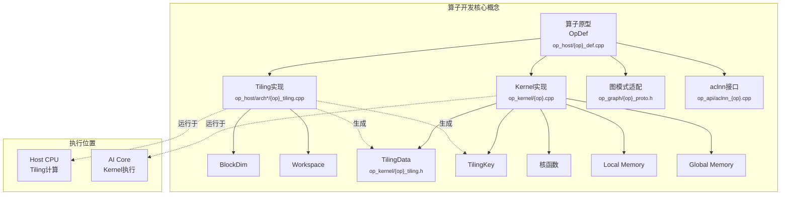
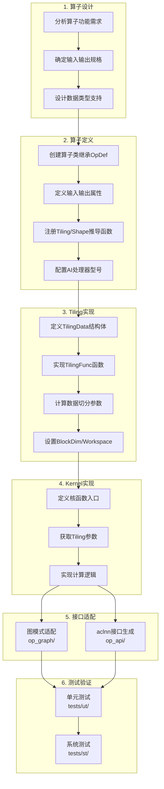
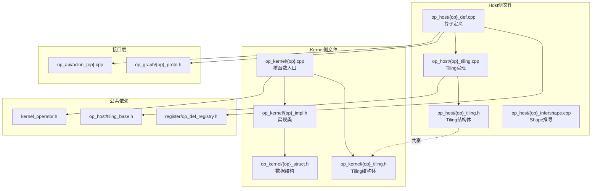
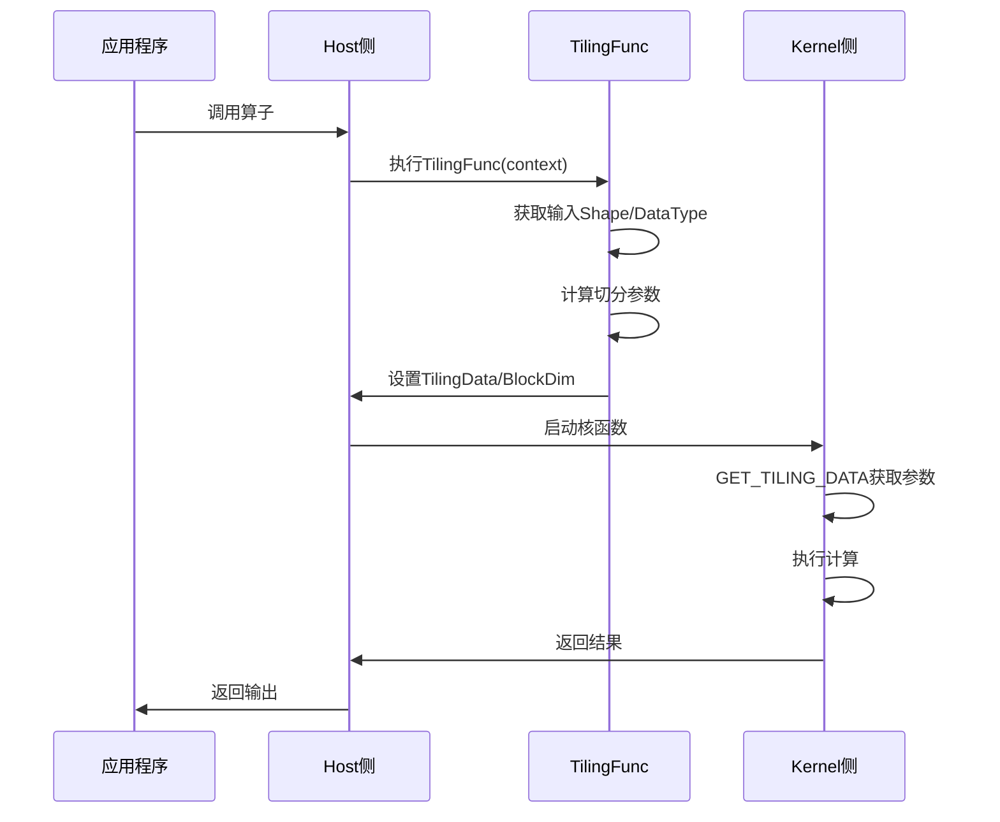
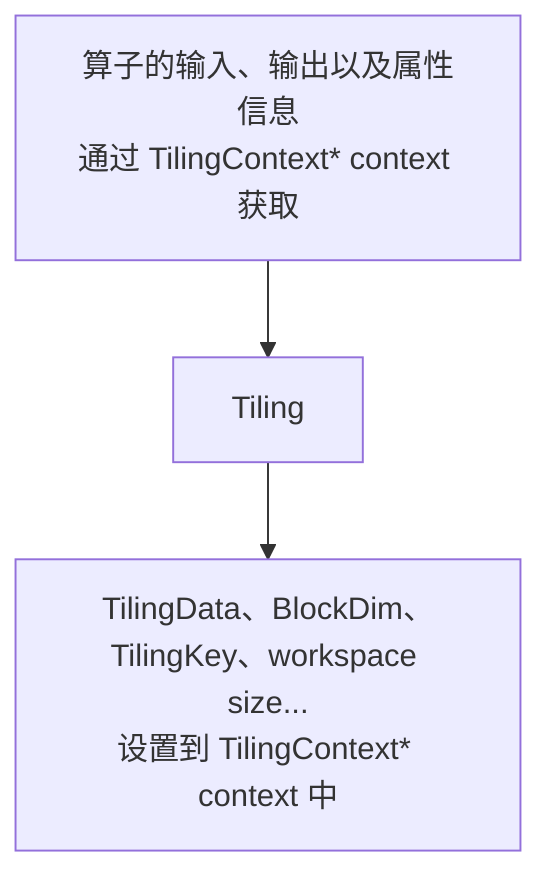
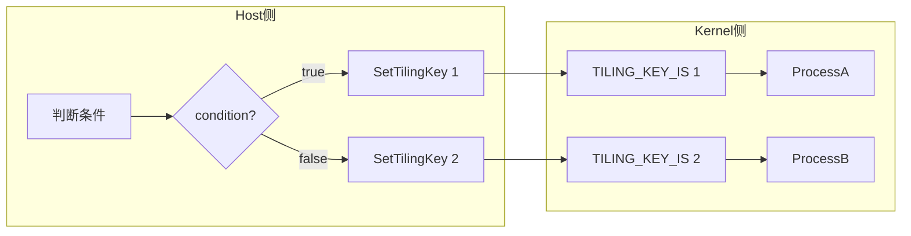
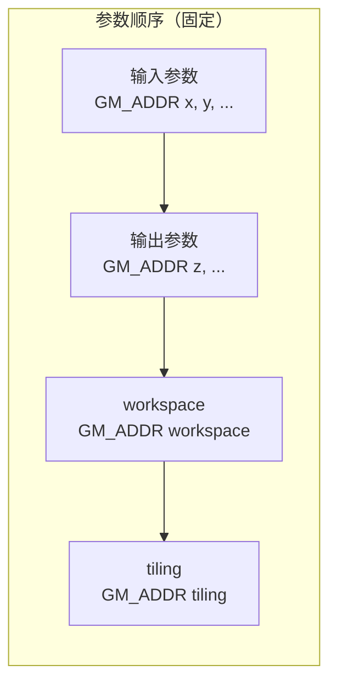
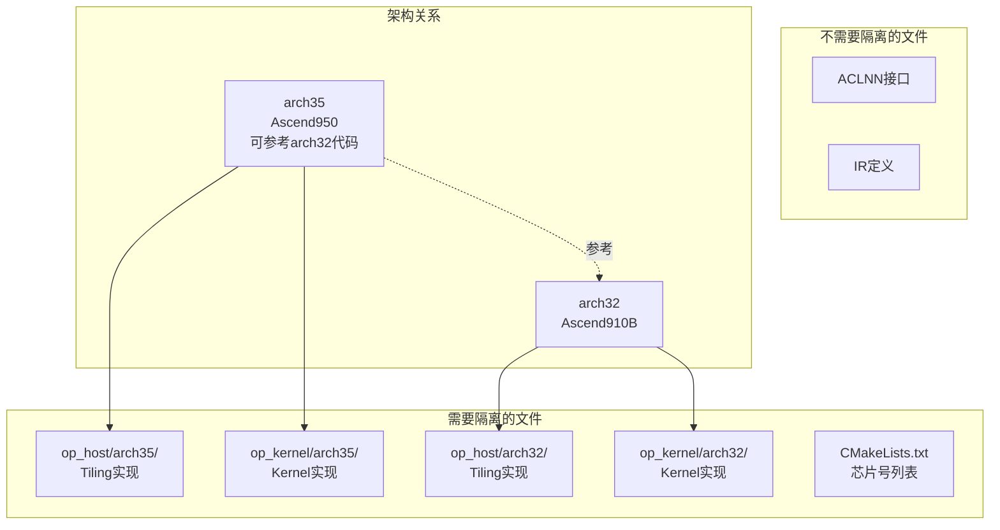

# AI Core算子开发进阶指南

> 本文档是《AI Core算子开发指南》的详细内容补充，提供算子开发中各模块的深入说明和进阶用法。建议先阅读[主文档](./aicore_develop_guide.md)了解整体开发流程。


## 目录

- [核心概念](#核心概念)
- [算子开发流程](#算子开发流程)
- [文件结构与依赖关系](#文件结构与依赖关系)
- [算子定义](#算子定义)
  - [算子输入/输出/属性定义](#算子输入输出属性定义)
  - [AI处理器上相关实现信息](#ai处理器上相关实现信息)
  - [注册Tiling实现、Shape推导等函数](#注册tiling实现shape推导等函数)
  - [多硬件平台注册差异化的算子原型](#多硬件平台注册差异化的算子原型)
- [Tiling实现](#tiling实现)
  - [基本流程](#基本流程)
  - [使用标准C++语法定义Tiling结构体](#使用标准c语法定义tiling结构体)
  - [Tiling模板编程](#tiling模板编程)
- [Kernel实现](#kernel实现)
  - [核函数定义](#核函数定义)
  - [GET_TILING_DATA获取Tiling参数](#get_tiling_data获取tiling参数)
  - [核函数内推导输入数据类型和格式](#核函数内推导输入数据类型和格式)
- [图模式适配](#图模式适配)
- [aclnn适配](#aclnn适配)
- [代际隔离](#代际隔离)
- [常见问题](#常见问题)
- [约束条件汇总](#约束条件汇总)
- [API快速参考](#api快速参考)

---

## 核心概念

### 概念关系图



### 关键术语表

| 术语 | 英文 | 说明 | 交付件文件 | 相关章节 |
|------|------|------|------------|----------|
| **算子原型** | OpDef | 算子输入输出属性定义 | `op_host/{op}_def.cpp` | [算子定义](#算子定义) |
| **Tiling** | Tiling | 数据切分、分块计算的过程 | `op_host/arch*/{op}_tiling.cpp` | [Tiling实现](#tiling实现) |
| **TilingData** | Tiling Data | 切分算法相关参数的数据结构 | `op_kernel/{op}_tiling.h` | [Tiling结构体](#使用标准c语法定义tiling结构体) |
| **BlockDim** | Block Dimension | 核函数执行的核数 | `op_host/arch*/{op}_tiling.cpp` | [基本流程](#基本流程) |
| **TilingKey** | Tiling Key | 区分不同kernel实现分支的标识 | `op_host/arch*/{op}_tiling.cpp` | [Tiling模板编程](#tiling模板编程) |
| **Workspace** | Workspace | 设备侧Global Memory上的工作内存 | `op_host/arch*/{op}_tiling.cpp` | [基本流程](#基本流程) |
| **核函数** | Kernel Function | 在AI Core上执行的函数 | `op_kernel/{op}.cpp` | [核函数定义](#核函数定义) |
| **IR定义** | IR Definition | 图模式算子原型定义 | `op_graph/{op}_proto.h` | [图模式适配](#图模式适配) |
| **aclnn** | ACL Neural Network | 单算子调用接口 | `op_api/aclnn_{op}.cpp` | [aclnn适配](#aclnn适配) |
| **代际隔离** | Generation Isolation | 不同芯片架构的代码隔离 | `arch32/` `arch35/` | [代际隔离](#代际隔离) |

---

## 算子开发流程

### 整体开发流程图



### 开发步骤详解

| 步骤 | 主要文件 | 关键API | 输出产物 |
|------|----------|---------|----------|
| 1. 算子设计 | - | - | 算子规格文档 |
| 2. 算子定义 | `op_host/{op}_def.cpp` | `OpDef`, `Input()`, `Output()`, `OP_ADD()` | 算子原型注册 |
| 3. Tiling实现 | `op_host/{op}_tiling.cpp` | `TilingFunc`, `GetTilingData<>()`, `SetBlockDim()` | Tiling参数 |
| 4. Kernel实现 | `op_kernel/{op}.cpp` | `__global__ __aicore__`, `GET_TILING_DATA` | 核函数二进制 |
| 5. 图模式适配 | `op_graph/{op}_proto.h` | `REG_OP()`, `INPUT()`, `OUTPUT()` | IR定义 |
| 6. aclnn适配 | `CMakeLists.txt` | `ACLNNTYPE aclnn` | API动态库 |

---

## 文件结构与依赖关系

### 算子工程目录结构

```
{op_name}/                      # 算子根目录（如 add/）
├── CMakeLists.txt              # 构建配置（必需）
├── README.md                   # 算子说明
│
├── op_host/                    # Host侧实现（必需）
│   ├── {op}_def.cpp           # 算子定义（必需）
│   ├── {op}_infershape.cpp    # Shape推导
│   ├── arch32/                 # Ascend910B架构
│   │   ├── {op}_tiling.cpp    # Tiling实现
│   │   └── {op}_tiling.h
│   ├── arch35/                 # Ascend950架构
│   │   ├── {op}_tiling.cpp
│   │   └── {op}_tiling.h
│   └── config/                 # 芯片配置
│       └── ascend950/
│
├── op_kernel/                  # Kernel侧实现（必需）
│   ├── {op}.cpp               # Kernel入口（arch32）
│   ├── {op}_apt.cpp           # Kernel入口（arch35）
│   ├── arch32/                 # Ascend910B实现
│   │   ├── {op}_impl.h
│   │   └── {op}_struct.h
│   └── arch35/                 # Ascend950实现
│       ├── {op}_apt_impl.h
│       └── {op}_struct.h
│
├── op_graph/                   # 图模式适配
│   ├── {op}_proto.h           # 算子原型
│   └── {op}_graph_infer.cpp   # 类型推导
│
├── op_api/                     # API实现
│   ├── aclnn_{op}.cpp         # aclnn实现
│   ├── aclnn_{op}.h           # aclnn头文件
│   └── {op}.cpp               # 算子实现
│
├── docs/                       # 算子文档
│   └── aclnn{Op}.md
│
├── examples/                   # 调用示例
│   └── test_aclnn_{op}.cpp
│
└── tests/                      # 测试代码
    ├── ut/                     # 单元测试
    └── st/                     # 系统测试
```

### 文件依赖关系图



### Host与Kernel数据交互



---

## 算子定义

算子原型主要描述了算子的输入输出、属性等信息以及算子在AI处理器上相关实现信息，并关联tiling实现等函数。算子原型通过自定义的算子类来承载，该算子类继承自OpDef类。完成算子的原型定义等操作后，需要调用OP_ADD接口，传入算子类型（自定义算子类的类名），进行算子原型注册。下面是一个简单的Add算子原型定义和注册的例子。

```c++
namespace ops {
class AddCustom : public OpDef {
public:
    AddCustom(const char* name) : OpDef(name)
    {
        this->Input("x")
            .ParamType(REQUIRED)
            .DataType({ge::DT_FLOAT16, ge::DT_FLOAT, ge::DT_INT32})
            .Format({ge::FORMAT_ND, ge::FORMAT_ND, ge::FORMAT_ND});
        this->Input("y")
            .ParamType(REQUIRED)
            .DataType({ge::DT_FLOAT16, ge::DT_FLOAT, ge::DT_INT32})
            .Format({ge::FORMAT_ND, ge::FORMAT_ND, ge::FORMAT_ND});
        this->Output("z")
            .ParamType(REQUIRED)
            .DataType({ge::DT_FLOAT16, ge::DT_FLOAT, ge::DT_INT32})
            .Format({ge::FORMAT_ND, ge::FORMAT_ND, ge::FORMAT_ND});
        // 如下的shape/datatype推导函数仅在算子入图场景使用
        this->SetInferShape(ge::InferShape);
        this->SetInferDataType(ge::InferDataType);
        this->AICore()
            .SetTiling(optiling::TilingFunc);
        // 请替换为实际的昇腾AI处理器型号
        this->AICore().AddConfig("ascendxxx");
    }
};
OP_ADD(AddCustom);
} // namespace ops
```

> 说明
>
> - 基于算子原型定义，自定义算子工程可以实现如下自动化能力：
>   - 自动生成单算子API调用的实现和接口，开发者可以直接使用生成的API实现单算子调用。
>   - 自动生成图模式场景使用的[算子原型定义REG_OP](###GE图模式原型定义)，开发者可以使用生成的算子原型进行构图、图编译、图执行等操作。
> - 注册算子类型后，框架会根据算子类型获取算子注册信息，同时在编译和运行时按照一定的规则匹配算子实现文件名称和kernel侧核函数名称。为了保证正确匹配，算子类型、算子实现文件名称和核函数名称需要遵循如下定义规则。通常情况下，开发者只需要保证创建算子工程时原型定义json文件中算子类型op的参数值为大驼峰命名方式即可，工程创建后自动生成的代码即满足该规则。在手动编写算子原型定义和算子实现文件时需要按照如下规则定义。
>   - 算子类型需要采用**大驼峰**的命名方式，即采用大写字符区分不同的语义。
>   - 算子实现文件名称、核函数名称需相同，均为算子类型转换为**下划线**命名方式后的值。下文描述了通过算子类型转换成算子实现文件名称和核函数名称的过程：
>     - 首字符的大写字符转换为小写字符。例如：Abc -> abc。
>     - 大写字符的前一个字符为小写字符或数字，则在大写字符前插一个下划线"_"，并将该字符转换为小写字符。例如：AbcDef -> abc_def。
>     - 大写字符前一个字符为大写字符且后一个字符是小写字符，则在大写字符前插一个下划线"_"，并将该字符转换为小写字符。例如：AbcAAc -> abc_a_ac。
>     - 其他大写字符转换为小写字符，小写字符保持不变。

### 算子命名规则示例

```
算子类型（大驼峰）  →  实现文件名/核函数名（下划线）
─────────────────────────────────────────────────
AddCustom           →  add_custom
BatchNorm           →  batch_norm
Conv2DBackprop      →  conv2d_backprop
ReduceMax           →  reduce_max
StatelessRandom    →  stateless_random
```

### 算子输入/输出/属性定义

算子原型定义描述了算子的输入输出、属性等信息。输入输出支持的datatype、format格式的数量需要一致，并保持一一对应的关系。

> **重要说明：算子原型注册需要排列组合，IR定义只需枚举列举**
>
> 当算子有多个输入输出时，**算子原型注册**需要明确标明输入输出之间的数据类型对应关系（排列组合），而**IR定义**只需要各自列举支持的数据类型即可。
>
> 例如：某算子输入x支持float32/float16，输出y支持float32/float16，但对应关系为：
> - float32 → float32
> - float16 → float16
> - float16 → float32
>
> | 定义位置 | 写法 | 说明 |
> |----------|------|------|
> | **算子原型注册** | 需要按**对应关系排列组合**列出 | x的第1个类型对应y的第1个类型，以此类推 |
> | **IR定义** | 只需**枚举**各输入输出支持的类型 | 无需标明输入输出的对应关系 |
>
> ```c++
> // 算子原型注册 (op_host/{op}_def.cpp) - 需要排列组合
> this->Input("x")
>     .DataType({ge::DT_FLOAT, ge::DT_FLOAT16, ge::DT_FLOAT16})  // 第1,2,3个分别对应输出的第1,2,3个
>     .Format({ge::FORMAT_ND, ge::FORMAT_ND, ge::FORMAT_ND});
> this->Output("y")
>     .DataType({ge::DT_FLOAT, ge::DT_FLOAT16, ge::DT_FLOAT})    // float32->float32, float16->float16, float16->float32
>     .Format({ge::FORMAT_ND, ge::FORMAT_ND, ge::FORMAT_ND});
>
> // IR定义 (op_graph/{op}_proto.h) - 只需枚举
> .INPUT(x, TensorType({DT_FLOAT, DT_FLOAT16}))
> .OUTPUT(y, TensorType({DT_FLOAT, DT_FLOAT16}))
> ```

如下的代码片段呈现了Add算子输入x的描述信息。

```c++
this->Input("x")
    .ParamType(REQUIRED)
    .DataType({ge::DT_FLOAT16, ge::DT_FLOAT, ge::DT_INT32})
    .Format({ge::FORMAT_ND, ge::FORMAT_ND, ge::FORMAT_ND});
```

**表1 输入输出参数说明**

| 原型定义     | 参数      | 具体描述                                                     |
| ------------ | --------- | ------------------------------------------------------------ |
| Input/Output | ParamType | 参数类型，Option取值为：OPTIONAL（可选）、REQUIRED（必选）、DYNAMIC（动态输入）。类似于上文中的Add样例，其输入输出是必选的。有些算子的输入或者输出个数是动态的，例如AddN，将N个输入Tensor累加到一起，输出一个Tensor；SplitV，将一个Tensor在某个轴上，拆分为N个Tensor输出。有些算子的输入/输出是可选的，例如BatchNorm算子，在训练的时候没有均值和方差输入，在推理的时候有均值和方差的输入。 |
|              | DataType  | 算子输入输出支持的datatype。                                 |
|              | Format    | 算子输入输出支持的format。                                   |

从上文的原型定义中可以看出，列出了输入输出所有datatype和format的组合，保持一一对应。使用如下接口，可以达到简化这种代码逻辑的目的。

- 在指定输入/输出的datatype信息时，如果某个输入/输出的datatype支持和其他所有输入/输出的datatype/format组合使用，其datatype可以通过DataTypeList来表达；在指定输入/输出的format信息时，如果某个输入/输出的format支持和其他所有输入/输出的datatype/format组合使用，其format可以通过FormatList来表达。示例如下，以下两种代码表达含义相同。

```c++
// 列出所有一一对应的组合
class XxxCustom : public OpDef {
public:
    XxxCustom(const char* name) : OpDef(name)
    {
        this->Input("x")
            .ParamType(REQUIRED)
            .DataType({ge::DT_FLOAT16, ge::DT_FLOAT16, ge::DT_FLOAT16})
            .Format({ge::FORMAT_ND, ge::FORMAT_ND, ge::FORMAT_ND});
        this->Input("y")
            .ParamType(REQUIRED)
            .DataType({ge::DT_FLOAT16, ge::DT_FLOAT, ge::DT_INT32})
            .Format({ge::FORMAT_ND, ge::FORMAT_ND, ge::FORMAT_ND});
        this->Output("z")
            .ParamType(REQUIRED)
            .DataType({ge::DT_FLOAT16, ge::DT_FLOAT, ge::DT_INT32})
            .Format({ge::FORMAT_ND, ge::FORMAT_ND, ge::FORMAT_ND});
        ...
    }
};
// 通过DataTypeList和FormatList来表达，无需重复列出
class XxxCustom : public OpDef {
public:
    XxxCustom(const char* name) : OpDef(name)
    {
        this->Input("x")
            .ParamType(REQUIRED)
            .DataTypeList({ge::DT_FLOAT16})
            .FormatList({ge::FORMAT_ND});
        this->Input("y")
            .ParamType(REQUIRED)
            .DataType({ge::DT_FLOAT16, ge::DT_FLOAT, ge::DT_INT32})
            .Format({ge::FORMAT_ND, ge::FORMAT_ND, ge::FORMAT_ND});
        this->Output("z")
            .ParamType(REQUIRED)
            .DataType({ge::DT_FLOAT16, ge::DT_FLOAT, ge::DT_INT32})
            .Format({ge::FORMAT_ND, ge::FORMAT_ND, ge::FORMAT_ND});
        ...
    }
};

```

- 通过Follow接口指定当前输入/输出的datatype/format/shape信息与之前定义过的某个输入一致。示例如下：输出"y1"Follow输入"x1"场景，此时"y1"的datatype、format以及shape都将会和"x1"保持一致。使用Follow接口指定shape一致时通常比shape推导函数逻辑更加简单，能用Follow表达的逻辑，建议使用Follow接口，则无需再编写注册InferShape函数。

```c++
this->Input("x1")
    .ParamType(REQUIRED)
    .DataType({ge::DT_FLOAT, ge::DT_FLOAT})
    .Format({ge::FORMAT_ND, ge::FORMAT_ND});
this->Input("x2")
    .ParamType(REQUIRED)
    .DataType({ge::DT_FLOAT, ge::DT_FLOAT})
    .Format({ge::FORMAT_ND, ge::FORMAT_ND});
this->Output("y1")
    .ParamType(REQUIRED)
    .Follow("x1")
    .OutputShapeDependOnCompute();
```

原型定义中还包括算子属性信息，如下的代码片段呈现了ReduceMax算子的属性reduceDim和isKeepDim的描述信息。

```c++
this->Attr("reduceDim")
    .AttrType(REQUIRED)
    .Int();
this->Attr("isKeepDim")
    .AttrType(OPTIONAL)
    .Int(1);
```

**具体参数说明如下：**

| 原型定义 | 注册方式          | 具体描述                                                     |
| -------- | ----------------- | ------------------------------------------------------------ |
| Attr     | AttrType          | 设置算子属性类型，取值为：OPTIONAL（可选）、REQUIRED（必选）。 |
|          | Bool/Float/Int... | 设置算子属性数据类型为Bool/Float/Int...。                    |

### AI处理器上相关实现信息

通过AddConfig注册算子支持的AI处理器型号以及相关的配置信息。AddConfig接口原型如下：soc参数表示AI处理器型号，aicore_config表示其他配置信息。

```c++
void AddConfig(const char *soc);
void AddConfig(const char *soc, OpAICoreConfig &aicore_config);
```

通过该接口注册AI处理器型号的样例如下，ascendxxx填写规则请参考算子工程目录下编译配置项文件CMakePresets.json中的ASCEND_COMPUTE_UNIT字段。

```c++
this->AICore().AddConfig("ascendxxx");
```

其他AI Core配置信息的配置方式请参考OpAICoreConfig。

### 注册Tiling实现、Shape推导等函数

通过SetInferShape、SetInferDataType、SetTiling接口来注册对应的Tiling实现和Shape推导等函数，样例如下。注册的Tiling实现等函数由框架侧进行调用，并在调用时传入对应的Context上下文，供开发者使用。Tiling函数的实现方法请参考Host侧Tiling实现，入图相关的Shape推导等函数实现请参考算子入图（GE图）开发。

```c++
// 如下的shape/datatype推导函数仅在算子入图场景使用
this->SetInferShape(ge::InferShape);
this->SetInferDataType(ge::InferDataType);
this->AICore()
    .SetTiling(optiling::TilingFunc);
```

### 多硬件平台注册差异化的算子原型

算子类继承基类OpDef，使用Input、Output、Attr等注册算子原型信息，硬件平台支持相同的算子原型的情况下，直接通过AICore().AddConfig添加支持的AI处理器型号即可；不同的硬件形态算子原型定义不同的情况，可以通过新增OpAICoreConfig的方式，针对不同的AI处理器型号注册差异化的算子原型。

**差异化算子原型生效规则：**

- 对于算子类的输入输出原型信息，OpAICoreConfig未配置的会继承OpDef定义的原型，比如算子类中定义了输出y，OpAICoreConfig中没有定义输出y，OpAICoreConfig会继承y的原型定义；
- 对于算子类和新增OpAICoreConfig中定义的算子原型相同的情况，新增OpAICoreConfig中定义的算子原型信息会覆盖OpDef定义的原型信息，比如算子类中定义了输入x支持DT_FLOAT16数据类型，新增OpAICoreConfig中也定义了输入x，但是支持DT_FLOAT16、DT_BF16数据类型，则以OpAICoreConfig新增定义为准。

如下样例中ascendxxx1、ascendxxx2（AI处理器型号）使用相同的算子原型，算子类通过继承基类OpDef，使用Input、Output、Attr等注册算子原型信息，再通过AICore().AddConfig添加支持的AI处理器型号；对于ascendxxx3支持的算子原型需要定制化处理，新增了DT_BF16的类型，通过新增OpAICoreConfig的方式进行注册，x，y，z的定义会覆盖算子类中对应定义的原型信息。

```c++
namespace ops {
class MyAdd : public OpDef {
public:
    MyAdd(const char* name) : OpDef(name)
    {
        // ascendxxx1 ascendxxx2 AI处理器型号原型定义
        this->Input("x")
            .ParamType(REQUIRED)
            .DataType({ge::DT_FLOAT16})
            .Format({ge::FORMAT_ND});
        this->Input("y")
            .ParamType(OPTIONAL)
            .DataType({ge::DT_INT64})
            .Format({ge::FORMAT_ND});
        this->Output("z")
            .ParamType(REQUIRED)
            .DataType({ge::DT_FLOAT16})
            .Format({ge::FORMAT_ND});
        this->AICore()
            .SetTiling(optiling::TilingFunc);
        this->AICore().AddConfig("ascendxxx1");
        this->AICore().AddConfig("ascendxxx2");
        // ascendxxx3 AI处理器定义OpAICoreConfig变量，定制化原型
        OpAICoreConfig config;
        config.Input("x")
            .ParamType(REQUIRED)
            .DataType({ge::DT_FLOAT16, ge::DT_BF16})
            .Format({ge::FORMAT_ND, ge::FORMAT_ND});
        config.Input("y")
            .ParamType(REQUIRED)
            .DataType({ge::DT_FLOAT16, ge::DT_BF16})
            .Format({ge::FORMAT_ND, ge::FORMAT_ND});
        config.Output("z")
            .ParamType(REQUIRED)
            .DataType({ge::DT_FLOAT16, ge::DT_BF16})
            .Format({ge::FORMAT_ND, ge::FORMAT_ND});
        this->AICore().AddConfig("ascendxxx3", config);
    }
};
OP_ADD(MyAdd);
}
```

如下的样例中，只有几个参数原型信息在不同硬件平台不一致，开发者也可以通过OpAICoreConfig定制部分算子原型信息，复用OpDef定义的其他算子原型信息，达到部分原型信息硬件平台定制化的目的。

```c++
class AddCustom : public OpDef {
public:
    AddCustom(const char* name) : OpDef(name)
    {
        this->Input("x").DataType({ ge::DT_FLOAT16 }).ParamType(OPTIONAL);
        this->Output("y").DataType({ ge::DT_FLOAT16 });
        OpAICoreConfig aicConfig1;
        OpAICoreConfig aicConfig2;
        aicConfig1.Input("x")
            .ParamType(OPTIONAL)
            .DataType({ ge::DT_FLOAT })
            .Format({ ge::FORMAT_ND });
        aicConfig2.Input("x")
            .ParamType(REQUIRED)
            .DataType({ ge::DT_INT32 })
            .Format({ ge::FORMAT_ND });
        this->AICore().AddConfig("ascendxxx1", aicConfig1);
        this->AICore().AddConfig("ascendxxx2", aicConfig2);
    }
};
```

---

## Tiling实现

### 基本流程

本章节侧重于介绍接入CANN框架时编程模式和API的使用。

大多数情况下，Local Memory的存储，无法完整的容纳算子的输入与输出，需要每次搬运一部分输入进行计算然后搬出，再搬运下一部分输入进行计算，直到得到完整的最终结果，这个数据切分、分块计算的过程称之为**Tiling**。根据算子的shape等信息来确定数据切分算法相关参数（比如每次搬运的块大小，以及总共循环多少次）的计算程序，称之为**Tiling实现**。

Tiling实现完成后，获取到的Tiling切分算法相关参数，会传递给kernel侧，用于指导并行数据的切分。由于Tiling实现中完成的均为标量计算，AI Core并不擅长，所以我们将其独立出来放在host CPU上执行。

**图1** Tiling实现的输入输出



如上图所示，Tiling实现即为根据算子shape等信息来确定切分算法相关参数的过程，这里的算子shape等信息可以理解为是**Tiling实现的输入**，切分算法相关参数可以理解为是**Tiling实现的输出**。输入和输出都通过Tiling函数的参数（TilingContext* context上下文结构）来承载。也就是说，开发者可以从上下文结构中获取算子的输入、输出以及属性信息，也就是**Tiling实现的输入**，经过Tiling计算后，获取到TilingData数据结构（切分算法相关参数）、blockDim变量、用于选择不同的kernel实现分支的TilingKey、算子workspace的大小，也就是**Tiling实现的输出**，并将这些输出设置到上下文结构中。

### Tiling输出参数详解

| 参数 | 类型 | 说明 | 设置方法 |
|------|------|------|----------|
| **TilingData** | struct | 切分算法相关参数，如每次搬运的块大小、循环次数 | `context->GetTilingData<T>()` |
| **blockDim** | uint32_t | 核函数执行的核数，范围[1,65535] | `context->SetBlockDim(n)` |
| **TilingKey** | uint64_t | 区分不同kernel实现分支的标识 | `context->SetTilingKey(key)` |
| **WorkspaceSize** | size_t | Global Memory上的工作内存大小 | `context->GetWorkspaceSizes(n)` |

### BlockDim设置规则

> blockDim是逻辑核的概念，取值范围为[1,65535]。为了充分利用硬件资源，一般设置为物理核的核数或其倍数。

**不同模式的blockDim设置：**

| 模式 | 说明 | 建议值 |
|------|------|--------|
| **耦合模式** | Vector、Cube单元集成在一起，不区分类型 | `GetCoreNumAiv()` 或 `GetCoreNumAic()` |
| **分离模式-Vector算子** | 仅Vector计算 | Vector核数，如40 |
| **分离模式-Cube算子** | 仅Cube计算 | Cube核数，如20 |
| **分离模式-融合算子** | Vector/Cube融合，按组合启动 | 组合数（不超过物理组合核数） |

### TilingKey使用场景

TilingKey用于区分不同的kernel实现分支，减少icache miss和scalar耗时：



**Host侧示例：**
```c++
static ge::graphStatus TilingFunc(gert::TilingContext* context)
{
    // some code
    if (condition) {
        context->SetTilingKey(1);
    } else {
        context->SetTilingKey(2);
    }
    return ge::GRAPH_SUCCESS;
}
```

**Kernel侧示例：**
```c++
if (TILING_KEY_IS(1)) {
    ProcessA();
} else if (TILING_KEY_IS(2)) {
    ProcessB();
}
```

### Workspace设置

Workspace是设备侧Global Memory上的一块内存，分为两部分：

1. **Ascend C API预留内存**：通过`GetLibApiWorkSpaceSize`获取
2. **算子实现使用内存**：根据算子需求自行分配

```c++
auto workspaceSizes = context->GetWorkspaceSizes(1); // 只使用1块workspace
workspaceSizes[0] = sysWorkspaceSize + usrWorkspaceSize;
```

### 使用标准C++语法定义Tiling结构体

#### 具体步骤

在定义Tiling结构体时，可以使用标准C++语法定义一个**POD类型（Plain Old Data）**，即与C语言兼容的数据类型。具体步骤如下。

- 使用C++语法定义Tiling结构体。

  该结构体定义所在的头文件应放置在算子工程的op_kernel目录下。由于只有该目录下的文件会被打包进算子包，供在线编译场景中使用，若将文件放置在其他目录中，可能导致在线编译因找不到相关文件而失败。

  用户在使用高阶API的Tiling结构体时，通过AscendC::tiling命名空间引用"kernel_tiling/kernel_tiling.h"中预定义的Tiling结构体，如下代码所示。

  ```c++
  #ifndef MATMUL_CUSTOM_TILING_H
  #define MATMUL_CUSTOM_TILING_H
  #include <cstdint>
  #include "kernel_tiling/kernel_tiling.h"    // for TCubeTiling

  struct MatmulCustomTilingData {
      uint64_t localMemSize;
      AscendC::tiling::TCubeTiling cubeTilingData;
  };
  #endif  // MATMUL_CUSTOM_TILING_H
  ```

- Host侧Tiling函数中对Tiling结构体赋值。

  - 需要包含Tiling结构体定义头文件。
  - 通过`GetTilingData`获取Tiling结构体指针，并对其成员变量进行赋值。

  ```c++
  #include "../op_kernel/matmul_custom_tiling.h"  // 包含Tiling结构体定义头文件
  ...

  namespace optiling {
  static ge::graphStatus TilingFunc(gert::TilingContext *context)
  {
      ...
      MultiCoreMatmulTiling cubeTiling(ascendcPlatform);
      ...
      // 获取Tiling结构体指针
      MatmulCustomTilingData *tiling = context->GetTilingData<MatmulCustomTilingData>();
      // 对tiling的成员变量赋值
      if (cubeTiling.GetTiling(tiling->cubeTilingData) == -1) {
          return ge::GRAPH_FAILED;
      }
      uint64_t localMemSize;
      ascendcPlatform.GetCoreMemSize(platform_ascendc::CoreMemType::UB, localMemSize);
      tiling->localMemSize = localMemSize;
      ...
      return ge::GRAPH_SUCCESS;
  }
  } // namespace optiling
  ```

- Kernel侧注册Tiling结构体，解析Tiling数据至TilingData结构并使用。

  - 需要包含Tiling结构体定义头文件。
  - 通过`REGISTER_TILING_DEFAULT`或者`REGISTER_TILING_FOR_TILINGKEY`注册Tiling结构体；通过`GET_TILING_DATA`解析Tiling数据至TilingData结构并使用。其中`REGISTER_TILING_DEFAULT`同时也用于标识使用标准C++语法定义TilingData结构体。

  ```c++
  #include "kernel_operator.h"
  #include "matmul_custom_tiling.h"  // 包含Tiling结构体定义头文件

  extern "C" __global__ __aicore__ void matmul_custom(GM_ADDR a, GM_ADDR b, GM_ADDR bias, GM_ADDR c, GM_ADDR workspace, GM_ADDR tiling)
  {
      REGISTER_TILING_DEFAULT(MatmulCustomTilingData);
      GET_TILING_DATA(tilingData, tiling);
      MatmulKernel<half, half, float, float> matmulKernel;
      AscendC::TPipe pipe;
      REGIST_MATMUL_OBJ(&pipe, GetSysWorkSpacePtr(), matmulKernel.matmulObj, &tilingData.cubeTilingData); // Initialize the matmul object.
      matmulKernel.Init(a, b, bias, c, workspace, tilingData.localMemSize, tilingData.cubeTilingData);
      ...
  }
  ```

### Tiling结构体定义方式对比

| 特性 | 标准C++语法 | 宏定义方式(BEGIN_TILING_DATA_DEF) |
|------|-------------|-----------------------------------|
| 支持bool类型 | ✅ | ❌ |
| 支持数组/列表初始化 | ✅ | ❌ |
| 同名不同结构体 | ✅ 支持 | ❌ 冲突 |
| 自定义赋值函数 | ✅ 直接访问成员 | ❌ 仅set/get方法 |
| C++开发者习惯 | ✅ 符合 | 需要学习 |

**标准C++语法优势示例：**

```c++
// 支持bool、数组、列表初始化
class TilingData {
public:
    bool enableFlag = false;
    uint32_t shapeInfo[2][128] = {0};
    uint8_t padding[2][2]{0};
};

// 不同算子可以定义同名不同结构的TilingData
// 算子A
class TilingData {
public:
    uint32_t length;
};

// 算子B
class TilingData {
public:
    uint32_t length;
    uint16_t coreNum;
};
```

### 使用约束

使用标准C++语法定义Tiling结构体时存在如下约束限制：

| 约束类型 | 错误示例 | 原因 |
|----------|----------|------|
| **不支持成员函数** | `__aicore__ funcA() {...}` | Host侧不支持__aicore__修饰符 |
| **不支持指针/引用** | `uint32_t* ptr;` | Host无法传递指针到Device |
| **仅支持POD类型** | 虚函数、虚继承 | 不支持面向对象特性 |
| **不支持模板类** | `template<T> class TilingData` | 编译问题 |

**正确用法示例：**

```c++
// 正确：POD类型结构体
class TilingData {
public:
    uint32_t totalLength;
    uint32_t tileNum;
    uint8_t flag;
};

// 正确：显式赋值
static ge::graphStatus TilingFunc(gert::TilingContext* context)
{
    TilingData *tiling = context->GetTilingData<TilingData>();
    // 必须显式赋值，GetTilingData获取的结构体不包含初值
    tiling->totalLength = totalLength;
    tiling->tileNum = TILE_NUM;
    return ge::GRAPH_SUCCESS;
}
```

### Tiling模板编程

在涉及多个TilingKey的场景中，开发者依赖TilingKey来管理kernel的实现，无论是在管理还是使用上都会遇到相当大的复杂性。为了简化这一过程，可以采用模板编程的方法来替代传统的TilingKey编程，从而减少对TilingKey数值标识的依赖，使kernel的管理更加直观和高效。使用步骤如下：

#### 步骤1：定义模板参数头文件

在op_kernel目录下，新增定义模板参数和模板参数组合的头文件，本示例中头文件命名为tiling_key_add_custom.h。

```c++
#include "ascendc/host_api/tiling/template_argument.h"

// 模板参数
ASCENDC_TPL_ARGS_DECL(AddCustomTemplate, // 算子OpType
ASCENDC_TPL_DATATYPE_DECL(D_T_X, C_DT_FLOAT, C_DT_FLOAT16, ASCENDC_TPL_INPUT(0)),  // DataType类型的模板参数定义
ASCENDC_TPL_DATATYPE_DECL(D_T_Y, C_DT_FLOAT, C_DT_FLOAT16, ASCENDC_TPL_INPUT(1)),
ASCENDC_TPL_DATATYPE_DECL(D_T_Z, C_DT_FLOAT, C_DT_FLOAT16, ASCENDC_TPL_OUTPUT(0)),
ASCENDC_TPL_UINT_DECL(TILE_NUM, ASCENDC_TPL_8_BW, ASCENDC_TPL_UI_MIX, 2, 0, 2, 3, 5, 10, 12, 13, 9, 8),
ASCENDC_TPL_BOOL_DECL(IS_SPLIT, 0, 1),
);

// 模板参数组合
ASCENDC_TPL_SEL(
    ASCENDC_TPL_ARGS_SEL(
    ASCENDC_TPL_KERNEL_TYPE_SEL(ASCENDC_TPL_AIV_ONLY),
    ASCENDC_TPL_DATATYPE_SEL(D_T_X, C_DT_FLOAT16),
    ASCENDC_TPL_DATATYPE_SEL(D_T_Y, C_DT_FLOAT16),
    ASCENDC_TPL_DATATYPE_SEL(D_T_Z, C_DT_FLOAT16),
    ASCENDC_TPL_UINT_SEL(TILE_NUM, ASCENDC_TPL_UI_LIST, 1, 8),
    ASCENDC_TPL_BOOL_SEL(IS_SPLIT, 0, 1)
    ),
    ASCENDC_TPL_ARGS_SEL(
    ASCENDC_TPL_KERNEL_TYPE_SEL(ASCENDC_TPL_AIV_ONLY),
    ASCENDC_TPL_DATATYPE_SEL(D_T_X, C_DT_FLOAT),
    ASCENDC_TPL_DATATYPE_SEL(D_T_Y, C_DT_FLOAT),
    ASCENDC_TPL_DATATYPE_SEL(D_T_Z, C_DT_FLOAT),
    ASCENDC_TPL_UINT_SEL(TILE_NUM, ASCENDC_TPL_UI_LIST, 1, 8),
    ASCENDC_TPL_BOOL_SEL(IS_SPLIT, 0, 1)
    ),
);
```

#### 步骤2：Host侧自动配置TilingKey

```c++
#include "tiling_key_add_custom.h"
static ge::graphStatus TilingFunc(gert::TilingContext *context)
{
    TilingData tiling;
    uint32_t totalLength = context->GetInputShape(0)->GetOriginShape().GetShapeSize();
    ge::DataType dtype_x = context->GetInputDesc(0)->GetDataType();
    ge::DataType dtype_y = context->GetInputDesc(1)->GetDataType();
    ge::DataType dtype_z = context->GetOutputDesc(1)->GetDataType();
    uint32_t D_T_X = static_cast<int>(dtype_x), D_T_Y = static_cast<int>(dtype_y), D_T_Z = static_cast<int>(dtype_z), TILE_NUM = 1, IS_SPLIT = 0;
    if(totalLength< MIN_LENGTH_FOR_SPLIT){
        IS_SPLIT = 0;
        TILE_NUM = 1;
    }else{
        IS_SPLIT = 1;
        TILE_NUM = DEFAULT_TILE_NUM;
    }
    context->SetBlockDim(BLOCK_DIM);
    tiling.set_totalLength(totalLength);
    tiling.SaveToBuffer(context->GetRawTilingData()->GetData(), context->GetRawTilingData()->GetCapacity());
    context->GetRawTilingData()->SetDataSize(tiling.GetDataSize());
    ASCENDC_TPL_SEL_PARAM(context, D_T_X, D_T_Y, D_T_Z, TILE_NUM, IS_SPLIT);
    size_t *currentWorkspace = context->GetWorkspaceSizes(1);
    currentWorkspace[0] = 0;
    return ge::GRAPH_SUCCESS;
}
```

#### 步骤3：Kernel侧模板实现

```c++
#include "tiling_key_add_custom.h"
...
template<typename D_T_X, typename D_T_Y, typename D_T_Z, int TILE_NUM, int IS_SPLIT>
 __global__ __aicore__ void add_custom_template(GM_ADDR x, GM_ADDR y, GM_ADDR z, GM_ADDR workspace, GM_ADDR tiling)
{
    GET_TILING_DATA(tiling_data, tiling);
    KernelAdd<D_T_X, D_T_Y, D_T_Z> op;
    op.Init(x, y, z, tiling_data.totalLength, TILE_NUM);
    if constexpr (std::is_same_v<D_T_X, float> && std::is_same_v<D_T_Y, float> && std::is_same_v<D_T_Z, float>) {
        op.Process1();
    } else if constexpr (std::is_same_v<D_T_X, half> && std::is_same_v<D_T_Y, half> && std::is_same_v<D_T_Z, half>){
        if (IS_SPLIT == 0) {
            op.Process1();
        } else if(IS_SPLIT == 1) {
            op.Process2();
        }
    }
}
```

### 模板参数定义API

#### 功能说明

通过以下函数原型进行模板参数ASCENDC_TPL_ARGS_DECL和模板参数组合ASCENDC_TPL_ARGS_SEL（即可使用的模板）的定义。

#### 模板参数声明宏

| 宏 | 功能 | 参数说明 |
|----|------|----------|
| `ASCENDC_TPL_ARGS_DECL(op, ...)` | 定义算子的模板参数 | op: 算子OpType; ...: 模板参数列表 |
| `ASCENDC_TPL_DATATYPE_DECL(name, ...)` | DataType类型模板参数 | name: 参数名; ...: 枚举值或`ASCENDC_TPL_INPUT(n)` |
| `ASCENDC_TPL_UINT_DECL(name, bw, mode, ...)` | UINT类型模板参数 | bw: 位宽; mode: RANGE/LIST/MIX |
| `ASCENDC_TPL_BOOL_DECL(name, ...)` | Bool类型模板参数 | 取值范围0和1 |
| `ASCENDC_TPL_KERNEL_TYPE_DECL(name, ...)` | Kernel类型参数 | AIV_ONLY/AIC_ONLY/MIX_* |

#### 模板参数选择宏

| 宏 | 功能 |
|----|------|
| `ASCENDC_TPL_SEL(...)` | 算子模板参数整体组合 |
| `ASCENDC_TPL_ARGS_SEL(...)` | 单个算子模板参数组合 |
| `ASCENDC_TPL_KERNEL_TYPE_SEL(type)` | 设置Kernel类型 |
| `ASCENDC_TPL_DATATYPE_SEL(name, ...)` | DataType类型组合 |
| `ASCENDC_TPL_UINT_SEL(name, mode, ...)` | UINT类型组合 |
| `ASCENDC_TPL_BOOL_SEL(name, ...)` | Bool类型组合 |

#### UINT参数定义模式

| 模式 | 说明 | 示例 |
|------|------|------|
| `ASCENDC_TPL_UI_RANGE` | 范围模式 | `{0, 2}, {3, 5}` → {0,1,2,3,4,5} |
| `ASCENDC_TPL_UI_LIST` | 穷举模式 | `10, 12, 13, 9, 8` |
| `ASCENDC_TPL_UI_MIX` | 混合模式 | 范围 + 穷举值 |

### GET_TPL_TILING_KEY

#### 功能说明

Tiling模板编程时，开发者通过调用此接口自动生成TilingKey。该接口将传入的模板参数通过定义的位宽，转成二进制，按照顺序组合后转成uint64数值，即TilingKey。

#### 函数原型

```c++
namespace AscendC {
    uint64_t EncodeTilingKey(TilingDeclareParams declareParams,
                             TilingSelectParams selectParamsVec,
                             std::vector<uint64_t> tilingParams);
}

#define GET_TPL_TILING_KEY(...) \
    AscendC::EncodeTilingKey(g_tilingDeclareParams, g_tilingSelectParams, {__VA_ARGS__})
```

#### 参数说明

| 参数 | 输入/输出 | 说明 |
| ---- | --------- | ---- |
| ... | 输入 | 可变长参数，模板参数的具体值，需与头文件中的顺序一致 |

#### 返回值

TilingKey数值（uint64_t）

#### 调用示例

```c++
#include "tiling_key_add_custom.h"
static ge::graphStatus TilingFunc(gert::TilingContext *context)
{
    // ... 参数计算 ...
    const uint64_t tilingKey = GET_TPL_TILING_KEY(D_T_X, D_T_Y, D_T_Z, TILE_NUM, IS_SPLIT);
    context->SetTilingKey(tilingKey);
    return ge::GRAPH_SUCCESS;
}
```

### ASCENDC_TPL_SEL_PARAM

#### 功能说明

Tiling模板编程时，开发者通过调用此接口自动生成并配置TilingKey。

#### 函数原型

```c++
#define ASCENDC_TPL_SEL_PARAM(context, ...)           \
do {                                                  \
    uint64_t key = GET_TPL_TILING_KEY({__VA_ARGS__}); \
    context->SetTilingKey(key);                       \
} while(0)
```

#### 参数说明

| 参数 | 输入/输出 | 说明 |
| ---- | --------- | ---- |
| context | 输入 | TilingFunc注册上下文 |
| ... | 输入 | 模板参数的具体值，需与头文件中的顺序一致 |

---

## Kernel实现

### 核函数定义

在算子工程目录下的"op_kernel/xxx.cpp"文件中实现算子的核函数。核函数的定义样例如下所示。**注意这里参数的顺序按照"输入、输出、workspace、tiling"的顺序排布，开发者不要调整其顺序。**

```c++
#include "kernel_operator.h"
extern "C" __global__ __aicore__ void add_custom(GM_ADDR x, GM_ADDR y, GM_ADDR z, GM_ADDR workspace, GM_ADDR tiling) {
    GET_TILING_DATA(tiling_data, tiling);// 获取Tiling参数，详见下文介绍
    // TODO: user kernel impl
}
```

> 说明
> 算子原型定义中的输入和输出同名的情况下，输出参数增加ref后缀予以区分。示例如下：
>
> ```c++
> extern "C" __global__ __aicore__ void add_custom(GM_ADDR x, GM_ADDR y, GM_ADDR x_ref, GM_ADDR workspace, GM_ADDR tiling) {
>     ...
> }
> ```

### 核函数参数规则



| 参数位置 | 参数类型 | 说明 |
|----------|----------|------|
| 1~N | GM_ADDR | 输入参数（按算子定义顺序） |
| N+1~M | GM_ADDR | 输出参数（按算子定义顺序） |
| M+1 | GM_ADDR | workspace地址（固定） |
| M+2 | GM_ADDR | tiling地址（固定） |

### GET_TILING_DATA获取Tiling参数

提供`GET_TILING_DATA`，用于获取算子kernel入口函数传入的tiling信息，并填入注册的Tiling结构体中，此函数会以宏展开的方式进行编译。注意，对应的算子host实现中需要定义TilingData结构体，实现并注册计算TilingData的Tiling函数。具体请参考Host侧Tiling实现。

核函数中调用`GET_TILING_DATA`获取TilingData的样例如下：

```c++
extern "C" __global__ __aicore__ void add_custom(GM_ADDR x, GM_ADDR y, GM_ADDR z, GM_ADDR workspace, GM_ADDR tiling)
{
    GET_TILING_DATA(tilingData, tiling);
    KernelAdd op;
    op.Init(x, y, z, tilingData.totalLength, tilingData.tileNum);
    if (TILING_KEY_IS(1)) {
        op.Process();
    }
}
```

### 核函数内推导输入数据类型和格式

算子工程在核函数内提供了DTYPE\_\<Arg>、ORIG_DTYPE\_\<Arg>、FORMAT_\<Arg>三种宏用于推导核函数入参的数据类型、原始数据类型和数据格式。其中\<Arg>会自动大写。样例如下：

```c++
template<class T> func() {}
extern "C" __global__ __aicore__ void add_custom(GM_ADDR x, GM_ADDR y, GM_ADDR z, GM_ADDR workspace, GM_ADDR tiling)
{
    DTYPE_X temp;
    func<DTYPE_Z>();
    if (FORMAT_Y == FORMAT_ND) {
        ...
    }
}
```

### Kernel宏定义速查

| 宏 | 功能 | 示例 |
|----|------|------|
| `DTYPE_<Arg>` | 参数数据类型 | `DTYPE_X`, `DTYPE_Y` |
| `ORIG_DTYPE_<Arg>` | 参数原始数据类型 | `ORIG_DTYPE_X` |
| `FORMAT_<Arg>` | 参数数据格式 | `FORMAT_Y == FORMAT_ND` |
| `TILING_KEY_IS(n)` | 判断TilingKey值 | `if (TILING_KEY_IS(1))` |

---

## 图模式适配

### 头文件

```c++
#include <graph/operator_reg.h>
```

### 功能说明

定义算子的原型，包括算子的输入、输出、属性以及对应的数据类型。

进行如上算子原型定义后，即相当于向GE注册了该算子的原型，告知GE对应类型的算子应该具备哪些输入、输出与属性；同时相当于定义了一个op::xxx的Class，开发者可以include该原型头文件，然后实例化该Class进行IR模型构建，如下所示：

```c++
conv = op::Conv2D()
conv.set_input_x(feature_map_data)
conv.set_input_filter(weight_data)
```

### 函数原型

```c++
REG_OP(xxx)
    .INPUT(x1, type)
    .OPTIONAL_INPUT(x2, type)
    .DYNAMIC_INPUT(x3, type)
    .OUTPUT(y1, type)
    .DYNAMIC_OUTPUT(y3, type)
    .REQUIRED_ATTR(a, type)
    .ATTR(b, type, default_value)
    .GRAPH(z1)
    .DYNAMIC_GRAPH(z2)
    .OP_END_FACTORY_REG(xxx)
```

### 接口说明

| **接口名称** | **接口说明** |
| ------------ | ------------ |
| `REG_OP(xxx)` | 定义一个算子原型，算子类型为xxx |
| `.INPUT(x, type)` | 定义输入名称和类型 |
| `.OPTIONAL_INPUT(x, type)` | 定义可选输入 |
| `.DYNAMIC_INPUT(x, type)` | 定义动态输入 |
| `.OUTPUT(x, type)` | 定义输出 |
| `.DYNAMIC_OUTPUT(x, type)` | 定义动态输出 |
| `.REQUIRED_ATTR(x, type)` | 定义必备属性 |
| `.ATTR(x, type, default_value)` | 定义可选属性（带默认值） |
| `.GRAPH(z1)` | 注册子图信息 |
| `.DYNAMIC_GRAPH(z2)` | 注册动态算子子图 |
| `.OP_END_FACTORY_REG(x)` | 结束算子原型定义 |

### 属性类型说明

| 类型 | C++类型 | 说明 |
|------|---------|------|
| Int | int64_t | 整数 |
| Float | float | 浮点数 |
| String | string | 字符串 |
| Bool | bool | 布尔值 |
| ListInt | vector\<int64_t> | 整数列表 |
| ListFloat | vector\<float> | 浮点数列表 |
| ListString | vector\<string> | 字符串列表 |
| ListBool | vector\<bool> | 布尔列表 |

### 调用示例

```c++
// 动态输入的算子原型定义
REG_OP(AddN)
    .DYNAMIC_INPUT(x, TensorType({NumberType(), DT_VARIANT}))
    .OUTPUT(y, TensorType({NumberType(), DT_VARIANT}))
    .REQUIRED_ATTR(N, Int)
    .OP_END_FACTORY_REG(AddN)

// 多输入的算子原型定义
REG_OP(GreaterEqual)
    .INPUT(x1, TensorType::RealNumberType())
    .INPUT(x2, TensorType::RealNumberType())
    .OUTPUT(y, TensorType({DT_BOOL}))
    .OP_END_FACTORY_REG(GreaterEqual)

// 注册子图的算子原型定义
REG_OP(If)
    .INPUT(cond, TensorType::ALL())
    .DYNAMIC_INPUT(input, TensorType::ALL())
    .DYNAMIC_OUTPUT(output, TensorType::ALL())
    .GRAPH(then_branch)
    .GRAPH(else_branch)
    .OP_END_FACTORY_REG(If)
```

### TensorType类

TensorType类用以定义输入或者输出支持的数据类型：

```c++
struct TensorType {
  explicit TensorType(DataType dt);
  TensorType(const std::initializer_list<DataType> &initial_types);

  static TensorType ALL();              // 所有类型
  static TensorType NumberType();       // 数值类型
  static TensorType RealNumberType();   // 实数类型
  static TensorType IntegerDataType();  // 整数类型
  static TensorType FloatingDataType(); // 浮点类型
  static TensorType FLOAT();            // float/float16/bf16
  // ... 更多类型
};
```

---

## aclnn适配

> Aclnn有自动生成和手写两种方式，可根据算子实际情况进行选择。

### 自动生成配置

在 `${op_name}/CMakeLists.txt` 中配置：

```cmake
ACLNNTYPE aclnn
```

### 自动生成接口

自动生成两个ACLNN接口：

```c++
// 获取Workspace大小
aclnnStatus aclnn{OpName}GetWorkspaceSize(
    const aclTensor *x,
    const aclTensor *out,
    uint64_t *workspaceSize,
    aclOpExecutor **executor);

// 执行算子
aclnnStatus aclnn{OpName}(
    void *workspace,
    uint64_t workspaceSize,
    aclOpExecutor *executor,
    aclrtStream stream);
```

### 生成文件位置

| 内容 | 路径 |
|------|------|
| 生成代码 | `build/autogen/` |
| 动态库 | `${ASCEND_HOME_PATH}/cann-{version}/opp/vendors/custom_math/op_api/lib/` |
| 头文件 | `${ASCEND_HOME_PATH}/cann-{version}/opp/vendors/custom_math/op_api/include/` |

### 动态库配置

```bash
export LD_LIBRARY_PATH=${ASCEND_HOME_PATH}/cann-{version}/opp/vendors/custom_math/op_api/lib/:${LD_LIBRARY_PATH}
```

---

## 代际隔离

> 当某个算子需要同时支持多款芯片且Tiling或kernel实现不同则需要考虑代际隔离问题。

### 芯片架构映射

| 架构目录 | 对应芯片系列 |
| -------- | ------------ |
| `arch35` | Ascend950DT / Ascend950PR |
| `arch32` | Ascend910B / Ascend910_93 |

### 隔离位置清单



| 位置 | 是否隔离 | 说明 |
| ---- | -------- | ---- |
| ACLNN接口 | ❌ 不隔离 | 多代际共用 |
| IR | ❌ 不隔离 | 多代际共用 |
| 算子CMakeLists.txt | ✅ 需隔离 | 芯片号列表要准确 |
| op_host/arch35 | ✅ 隔离 | Ascend950系列 |
| op_host/arch32 | ✅ 隔离 | Ascend910B系列 |
| op_kernel/arch35 | ✅ 隔离 | Ascend950系列 |
| op_kernel/arch32 | ✅ 隔离 | Ascend910B系列 |

**重要提示：**
1. 严格按照架构关系规划目录
2. **高架构芯片可以参考低架构芯片代码，低架构芯片不能照抄高架构芯片的代码！**
3. arch35以上才支持MicroAPI微指令编程

### Kernel入口配置

在 `${op_name}_def.cpp` 中配置：

```cpp
// 默认配置（第一代芯片）
ExtendCfgInfo("opFile.value", "{op_name_snake}");

// 第二代芯片隔离（最多支持两代）
ExtendCfgInfo("opFile.value", "{op_name_snake}_apt");
```

### 对应文件关系

| 配置值 | 对应Kernel文件 |
| ------ | -------------- |
| `{op_name_snake}` | `{op_name_snake}.cpp` |
| `{op_name_snake}_apt` | `{op_name_snake}_apt.cpp` |

### 编译隔离实现

```cpp
// {op_name_snake}.cpp (arch32/Ascend910B)
#include "{op_name_snake}_impl.h"

// {op_name_snake}_apt.cpp (arch35/Ascend950)
#include "{op_name_snake}_apt_impl.h"
```

---

## 常见问题

### Q1: Tiling结构体定义放在哪个目录？

**A:** Tiling结构体头文件应放置在`op_kernel/`目录下，因为只有该目录下的文件会被打包进算子包。如果放在其他目录，可能导致在线编译失败。

### Q2: 核函数参数顺序可以调整吗？

**A:** 不可以。核函数参数必须按照 **输入 → 输出 → workspace → tiling** 的固定顺序排布。

### Q3: 如何选择BlockDim的值？

**A:**
- 耦合模式：使用`GetCoreNumAiv()`或`GetCoreNumAic()`获取核数
- 分离模式Vector算子：设置为Vector核数
- 分离模式Cube算子：设置为Cube核数
- 一般建议设置为物理核数以充分利用硬件资源

### Q4: TilingData获取后需要初始化吗？

**A:** 是的。通过`GetTilingData<T>()`获取的Tiling结构体不包含初值，必须显式赋值所有需要使用的成员变量。

### Q5: 算子输入输出同名怎么处理？

**A:** 输出参数会增加`ref`后缀。例如输入`x`，输出也是`x`时，核函数参数为`x`和`x_ref`。

### Q6: 不同芯片架构的代码如何隔离？

**A:**
1. 在`op_host/`和`op_kernel/`下分别创建`arch32/`和`arch35/`目录
2. 在`{op}_def.cpp`中通过`ExtendCfgInfo("opFile.value", ...)`配置不同入口
3. **注意：低架构不能直接复制高架构代码**

---

## 约束条件汇总

### Tiling结构体约束

| 约束项 | 要求 |
|--------|------|
| 成员函数 | ❌ 不支持 |
| 指针/引用类型 | ❌ 不支持 |
| 虚函数/虚继承 | ❌ 不支持 |
| 模板类 | ❌ 不支持 |
| 数据类型 | 仅POD类型 |

### 核函数约束

| 约束项 | 要求 |
|--------|------|
| 参数顺序 | 固定为：输入→输出→workspace→tiling |
| 修饰符 | 必须包含`extern "C" __global__ __aicore__` |
| 文件位置 | 必须在`op_kernel/`目录下 |

### 算子原型约束

| 约束项 | 要求 |
|--------|------|
| 算子类型 | 全局唯一 |
| 输入名称 | 同一算子内不重复 |
| 输出名称 | 同一算子内不重复 |
| 属性名称 | 同一算子内不重复 |

### BlockDim约束

| 约束项 | 要求 |
|--------|------|
| 取值范围 | [1, 65535] |
| 融合算子 | 不超过物理组合核数 |
| 资源限制场景 | 不超过`GetCoreNum*()`返回值 |

---

## API快速参考

### 算子定义API

```c++
// 继承OpDef定义算子类
class XxxCustom : public OpDef {
public:
    XxxCustom(const char* name) : OpDef(name) {
        // 输入定义
        this->Input("x")
            .ParamType(REQUIRED)          // REQUIRED/OPTIONAL/DYNAMIC
            .DataType({ge::DT_FLOAT16})   // 数据类型列表
            .Format({ge::FORMAT_ND});     // 格式列表

        // 输出定义（Follow简化）
        this->Output("y")
            .Follow("x");                 // 跟随输入x的属性

        // 属性定义
        this->Attr("axis")
            .AttrType(REQUIRED)
            .Int();

        // 注册函数
        this->SetInferShape(ge::InferShape);
        this->AICore().SetTiling(optiling::TilingFunc);
        this->AICore().AddConfig("ascend910b");
    }
};
OP_ADD(XxxCustom);  // 注册算子
```

### Tiling实现API

```c++
static ge::graphStatus TilingFunc(gert::TilingContext *context)
{
    // 获取输入信息
    auto shape = context->GetInputShape(0)->GetOriginShape();
    auto dtype = context->GetInputDesc(0)->GetDataType();

    // 获取Tiling结构体
    auto tiling = context->GetTilingData<TilingData>();
    tiling->totalLength = shape.GetShapeSize();

    // 设置输出
    context->SetBlockDim(8);
    context->SetTilingKey(1);

    // 设置Workspace
    auto ws = context->GetWorkspaceSizes(1);
    ws[0] = 1024;

    return ge::GRAPH_SUCCESS;
}
```

### Kernel实现API

```c++
#include "kernel_operator.h"

extern "C" __global__ __aicore__ void xxx_custom(
    GM_ADDR x, GM_ADDR y, GM_ADDR workspace, GM_ADDR tiling)
{
    // 获取Tiling数据
    GET_TILING_DATA(tilingData, tiling);

    // 类型推导宏
    DTYPE_X temp;
    if (FORMAT_Y == FORMAT_ND) { ... }

    // TilingKey分支
    if (TILING_KEY_IS(1)) {
        Process1();
    }
}
```

### 图模式API

```c++
#include <graph/operator_reg.h>

REG_OP(XxxCustom)
    .INPUT(x, TensorType({DT_FLOAT, DT_FLOAT16}))
    .OUTPUT(y, TensorType({DT_FLOAT, DT_FLOAT16}))
    .REQUIRED_ATTR(axis, Int)
    .ATTR(keep_dims, Bool, false)
    .OP_END_FACTORY_REG(XxxCustom)
```

