# AI Core算子开发指南

> 说明：
>
> 1. 算子开发过程中涉及的基本概念如Tiling、Kernel、Ascend C接口等，详细介绍请参考[《Ascend C算子开发》](https://hiascend.com/document/redirect/CannCommunityOpdevAscendC)。  
> 2. AI CORE算子是使用Ascend C语言开发，运行在AI CORE硬件单元算子，AI CPU算子是使用C++语言开发，运行在AI CPU硬件单元算子，如果你想贡献AI CPU算子，请参考[AI CPU算子开发指南](./aicpu_develop_guide.md)。
> 3. 针对基于[Ascend/samples](https://gitee.com/ascend/samples/tree/master)仓贡献的算子，请参考[算子工程迁移](#算子工程迁移)完成存量算子往本项目工程迁移的操作。
> 4. build.sh：算子开发过程中涉及的命令可通过`bash build.sh --help`查看，功能参数介绍参考[build参数说明](../context/build.md)。

开发指南以`AddExample`算子开发为例，介绍新算子开发流程以及涉及的交付件，完整样例代码请访问项目`examples`目录。

1. [工程创建](#工程创建)：开发算子前，需完成环境部署并创建算子目录，方便后续算子的编译和部署。
   
2. [算子定义](#算子定义)：算子功能说明与原型定义

3. [Tiling实现](#Tiling实现)：实现Host侧算子Tiling函数。

4. [Kernel实现](#Kernel实现)：实现Device侧算子核函数。

5. [图模式适配](#图模式适配)：自定义算子实现运行图模式。

6. [aclnn适配](#aclnn适配)：自定义算子推荐aclnn接口调用，需完成二进制发布。如需入图，请参考[附录](#附录)。

7. [编译部署](#编译部署)：通过工程编译脚本完成自定义算子的编译和安装。 

8. [算子验证](#算子验证)：通过常见算子调用方式，验证自定义算子功能。  

## 工程创建
**1. 环境部署**

开发算子前，请先参考[环境部署](../context/quick_install.md)完成基础环境搭建。

**2. 目录创建**

目录创建是算子开发的重要步骤，为后续代码编写、编译构建和调试提供统一的目录结构和文件组织方式。

本项目`build.sh`，支持快速创建算子目录。进入项目根目录，执行以下命令：

```bash
# 创建指定算子目录，如bash build.sh --genop=examples/example_ops
# ${op_class}表示算子类型，如math类。
# ${op_name}表示算子名的小写下划线形式，如`ExampleOps`算子对应为example_ops，新增算子不允许与已有算子重名。
bash build.sh --genop=${op_class}/${op_name}
```

如果命令执行成功，会看到如下提示信息：

```bash
Create the initial directory for ${op_name} under ${op_class} success
```
创建完成后，目录结构如下所示：

```
${op_name}                              # 替换为实际算子名的小写下划线形式
├── examples                            # 算子调用示例
│   ├── test_aclnn_${op_name}.cpp       # 算子aclnn调用示例
├── op_graph                            # 算子图模式
│   ├── {op_name}_graph_infer.cpp       # InferDtepy实现，实现算子dtype推导，在运行时推导输出dtype
│   └── {op_name}_proto.h               # 实现算子图模式的原型
├── op_host                             # Host侧实现
│   ├── ${op_name}_def.cpp              # 算子信息库，定义算子基本信息，如名称、输入输出、数据类型等
│   ├── ${op_name}_infershape.cpp       # InferShape实现，实现算子形状推导，在运行时推导输出shape
│   └── ${op_name}_tiling.cpp           # Tiling实现，将张量划分为多个小块，区分数据类型进行并行计算
└── op_kernel                           # Device侧Kernel实现
│   ├── ${op_name}_tiling_key.h         # Tilingkey文件，定义Tiling策略的Key，标识不同的划分方式
│   ├── ${op_name}_tiling_data.h        # Tilingdata文件，存储Tiling策略相关的配置数据，如块大小、并行度
│   ├── ${op_name}.cpp                  # Kernel入口文件，包含主函数和调度逻辑
│   └── ${op_name}.h                    # Kernel实现文件，定义Kernel头文件，包含函数声明、结构定义、逻辑实现
├── tests                               # UT实现
│   ├── ut                              # tiling/kernel/aclnn UT实现
└── CMakeLists.txt                      # 算子cmakelist入口
```

 若```${op_class}```为全新算子分类需额外在`CMakeLists.txt`中添加```add_subdirectory(${op_class})```，否则无法正常编译。
 	 
 	 ```
 	 if(ENABLE_EXPERIMENTAL)
 	    # genop新增experimental算子分类
 	    # add_subdirectory(${op_class})
 	    add_subdirectory(experimental/math)
 	 else()
 	    # genop新增非experimental算子分类
 	    # add_subdirectory(${op_class})
 	    add_subdirectory(math)
 	 endif()
 	 ```

## 算子定义
算子定义需要完成两个交付件：`README.md` ```${op_name}_def.cpp```

> 💡 **进阶内容**：关于算子原型定义的详细说明，包括输入/输出/属性定义、AI处理器配置、多硬件平台差异化注册等，请参考[《AI Core算子开发进阶指南 - 算子原型定义》](./aicore_develop_advanced_guide.md#算子原型定义)。

**交付件1：README.md**

开发算子前需要先确定目标算子的功能和计算逻辑。

以自定义`AddExample`算子说明为例，请参考[AddExample算子说明](../../../examples/add_example/README.md)。

**交付件2：${op_name}_def.cpp**

算子信息库。

以自定义`AddExample`算子说明为例，请参考[AddExample算子信息库](../../../examples/add_example/op_host/add_example_def.cpp)。
## Tiling实现

> 💡 **进阶内容**：关于Host侧Tiling实现的详细说明，包括基本流程、Tiling结构体定义、Tiling模板编程等，请参考[《AI Core算子开发进阶指南 - Host侧Tiling实现》](./aicore_develop_advanced_guide.md#host侧tiling实现)。

### Tiling简介

因NPU中AI Core内部存储空间有限，无法一次性将整个张量数据加载到计算单元中处理，因此需要将输入张量切分为多个小块（Tile），逐块进行计算，这一过程称为Tiling。

用于指导数据切分的算法称为Tiling策略或Tiling算法，其决定了如何将输入数据切分为多个计算块，并指导Kernel如何分配内存、调度计算任务。Tiling与Kernel之间通过`TilingData`结构体进行信息传递。

### 代码实现

Tiling一共需要三个交付件：```${op_name}_tiling.cpp``` ```${op_name}_tiling_key.h``` ```${op_name}_tiling_data.h```
> 说明：
> 1. `${op_name}_tiling.cpp`放在`${op_name}/op_host`目录下；
> 2. `${op_name}_tiling_key.h`和`${op_name}_tiling_data.h`放在`${op_name}/op_kernel`目录下；
> 3. 如果`${op_name}_tiling.cpp`中需要引用`${op_name}_tiling_data.h`，请使用相对路径的方式，例如：`#incldue "../op_kernel/${op_name}_tiling_data.h"`。

**交付件1：${op_name}_tiling.cpp**

Tiling主要切分逻辑。

如需查看详细实现，请参考[add_example_tiling.cpp](../../../examples/add_example/op_host/add_example_tiling.cpp)。

```CPP
// ${op_name}_tiling.cpp
// 1.Tiling需要获取运行环境信息，包括可用核数、UB(Unified Buffer)大小，并将获取到的信息传递给CompileInfo, 自动生成aclnn不调用该函数，直接返回ge::GRAPH_SUCCESS即可。
static ge::graphStatus TilingParse(gert::TilingParseContext* context)
{
    return ge::GRAPH_SUCCESS;
    // 若手写aclnn接口，可以按照下面步骤完善parse函数
    // // 1.1获取环境信息
    // auto compileInfo = context->GetCompiledInfo<CompileInfo>();
    // OP_CHECK_NULL_WITH_CONTEXT(context, compileInfo);
    // auto platformInfo = context->GetPlatformInfo();
    // auto ascendcPlatform = platform_ascendc::PlatformAscendC(platformInfo);
    // // 1.2获取可用核数
    // compileInfo->totalCoreNum = ascendcPlatform.GetCoreNumAiv();
    // // 1,3获取UB大小
    // uint64_t ubSizePlatForm;
    // ascendcPlatform.GetCoreMemSize(platform_ascendc::CoreMemType::UB, ubSizePlatForm);
    // compileInfo->ubSize = static_cast<int64_t>(ubSizePlatForm);
    // ...
    // return ge::GRAPH_SUCCESS;
}

// 2.Tiling计算主入口
static ge::graphStatus TilingFunc(gert::TilingContext* context){
    // 2.1获取平台信息
    uint64_t ubSize;
    int64_t coreNum;
    OP_CHECK_IF(
        GetPlatformInfo(context, ubSize, coreNum) != ge::GRAPH_SUCCESS, OP_LOGE(context, "GetPlatformInfo error"),
        return ge::GRAPH_FAILED);
    
    // 2.2获取输入信息
    // 获取输入张量shape信息
    auto inputX = context->GetInputShape(0);
    OP_CHECK_NULL_WITH_CONTEXT(context, inputX);

    // 如果输入shape是标量，转换为{1}，否则保持原shape不变
    auto inputShapeX = EnsureNotScalar(inputX->GetStorageShape());

    // 获取输入张量的描述信息
    auto inputDesc = context->GetInputDesc(0);
    OP_CHECK_NULL_WITH_CONTEXT(context, inputDesc);

    // 获取数据类型
    dataType = inputDesc->GetDataType();

    // 2.3计算Tiling参数（根据算子功能不同自行设计）
    ...

    // 2.4设置TilingData信息
    ${op_name}TilingData* tiling = context->GetTilingData<${op_name}TilingData>();
    OP_CHECK_NULL_WITH_CONTEXT(context, tiling);
    OP_CHECK_IF(
        memset_s(tiling, sizeof(${op_name}TilingData), 0, sizeof(${op_name}TilingData)) != EOK,
        OP_LOGE(context, "set tiling data error"), return ge::GRAPH_FAILED);
    tiling->totalLength = totalIdx;
    tiling->tileNum = TILE_NUM;

    // 2.5设置WorkspaceSize（可选）
    size_t* currentWorkspace = context->GetWorkspaceSizes(1);
    OP_CHECK_NULL_WITH_CONTEXT(context, currentWorkspace);
    currentWorkspace[0] = WS_SYS_SIZE;
}

// 3.Tiling注册入口
IMPL_OP_OPTILING(${op_name}).Tiling(TilingFunc).TilingParse<CompileInfo>(TilingParse);
```
**交付件2：${op_name}_tiling_key.h**

TilingKey是一个算子内为了区分不同的实现而将kernel代码进行区分的方法，kernel侧可以通过TilingKey来选择不同的算法逻辑。

如需查看详细实现，请参考[add_example_tiling_key.h](../../../examples/add_example/op_kernel/add_example_tiling_key.h)。

```CPP
// ${op_name}_tiling_key.h
ASCENDC_TPL_ARGS_DECL(
    ${op_name},
    ASCENDC_TPL_UINT_DECL(schMode, 1, ASCENDC_TPL_UI_LIST, ELEMENTWISE_TPL_SCH_MODE_0, ELEMENTWISE_TPL_SCH_MODE_1));

ASCENDC_TPL_SEL(ASCENDC_TPL_ARGS_SEL(
    ASCENDC_TPL_UINT_SEL(schMode, ASCENDC_TPL_UI_LIST, ELEMENTWISE_TPL_SCH_MODE_0, ELEMENTWISE_TPL_SCH_MODE_1)));
```
**交付件3：${op_name}_tiling_data.h**

切分算法相关的参数，比如总数据量大小、每个核数据切块数量，通过结构体存储。

如需查看详细实现，请参考[add_example_tiling_data.h](../../../examples/add_example/op_kernel/add_example_tiling_data.h)。

```CPP
// ${op_name}_tiling_data.h
struct ${op_name}TilingData {
    int64_t totalLength;
    int64_t tileNum;
};
```

如需实现复杂参数组合完成分支选择（涉及多TilingKey场景），请参考[《Ascend C算子开发》](https://hiascend.com/document/redirect/CannCommunityOpdevAscendC)中“算子实现 > 工程化算子开发 > Host侧Tiling实现 > Tiling模板编程”。

## Kernel实现

> 💡 **进阶内容**：关于Kernel侧算子实现的详细说明，包括核函数定义、GET_TILING_DATA获取Tiling参数、核函数内推导输入数据类型和格式等，请参考[《AI Core算子开发进阶指南 - Kernel侧算子实现》](./aicore_develop_advanced_guide.md#kernel侧算子实现)。

### Kernel简介
Kernel是算子在NPU执行的核心部分，负责张量数据的加载、计算和存储，是算子功能实现的最终载体。Kernel的实现需要与Tiling策略紧密配合，根据Tiling提供的`TilingData`、`TilingKey`信息进行内存分配和计算调度。

Kernel实现包括如下步骤，整个流程通过`Process`函数串联，实现完整的算子流程。

```mermaid
graph LR
	H([核函数定义]) -->A([定义Kernel类])
	A -->B([初始化函数<br>Init])
    B -->C([主处理函数<br>Process])
    subgraph C [主处理函数 Process]
        D([数据搬入<br>CopyIn]) -->E([计算<br>Compute]) -->F([数据搬出<br>CopyOut])
    end
    F -->G([Kernel执行完成])
```




### 代码实现

Kernel一共需要两个交付件：```${op_name}.cpp``` ```${op_name}.h```
> 说明：
> 1. `${op_name}.cpp`为kernel的入口函数只能放在`${op_name}/op_kernel`目录下；
> 2. `${op_name}.h`文件可以按照不同SoC或模板放在对应目录下，例如：`${op_name}/op_kernel/arch32`、`${op_name}/op_kernel/arch35`或`${op_name}/op_kernel/impl`等目录下；

**交付件1：${op_name}.cpp**

Kernel入口文件，包含主函数和调度逻辑。

如需查看详细实现，请参考[add_example.cpp](../../../examples/add_example/op_kernel/add_example.cpp)。

```CPP
// 1、核函数定义
// schMode是一个模板参数，用于支持不同数据类型（如float和int32）的计算路径
// __global__ __aicore__表示该函数是个全局函数，可以在AI Core上执行
template <uint32_t schMode>
__global__ __aicore__ void add_example(GM_ADDR x, GM_ADDR y, GM_ADDR z, GM_ADDR workspace, GM_ADDR tiling){
    ....
    // Tiling注册入口
    REGISTER_TILING_DEFAULT(AddExampleTilingData);

    // 宏方式获取TilingData
    GET_TILING_DATA_WITH_STRUCT(AddExampleTilingData, tilingData, tiling);

    // 根据TilingKey实例化Kernel对象并完成计算
    if constexpr (schMode == static_cast<uint32_t>(AddExampleTilingKey::TILING_KEY_EXAMPLE_FLOAT)) { // float数据类型走该分支
        NsAddExample::AddExample<float> op;     // 算子Kernel实例获取
        op.Init(x, y, z, &tilingData);          // 算子Kernel实例初始化
        op.Process();                           // 算子Kernel实例执行
    }
    ....
}
```
**交付件2：${op_name}.h**

定义Kernel头文件，包含函数声明、结构定义、逻辑实现等。

如需查看详细实现，请参考[add_example.h](../../../examples/add_example/op_kernel/add_example.h)。

```C++
// 2、定义Kernel类
template <typename T>
class AddExample
{
public:
    // 默认构造函数，__aicore__表示该函数在AI Core上运行
    __aicore__ inline AddExample(){};     
    // 初始化函数，用于设置输入输出地址和Tiling切分信息计算
    __aicore__ inline void Init(GM_ADDR x, GM_ADDR y, GM_ADDR z, const AddExampleTilingData* tilingData);
    // 主处理函数，执行数据拷贝和计算
    __aicore__ inline void Process();

private:
    // 数据从GM拷贝到LM的函数
    __aicore__ inline void CopyIn(int32_t progress);
    // 数据从LM拷贝到GM的函数
    __aicore__ inline void CopyOut(int32_t progress);
    // 执行计算的函数，datalength表示当前处理的数据长度
    __aicore__ inline void Compute(const int32_t dataLength);

private:
    // 管道对象，用于管理数据流（拷贝和计算的流水线）
    TPipe pipe_;
    // 输入队列X，从GM拷贝到LM，BUFFER_NUM表示buffer数量，开启double buff达到流水并行，为2
    TQue<QuePosition::VECIN, BUFFER_NUM> inputQueueX_;
    // 输入队列Y，从GM拷贝到LM，BUFFER_NUM表示buffer数量，开启double buff达到流水并行，为2
    TQue<QuePosition::VECIN, BUFFER_NUM> inputQueueY_;
    // 输出队列Z，从LM拷贝到GM，BUFFER_NUM表示 buffer数量，这里开启double buff达到流水并行，为2
    TQue<QuePosition::VECOUT, BUFFER_NUM> outputQueueZ_;

    // 输入X的GM地址
    GlobalTensor<T> inputGMX_;
    // 输入Y的GM地址
    GlobalTensor<T> inputGMY_;
    // 输入Z的GM地址
    GlobalTensor<T> outputGMZ_;
    
    // 总数据长度
    int64_t blockLength_ = 0;
    // 每个block被划分多少块
    int64_t tileNum_ = 0;
    // 每个tile处理数据长度
    int64_t tileLength_ = 0;
    ...
};

// 3、初始化函数Init
template <typename T>
__aicore__ inline void AddExample<T>::Init(GM_ADDR x, GM_ADDR y, GM_ADDR z, const AddExampleTilingData* tilingData)
{
    // 3.1 初始化成员变量
    blockLength_ = tilingData->totalLength / AscendC::GetBlockNum();
    ...
    // 3.2 初始化GM地址
    inputGMX.SetGlobalBuffer((__gm__ T*)x + blockLength_ * AscendC::GetBlockIdx(), blockLength_);
    ...
    // 3.3 初始化队列长度
    pipe.InitBuffer(inputQueueX_, BUFFER_NUM, tileLength_ * sizeof(T));
    ...
}

// 4、主处理函数Process
template <typename T>
__aicore__ inline void AddExample<T>::Process()
{
    // 计算当前核处理数据循环次数
    int32_t loopCount = tileNum_ * BUFFER_NUM;
    for (int32_t i = 0; i < loopCount; i++) {
        CopyIn(i);              // 数据搬入
        Compute(i);             // 计算
        CopyOut(i);             // 数据搬出
    }
}
...
```

## 图模式适配

> 💡 **进阶内容**：关于GE图模式原型定义的详细说明，包括REG_OP接口、TensorType类等，请参考[《AI Core算子开发进阶指南 - GE图模式原型定义》](./aicore_develop_advanced_guide.md#ge图模式原型定义)。

图模式一共需要三个交付件：```${op_name}_graph_infer.cpp``` ```${op_name}_infershape.cpp``` ```${op_name}_proto.h```
详细说明见图模式适配指南[graph_develop_guide.md](./graph_develop_guide.md)。

## aclnn适配

> 💡关于Aclnn接口的详细说明，包括自动生成配置方式、动态库路径等，请参考[《AI Core算子开发进阶指南 - Aclnn指导》](./aicore_develop_advanced_guide.md#aclnn指导)。

通常算子开发和编译完成后，会自动生成aclnn接口（一套基于C 的API），可直接在应用程序中调用aclnn接口实现调用算子。

为实现该调用方式，需提前生成算子对应的二进制包，增加二进制编译json文件，以`AddExample`算子为例：

1. 在`scripts/kernel/binary_config`目录[ascendc_config.json](../../../scripts/kernel/binary_config/ascendc_config.json)中，注册算子的NPU型号和实现模式，示例如下，输入实际name和compute_units即可。

    ```json
    {"name":"AddExample", "compute_units": ["${soc_version}"], "auto_sync":true, "impl_mode" : "high_performance"},
    ```

## 编译部署

算子开发完成后，需对算子工程进行编译，生成自定义算子安装包\*\.run，详细的编译操作如下：

1. **准备工作。**

    参考[工程创建](#工程创建)完成基础环境搭建，同时检查算子开发交付件是否完备，是否在对应算子分类目录下。

2. **配置环境变量。**
	
	根据实际场景，选择合适的命令。

    ```bash
   # 默认路径安装，以root用户为例（非root用户，将/usr/local替换为${HOME}）
   source /usr/local/Ascend/cann/set_env.sh
   # 指定路径安装
   # source ${install_path}/cann/set_env.sh
    ```

3. **编译自定义算子包。**

    以`AddExample`算子为例，假设开发交付件在`examples`目录，完整代码参见[add_example](../../../examples/add_example)目录。若编译`experimental`目录下用户自定义算子，编译命令需增加编译参数`--experimental`。

    > 说明：编译过程依赖第三方开源软件，联网场景会自动下载，离线编译场景需要自行安装，具体参考[离线编译](../context/build_offline.md)。

    进入项目根目录，执行如下编译命令。build.sh编译参数参考[build参数说明](../context/build.md)。

    ```bash
    # 编译指定算子，如bash build.sh --pkg --ops=add_example -j16
    bash build.sh --pkg --soc=${soc_version} --vendor_name=${vendor_name} --ops=${op_list} [-j${n}]

    # 编译experimental目录下指定算子
    bash build.sh --pkg --soc=${soc_version} --vendor_name=${vendor_name} --ops=${op_list} [--experimental] [-j${n}]
    ```
   - --soc：\$\{soc\_version\}表示NPU型号。Atlas A2系列产品使用"ascend910b"（默认），Atlas A3系列产品使用"ascend910_93"，Ascend 950PR/Ascend 950DT产品使用"ascend950"。
   - --vendor_name（可选）：\$\{vendor\_name\}表示构建的自定义算子包名，默认名为custom。
   - --ops（可选）：\$\{op\_list\}表示待编译算子，不指定时默认编译所有算子。格式形如"--ops=add_example"。
   - --experimental（可选）：若编译的算子为贡献算子，需配置--experimental。
   - -j（可选）：指定编译线程数，加快编译速度。

    若提示如下信息，说明编译成功：

    ```bash
    Self-extractable archive "cann-ops-math-${vendor_name}_linux-${arch}.run" successfully created.
    ```

4. **安装自定义算子包。**

    执行以下命令进行安装：
    
    ```bash
    # 安装run包
    ./build_out/cann-ops-math-${vendor_name}_linux-${arch}.run
    ```
     自定义算子包安装在```${ASCEND_HOME_PATH}/opp/vendors```路径中，```${ASCEND_HOME_PATH}```表示CANN软件安装目录，可提前在环境变量中配置。

5. **（可选）卸载自定义算子包。**

    自定义算子包安装后在```${ASCEND_HOME_PATH}/opp/vendors/custom_math/scripts```目录会生成`uninstall.sh`，通过该脚本可卸载自定义算子包，命令如下：
    ```bash
    bash ${ASCEND_HOME_PATH}/opp/vendors/custom_math/scripts/uninstall.sh
    ```

## 算子验证
```bash
    # 执行前需要导入环境变量
    export LD_LIBRARY_PATH=${ASCEND_HOME_PATH}/opp/vendors/${vendor_name}_math/op_api/lib:${LD_LIBRARY_PATH}
```

### UT验证

    算子开发过程中，可通过UT验证方式进行快速验证。
    
    执行UT验证的命令，请参考[算子调用](../invocation/quick_op_invocation.md)。


#### InfershapeUT

```test_{op_name}_infershape.cpp```交付件，仅当算子存在图模式交付件时需要。

    InfershapeUT测试主要是验证输出的shape是否与预期shape一致。

**1.头文件**

``` cpp
#include <iostream>
#include <gtest/gtest.h>
#include "infershape_context_faker.h"  // 上下文构造接口
#include "infershape_case_executor.h"  // 用例执行接口
```

**2.测试类**

定义自己的测试类，用于组织测试，继承自testing:Test————Google Test提供的“测试基类”。  
包含SetUpTestCase()方法和TearDownTestCase()方法，分别在测试类运行前/后执行一次，用于初始化/清理。
``` cpp
class MirrorPadInfershapeTest : public testing::Test {
protected:
    static void SetUpTestCase()
    {
        std::cout << "MirrorPadInfershapeTest SetUp" << std::endl;
    }

    static void TearDownTestCase()
    {
        std::cout << "MirrorPadInfershapeTest TearDown" << std::endl;
    }
};
```
建议的测试类命名为：算子名+测试类别+Test，如MirrorPad+Infershape+Test，表示算子MirrorPad的Infershape的UT测试。

**3.测试用例**

测试用例的shape和format要求初次上手可参考xxx_def.cpp算子信息库。

``` cpp
// TEST_F(A, B)中，A为刚才自己定义的测试类，B为该测试用例名称。
TEST_F(MirrorPadInfershapeTest, mirror_pad_infershape_case_1)
{
    // 1.设定输入
    // gert::StorageShape 数据类型的格式为 {origin_shape，storage_shape} 其中origin_shape为数据shape的数学描述，storage_shape为shape实际运行时的shape格式
    gert::StorageShape xShape = {{5, 6}, {5, 6}};  // 输入x
    gert::StorageShape padShape = {{2, 2}, {2, 2}};  // 输入paddings
    int pad_value[2][2] = {{1, 2}, {3, 4}};  // 为paddings设定的value

    // 2.构造上下文
    gert::InfershapeContextPara infershapeContextPara(
        "MirrorPad", // 算子名称
        {   //输入设置
            // shape, dtype, format
            {xShape, ge::DT_INT32, ge::FORMAT_ND}, 
            // 当输入ValueDepend时，需额外补充两个参数，true表示该输入为ValueDepend，pad_value为设定的值
            {padShape, ge::DT_INT32, ge::FORMAT_ND, true, pad_value}
        },
        {   //输出设置
            // 这里在填shape的位置填入了{{-2},{-2}}，表示维度数未知，每个维度的值也未知。也可以填入{{},{}}。
            {{{-2},{-2}}, ge::DT_INT32, ge::FORMAT_ND}  
        }
    );

    // 3.设定预期结果
    // 结果一般自己计算
    // 如mirror_pad输入x原始shape为{5, 6}，pad_value的第一维{1, 2}对x第一维的前后进行扩充，扩充后结果第一维为 1+5+2=8；pad_value的第二维{3, 4}对x的第二维的前后进行扩充，扩充后结果第二维为 3+6+4=13
    // 因此最终输出shape为{ 8, 13 }
    std::vector<std::vector<int64_t>> expectOutputShape = {{ 8, 13 },};
    // 设定预期的状态
    ge::graphStatus expectResult = ge::GRAPH_SUCCESS;

    // 4.执行测试用例，传入 (上下文，预期状态，预期结果)
    ExecuteTestCase(infershapeContextPara, expectResult, expectOutputShape);
}
``` 

#### TilingUT

```test_{op_name}_tiling.cpp```交付件，仅当算子存在图模式交付件时需要。

    tiling测试主要是验证输出的tiliingKey，tilingData等是否和预期的tilingKey，tilingData等一致。

**1.头文件**

    ``` cpp
    #include <iostream>
    #include <gtest/gtest.h>
    #include "tiling_context_faker.h"  // 上下文构造接口
    #include "tiling_case_executor.h"  // 用例执行接口
    // #include "../../../../op_host/xxx_tiling_arch35.h"  // TilingUT中使用的CompileInfo如果在tiling头文件中已经声明，则需要引用。
    ```

**2.测试类**
    
    测试类定义规范一致。

**3.测试用例**

``` cpp
// 1.设定输入
gert::StorageShape xShape = {{5, 6}, {5, 6}};
gert::StorageShape padShape = {{2, 2}, {2, 2}};
int pad_value[2][2] = {{1, 2}, {3, 4}};
// 若CompileInfo没有从tiling头文件中引入，则需要声明。
struct MirrorPadCompileInfo{};
MirrorPadCompileInfo compileInfo = {};

// 2.构造上下文
gert::TilingContextPara tilingContextPara(
    "MirrorPad",
    {
        {xShape, ge::DT_INT32, ge::FORMAT_ND}, 
        {padShape, ge::DT_INT32, ge::FORMAT_ND, true, pad_value}
    },
    {
        {{{-2},{-2}}, ge::DT_INT32, ge::FORMAT_ND}
    },
    // TilingUT构造上下文时需要传入属性
    {
        gert::TilingContextPara::OpAttr("mode", Ops::Math::AnyValue::CreateFrom<std::string>("REFLECT"))
    },
    // 传入compileInfo
    &compileInfo);

// 3.设定预期结果
// Tiling的预期结果较为复杂，可以先设置为空，然后通过执行的结果反过来设定预期结果。也可以通过推理设置。
uint64_t expectTilingKey = 21000;
string expectTilingData = "2 0 0 5 6 0 0 0 0 0 0 8 13 0 0 0 0 0 0 6 1 0 0 0 0 0 0 13 1 0 0 0 0 0 0 1 3 0 0 0 0 0 0 ";
std::vector<size_t> expectWorkspaces = {16777216};

// 4.执行测试用例，传入 (上下文，预期状态，预期结果...)
ExecuteTestCase(tilingContextPara, ge::GRAPH_SUCCESS, expectTilingKey, expectTilingData, expectWorkspaces);
```

#### aclnnUT

```test_{api_name}.cpp```交付件，仅当算子存在op_api交付件时需要。

    aclnnUT的作用是验证接口功能是否正常。

**1.头文件**
``` cpp
#include "gtest/gtest.h"

#include "../../../op_api/aclnn_xxx.h"  // 对应的aclnn头文件
#include "op_api_ut_common/tensor_desc.h"  // 构造输入Tensor的接口
#include "op_api_ut_common/array_desc.h"  // 构造常量输入的值的接口
#include "op_api_ut_common/op_api_ut.h"  // op_api_ut对象接口
```
**2.测试类**

    测试类定义规范一致。

**3.测试用例**
    
``` cpp
TEST_F(reflection_pad2d_test, case_16)
{
    auto self_tensor_desc = TensorDesc({0, 1, 3, 10}, ACL_FLOAT16, ACL_FORMAT_ND);  // 构造输入
    auto padding_desc = IntArrayDesc(vector<int64_t>{2, 2, 2, 2});  // 构造常量输入

    auto out_desc = TensorDesc({0, 1, 7, 14}, ACL_FLOAT16, ACL_FORMAT_ND);  // 构造输出

    auto ut = OP_API_UT(aclnnReflectionPad2d, INPUT(self_tensor_desc, padding_desc), OUTPUT(out_desc));  // 构造对象

    // SAMPLE: only test GetWorkspaceSize
    uint64_t workspace_size = 0;
    aclnnStatus aclRet = ut.TestGetWorkspaceSize(&workspace_size);  // 调用第一段接口
    EXPECT_EQ(aclRet, ACL_SUCCESS);
}
```

### aclnn调用验证

    开发好的算子完成编译部署后，可通过aclnn方式验证功能，方法请参考[算子调用方式](../invocation/op_invocation.md)。

## 附录

自定义算子如需运行图模式，不需要aclnn适配，详细内容请参考[图模式开发指南](./graph_develop_guide.md)。

> 💡 **进阶内容**：
> - 关于多芯片代际隔离的详细说明，包括芯片架构映射、隔离位置清单、Kernel入口配置等，请参考[《AI Core算子开发进阶指南 - 代际隔离说明》](./aicore_develop_advanced_guide.md#代际隔离说明)。

### 算子工程迁移

由于Ascend/samples工程与本项目工程有差异，在本项目创建工程后（参考[工程创建](#工程创建)），迁移请参考下表中的迁移方法。

<table border="1">
  <tr>
    <th>cann-ops</th>
    <th>gitcode</th>
    <th>迁移方法</th>
    <th>代码示例</th>
  </tr>
  <tr>
    <td rowspan="4">op_host/{op_name}.cpp</td>
    <td>op_host/{op_name}_def.cpp</td>
    <td>将原有op_host/{op_name}.cpp中算子原型描述部分独立出来</td>
    <td><a href="#op_host/{op_name}_def.cpp">op_host/{op_name}_def.cpp</a>
    </td>
  </tr>
  <tr>
    <td>op_host/{op_name}_infershape.cpp</td>
    <td>（可选）将原有op_host/{op_name}.cpp中shape推导部分独立出来</td>
    <td><a href="#op_host/{op_name}_infershape.cpp">op_host/{op_name}_infershape.cpp</a>
    </td>
  </tr>
  <tr>
    <td>op_host/{op_name}_tiling.cpp</td>
    <td>仅保留原有op_host/{op_name}.cpp中的TilingFunc</td>
    <td><a href="#op_host/{op_name}_tiling.cpp">op_host/{op_name}_tiling.cpp</a></td>
  </tr>
  <tr>
    <td>op_graph/{op_name}_graph_infer.cpp</td>
    <td>（可选）将原有op_host/{op_name}.cpp中类型推导部分独立出来</td>
    <td><a href="#op_graph/{op_name}_graph_infer.cpp">op_graph/{op_name}_graph_infer.cpp</a></td>
  </tr>
  <tr>
    <td>op_host/{op_name}_tiling.h</td>
    <td>op_kernel/{op_name}_tiling_data.h</td>
    <td>将原有op_host目录下的宏定义Tiling结构体定义改成C++标准定义</td>
    <td><a href="#op_kernel/{op_name}_tiling_data.h">op_kernel/{op_name}_tiling_data.h</a></td>
  </tr>
  <tr>
    <td rowspan="2">op_kernel/{op_name}.cpp</td>
    <td>op_kernel/{op_name}.h</td>
    <td>保留原有op_host/{op_name}.cpp中kernel实现的算子类定义部分</td>
    <td><a href="#op_kernel/{op_name}.h">op_kernel/{op_name}.h</a></td>
  </tr>
  <tr>
    <td>op_kernel/{op_name}.cpp</td>
    <td>将原有op_host/{op_name}.cpp中kernel实现的核函数实现迁移至cpp文件，同时：
      <br>. 新增REGISTER_TILING_DEFAULT调用注册Tiling结构体，使用GET_TILING_DATA_WITH_STRUCT获取TilingData
      <br>. 添加tiling模板，支持模板参数的传入，根据模板参数的分支判断，选择不同的kernel侧是实现
    </td>
    <td><a href="#op_kernel/{op_name}.cpp">op_kernel/{op_name}.cpp</a></td>
  </tr>
  <tr>
    <td>op_kernel/tiling_key_{op_name}.h</td>
    <td>op_kernel/{op_name}_tiling_key.h</td>
    <td>保留原有op_kernel/tiling_key_{op_name}.h中算子的模板参数定义，若不存在op_kernel/tiling_key_{op_name}.h，新增定义模板参数和模板参数组合</td>
    <td><a href="#op_kernel/{op_name}_tiling_key.h">op_kernel/{op_name}_tiling_key.h</a></td>
  </tr>
</table>

<div id="op_host/{op_name}_def.cpp">
<p style="font-size:18px;"><b>op_host/{op_name}_def.cpp</b></p>
</div>

将原有${op_name}.cpp中算子信息库内容独立迁移至该文件，需要去掉SetInferShape和SetTiling内容。

```CPP
// 原有${op_name}.cpp中算子信息库内容
namespace ops {
class AddCustom : public OpDef {
public:
    explicit AddCustom(const char *name) : OpDef(name)
    {
        this->Input("x")
        ....
        this->Output("z")
            .ParamType(REQUIRED)
            .DataType({ge::DT_FLOAT16, ge::DT_FLOAT})
            .Format({ge::FORMAT_ND, ge::FORMAT_ND});

        this->SetInferShape(ge::InferShape).SetInferDataType(ge::InferDataType);   // 需要去掉SetInferShape
        this->AICore()
            .SetTiling(optiling::TilingFunc)                                       // 需要去掉SetTiling
            .AddConfig("ascend910")
            .AddConfig("ascend310p")
            .AddConfig("ascend310b")
            .AddConfig("ascend910b");
    }
};
OP_ADD(AddCustom);
} // namespace ops

// 迁移至op_host/{op_name}_def.cpp后，代码中无SetInferShape和SetTiling内容
namespace ops {
class AddCustom : public OpDef {
public:
    explicit AddCustom(const char *name) : OpDef(name)
    {
        this->Input("x")
        ....
        this->Output("z")
            .ParamType(REQUIRED)
            .DataType({ge::DT_FLOAT16, ge::DT_FLOAT})
            .Format({ge::FORMAT_ND, ge::FORMAT_ND});

        this->AICore()
            .AddConfig("ascend910")
            .AddConfig("ascend310p")
            .AddConfig("ascend310b")
            .AddConfig("ascend910b");
    }
};
OP_ADD(AddCustom);
} // namespace ops
```

<div id="op_host/{op_name}_infershape.cpp">
<p style="font-size:18px;"><b>op_host/{op_name}_infershape.cpp</b></p>
</div>

图模式场景需要适配该文件，将原有${op_name}.cpp中shape推导部分独立迁至该文件，调用接口IMPL_OP_INFERSHAPE完成InferShape注册。

```CPP
// 原有${op_name}.cpp中的InferShape
namespace ge {
static graphStatus InferShape(gert::InferShapeContext *context)
{
    const gert::Shape *x1_shape = context->GetInputShape(0);
    gert::Shape *y_shape = context->GetOutputShape(0);
    *y_shape = *x1_shape;
    return GRAPH_SUCCESS;
}
} // namespace ge

// 迁移至op_host/{op_name}_infershape.cpp后，调用接口IMPL_OP_INFERSHAPE完成InferShape注册
namespace ge {
static graphStatus InferShape(gert::InferShapeContext *context)
{
    const gert::Shape *x1_shape = context->GetInputShape(0);
    gert::Shape *y_shape = context->GetOutputShape(0);
    *y_shape = *x1_shape;
    return GRAPH_SUCCESS;
}
IMPL_OP_INFERSHAPE(AddCustom).InferShape(InferShape);   // 在该文件中完成InferShape注册
} // namespace ge
```
<div id="op_host/{op_name}_tiling.cpp">
<p style="font-size:18px;"><b>op_host/{op_name}_tiling.cpp</b></p>
</div>

将原有${op_name}.cpp中TilingFunc迁移至该文件后，调用接口IMPL_OP_OPTILING完成TilingFunc注册。
宏定义TilingData结构体改成标准C++结构体后，TilingFunc中对结构体成员变量不再使用tiling.set_xxx的方式进行赋值，而是直接对成员变量赋值。
若是新增定义模板参数和模板参数组合，TilingFunc中需要同时配置模板参数tilingKey。
可参考[add_example_tiling.cpp](../../../examples/add_example/op_host/add_example_tiling.cpp)。

```CPP
// 原有${op_name}.cpp中TilingFunc
namespace optiling {
const uint32_t BLOCK_DIM = 8;
const uint32_t DEFAULT_TILE_NUM = 8;
constexpr int MIN_LENGTH_FOR_SPLIT = 2048;
static ge::graphStatus TilingFunc(gert::TilingContext *context)
{
    TilingData tiling;
    uint32_t totalLength = context->GetInputShape(0)->GetOriginShape().GetShapeSize();
    ge::DataType dtype_x = context->GetInputDesc(0)->GetDataType();
    ge::DataType dtype_y = context->GetInputDesc(1)->GetDataType();
    ge::DataType dtype_z = context->GetOutputDesc(0)->GetDataType();
    ....
    tiling.set_totalLength(totalLength);
    tiling.SaveToBuffer(context->GetRawTilingData()->GetData(), context->GetRawTilingData()->GetCapacity());
    context->GetRawTilingData()->SetDataSize(tiling.GetDataSize());
    const uint64_t tilingKey = GET_TPL_TILING_KEY(D_T_X, D_T_Y, D_T_Z, TILE_NUM, IS_SPLIT); // 模板参数tilingkey配置
    context->SetTilingKey(tilingKey);
    size_t *currentWorkspace = context->GetWorkspaceSizes(1);
    currentWorkspace[0] = 0;
    return ge::GRAPH_SUCCESS;
}
} // namespace optiling

// 迁移至op_host/{op_name}_tiling.cpp后，调用接口IMPL_OP_OPTILING完成TilingFunc注册，直接对结构体成员变量赋值，
namespace optiling {
const uint32_t BLOCK_DIM = 8;
const uint32_t DEFAULT_TILE_NUM = 8;
constexpr int MIN_LENGTH_FOR_SPLIT = 2048;
static ge::graphStatus TilingFunc(gert::TilingContext *context)
{
    // TilingData tiling;
    TilingData* tiling = context->GetTilingData<TilingData>();
    uint32_t totalLength = context->GetInputShape(0)->GetOriginShape().GetShapeSize();
    ge::DataType dtype_x = context->GetInputDesc(0)->GetDataType();
    ge::DataType dtype_y = context->GetInputDesc(1)->GetDataType();
    ge::DataType dtype_z = context->GetOutputDesc(0)->GetDataType();
    ....
    tiling->totalLength = totalLength;   // 直接对结构体成员变量赋值
    // tiling.set_totalLength(totalLength);   // 不再使用tiling.set_xxx的方式进行赋值
    // tiling.SaveToBuffer(context->GetRawTilingData()->GetData(), context->GetRawTilingData()->GetCapacity());
    // context->GetRawTilingData()->SetDataSize(tiling.GetDataSize());
    const uint64_t tilingKey = GET_TPL_TILING_KEY(D_T_X, D_T_Y, D_T_Z, TILE_NUM, IS_SPLIT); // 模板参数tilingkey配置
    context->SetTilingKey(tilingKey);
    size_t *currentWorkspace = context->GetWorkspaceSizes(1);
    currentWorkspace[0] = 0;
    return ge::GRAPH_SUCCESS;
}
IMPL_OP_OPTILING(AddCustom).Tiling(TilingFunc);   // 在该文件中完成TilingFunc注册
} // namespace optiling
```

<div id="op_graph/{op_name}_graph_infer.cpp">
<p style="font-size:18px;"><b>op_graph/{op_name}_graph_infer.cpp</b></p>
</div>
图模式场景需要适配该文件，将原有${op_name}.cpp中类型推导独立迁移至该文件后，调用接口IMPL_OP完成InferDataType注册。

```CPP
// 原有${op_name}.cpp中InferDataType
namespace ge {
static graphStatus InferDataType(gert::InferDataTypeContext *context)
{
    const auto inputDataType = context->GetInputDataType(0);
    context->SetOutputDataType(0, inputDataType);
    return ge::GRAPH_SUCCESS;
}
} // namespace ge

// 迁移至op_graph/{op_name}_graph_infer.cpp后，调用接口IMPL_OP完成InferDataType注册
namespace ge {
static graphStatus InferDataType(gert::InferDataTypeContext *context)
{
    const auto inputDataType = context->GetInputDataType(0);
    context->SetOutputDataType(0, inputDataType);
    return ge::GRAPH_SUCCESS;
}
IMPL_OP(AddCustom).InferDataType(InferDataType);   // 在该文件中完成InferDataType函数注册
} // namespace ge
```

<div id="op_kernel/{op_name}_tiling_data.h">
<p style="font-size:18px;"><b>op_kernel/{op_name}_tiling_data.h</b></p>
</div>

```CPP
// 原有op_host/{op_name}_tiling.h中的宏定义TilingData结构体
namespace optiling {
BEGIN_TILING_DATA_DEF(TilingData)
TILING_DATA_FIELD_DEF(uint32_t, totalLength);
END_TILING_DATA_DEF;

REGISTER_TILING_DATA_CLASS(XXX, TilingData)
} // namespace optiling

// 迁移至op_kernel/{op_name}_tiling_data.h后，改成C++标准结构体
struct TilingData {
    uint32_t  totalLength;
};
```

<div id="op_kernel/{op_name}.h">
<p style="font-size:18px;"><b>op_kernel/{op_name}.h</b></p>
</div>

保留原有op_host/{op_name}.cpp中kernel实现的算子类定义部分。

<div id="op_kernel/{op_name}.cpp">
<p style="font-size:18px;"><b>op_kernel/{op_name}.cpp</b></p>
</div>

```CPP
// 原有op_kernel/{op_name}.cpp中的核函数实现
template<int D_T_X, int D_T_Y, int D_T_Z, int TILE_NUM, int IS_SPLIT>
 __global__ __aicore__ void add_custom(GM_ADDR x, GM_ADDR y, GM_ADDR z, GM_ADDR workspace, GM_ADDR tiling)
{
    GET_TILING_DATA(tiling_data, tiling);
    if(D_T_X == ADD_TPL_FP32 && D_T_Y == ADD_TPL_FP32 && D_T_Z == ADD_TPL_FP32){
        KernelAdd<float, float, float> op;
        op.Init(x, y, z, tiling_data.totalLength, TILE_NUM);
        op.Process1();
    }else if(D_T_X == ADD_TPL_FP16 && D_T_Y == ADD_TPL_FP16 && D_T_Z == ADD_TPL_FP16){
        KernelAdd<half, half, half> op;
        if(IS_SPLIT == 0){
            op.Init(x, y, z, tiling_data.totalLength, TILE_NUM);
            op.Process1();
        }else if(IS_SPLIT == 1){
            op.Init(x, y, z, tiling_data.totalLength, TILE_NUM);
            op.Process2();
        }
    }
}

// 迁移至op_kernel/{op_name}.cpp后，新增REGISTER_TILING_DEFAULT调用注册Tiling结构体，使用GET_TILING_DATA_WITH_STRUCT获取TilingData
template<int D_T_X, int D_T_Y, int D_T_Z, int TILE_NUM, int IS_SPLIT>
 __global__ __aicore__ void add_custom(GM_ADDR x, GM_ADDR y, GM_ADDR z, GM_ADDR workspace, GM_ADDR tiling)
{
    // GET_TILING_DATA(tiling_data, tiling);
    REGISTER_TILING_DEFAULT(TilingData);   // 新增REGISTER_TILING_DEFAULT调用注册TilingData结构体
    GET_TILING_DATA_WITH_STRUCT(TilingData, tiling_data, tiling);   // 宏GET_TILING_DATA_WITH_STRUCT获取TilingData
    if(D_T_X == ADD_TPL_FP32 && D_T_Y == ADD_TPL_FP32 && D_T_Z == ADD_TPL_FP32){
        KernelAdd<float, float, float> op;
        op.Init(x, y, z, tiling_data.totalLength, TILE_NUM);
        op.Process1();
    }else if(D_T_X == ADD_TPL_FP16 && D_T_Y == ADD_TPL_FP16 && D_T_Z == ADD_TPL_FP16){
        KernelAdd<half, half, half> op;
        if(IS_SPLIT == 0){
            op.Init(x, y, z, tiling_data.totalLength, TILE_NUM);
            op.Process1();
        }else if(IS_SPLIT == 1){
            op.Init(x, y, z, tiling_data.totalLength, TILE_NUM);
            op.Process2();
        }
    }
}
```

<div id="op_kernel/{op_name}_tiling_key.h">
<p style="font-size:18px;"><b>op_kernel/{op_name}_tiling_key.h</b></p>
</div>

保留原有op_kernel/tiling_key_{op_name}.h中算子的模板参数定义，若不存在op_kernel/tiling_key_{op_name}.h，请参考[add_example_tiling_key.h](../../../examples/add_example/op_kernel/add_example_tiling_key.h)新增定义模板参数和模板参数组合。
