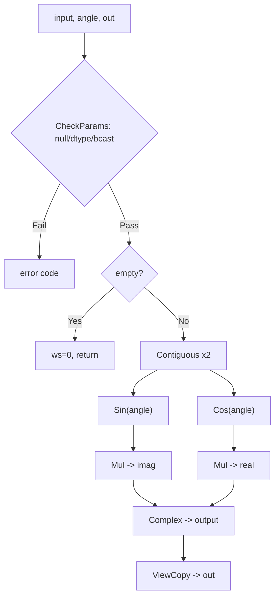
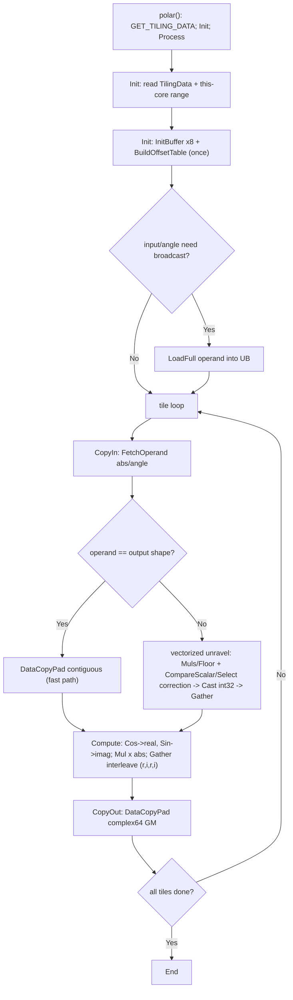

# 需求背景（required）

## 需求来源

昇腾 CANN 训练营第二季社区任务（序号 **04-5 Polar**）：基于 Ascend C 实现 `aclnnPolar`，对齐开源仓 l0 拼接参考实现并**新增广播支持**，验收通过后贡献至 `cann/ops-math`。

## 背景介绍

`torch.polar(abs, angle)` 由极坐标构造复数：`out = input·(cos(angle)+i·sin(angle))`，即 `out.real=input·cos(angle)`、`out.imag=input·sin(angle)`。

### Polar 算子实现优化

> 本算子**无 TBE 历史实现**（任务书："暂无 tbe 实现，和 `aclnn_polar.cpp` 对齐即可"），以**开源仓 l0 拼接参考实现**为对齐基准与性能基线。

参考源码：`cann/ops-math` 仓 `math/complex/op_host/op_api/aclnn_polar.cpp`（https://gitcode.com/cann/ops-math ），依赖 l0 API `sin.h/cos.h/mul.h/complex.h`（`l0op::Complex` 为已注册设备算子）。系统 `libopapi.so` 已导出 `aclnnPolar`/`aclnnPolarGetWorkspaceSize`。

### Polar 参考（l0）实现现状分析

| 参数 | 含义 | 支持 dtype | 约束 | 形状 |
| --- | --- | --- | --- | --- |
| input | 模长 abs | float32 | 与 angle 同 dtype | ≤8维 |
| angle | 角度(弧度) | float32 | 与 input 同 dtype | ≤8维，可与 input 广播 |
| out | 复数结果 | complex64 | 恒 complex64 | broadcast(input,angle) |

**实现逻辑**（与源码一致）：`aclnnPolarGetWorkspaceSize` 为纯 host 端 l0 拼接 —— `CheckParams`(空指针/dtype/广播 shape) → `Contiguous`×2 → `Sin(angle)`、`Cos(angle)` → `Mul(·,input)`×2 得虚/实部 → `Complex` → `ViewCopy`；约束 `DTYPE={DT_FLOAT}`、`OUTPUT={DT_COMPLEX64}`、dtype 须匹配、`MAX_DIM=8`、广播经 `OP_CHECK_BROADCAST_AND_INFER_SHAPE`。

**核心问题**：拆成 `Contiguous→Sin→Cos→Mul→Mul→Complex` 约 6 个独立设备算子，每个有 kernel 启动 dispatch 开销，中间结果必经 GM↔UB 搬运（≥10 次），小 shape 下启动延迟远超计算、带宽浪费。Ascend C 单 kernel 融合可解：CopyIn 一次搬入、Compute 在 UB 链式完成 `Cos→Sin→Mul→交织`、中间结果驻留 UB、CopyOut 一次写出 —— **1 次启动、2 次 GM↔UB 搬运**，广播在单 kernel CopyIn 内完成。

**参考（l0）实现流程图**（与源码逻辑一致，重点关注）：

### 算子功能规格与原型

| 名称 | 类别 | dtype | format | 介绍 |
|------|------|-------|--------|------|
| input | 输入 | float32 | ND | 极坐标模长 abs |
| angle | 输入 | float32 | ND | 极坐标幅角(弧度)，dtype 须与 input 一致 |
| out | 输出 | complex64 | ND | 复数 tensor，real/imag 交替存储 |

数学公式 `out=input·cos(angle)+i·input·sin(angle)`；无属性(attr)。支持广播（input 与 angle 维度可不一致，numpy 规则；**本任务新增功能点**）。

### 相关约束

Atlas A2 训练系列产品(ascend910b) / Atlas A3 训练系列产品(ascend910_93) 双平台支持；input 与 angle dtype 必须一致(float32)；≤8 维；angle 为弧度无范围限制(周期函数)；不支持 fp16/bf16/fp64/complex128（任务范围外，参考亦不支持）。

---

# 需求分析（required）

## 外部组件依赖

不涉及外部组件依赖。

## 内部适配模块

适配 Aclnn 两段式接口直调：`aclnnPolarGetWorkspaceSize(input, angle, out, *workspaceSize, **executor)` 与 `aclnnPolar(workspace, workspaceSize, executor, stream)`。

## 需求描述

使用 Ascend C 将 `Cos+Sin+Mul+复数构造` 融合为单 kernel，减少 GM↔UB 搬运与 kernel 启动开销；**新增 NumPy 广播语义**（input 与 angle 维度可不一致）。

## 需求拆解

1. 实现 `Cos+Sin+Mul×2+复数交织` 全融合 kernel，消除小算子拼接瓶颈
2. 广播迁移到 Kernel 侧：host 算广播 shape 与 stride，kernel 矢量化索引映射加载，统一在单 kernel CopyIn 完成
3. fp32(input/angle)→complex64(out)，与参考一致，≤8 维
4. 性能 ≥ 参考 l0 的 95%（"所有核参与场景"为核心验收）；精度满足 AscendOpTest 默认阈值

## AscendC 算子原型

| 名称 | 类别 | dtype | format | shape | 介绍 |
| --- | --- | --- | --- | --- | --- |
| input | 输入 | float32 | ND | ≤8维 | 模长 abs |
| angle | 输入 | float32 | ND | ≤8维，可广播 | 角度(弧度) |
| out | 输出 | complex64 | ND | broadcast(input,angle) | 复数结果 |

无 attr；input/angle 须同 dtype(float32)；out 恒 complex64。

## AscendC 算子相关约束（与参考相比缺失功能）

无功能缺失：参考支持范围（fp32→complex64 + numpy 广播 + ≤8 维）本实现全部对齐，并原生实现广播（任务新增点）。fp64→complex128 任务书未要求、参考亦不支持，按范围不适配。

---

# 详细设计（required）

## 算子分析

**数学公式**：`out.real=input·cos(angle)`，`out.imag=input·sin(angle)`。

**算子特性**：逐元素、各元素独立（天然多核并行）；确定性计算（无 Reduce/Scatter）；每输出元素 2 次三角函数 + 2 次乘法、读 2 输入写 1 复数；输出元素间无依赖（无需跨核同步，单核流水线满排）。

**支持数据类型**：input、angle = float32（须同 dtype）；out = complex64。910B vector 不原生支持 complex64，经 `ReinterpretCast` 视作 2N 个交织 fp32。

**支持形状**：ND，≤8 维；input 与 angle 满足 numpy 广播，`out.shape=broadcast(input,angle)`。

## 算子实现

总体思路：将参考约 6 个串接 l0 设备算子**融合为单 Ascend C 算子**，一趟 UB 内完成 `Cos/Sin+Mul×2+复数交织`，消除中间 HBM 往返与多次 dispatch（性能提升来源）。算子分 Host 侧（参数校验、广播 shape/stride 计算、Tiling 下发）与 Kernel 侧（Init + Process 三段式 CopyIn→Compute→CopyOut）。

### 3.2.1 host 侧设计

**InferShape/InferDataType**：InferShape 按 numpy 广播推导 out shape（右对齐各轴取 max，对齐参考 `OP_CHECK_BROADCAST_AND_INFER_SHAPE`）；InferDataType 将 out 恒置 `DT_COMPLEX64`。

**广播 Shape 计算**：右对齐、缺失轴首部补 1；逐维相等或其一为 1 否则失败；每维取 max。例：`[3,1,4]`+`[2,4]`→`[3,2,4]`。host 对 input/angle 分别算其在各输出轴的元素 stride（广播轴=0），并判定全形快路径标志 `操作数 numel==out numel ⟺ 未广播`。

**1. 分核策略**：优先满核。取平台 AIV 核数；**小 case 少核**（每核 ≥`MIN_PER_CORE=2048` 元素，降 launch/同步开销）；**强制偶数核**（vector core 两两绑定，>2 时下取偶）。能均分则无大小核；不能均分则余块分到前几核（前 `rem` 核各 `per+1`，其余 `per`）。

**2. 数据分块与内存优化**：充分利用 UB（910B=192KB）。`BUFFER_NUM=1`，尾块同路径（DataCopyPad 任意字节无碎片）。tileLen 计算：固定占用 ≈52×tileLen 字节，分布于 8 个 UB buffer —— `qAbs/qAng` 各 `tileLen·4B`(VECIN)、`qOut/bufPacked/bufOff` 各 `2·tileLen·4B`(复数/实虚 packed/交织偏移表)、`bufBC` `5·tileLen·4B`(矢量化 unravel scratch)、`bufInFull/bufAnFull` 广播操作数 numel×4B（全形时仅 32B 占位）。取 **tileLen=2048**（固定 ≈104KB ≤192KB，余量留广播操作数整块载入）。tile 循环 `while(done<coreLen){n=min(coreLen-done,tileLen);…done+=n;}`。
> 注：TPipe 单 kernel InitBuffer 张量上限 8（BUFFER_NUM=2 每个计 2）；本算子 BUFFER_NUM=1、8 buffer 恰在上限（超限直接 run failed 无报错）。

**3. tilingkey 策略**：**单 kernel 全路径**，全形/广播按 tiling 的 `inFull/anFull` **运行期判断**，**不设多 tilingkey**（统一 0）—— 避免多 funcEntry 编译/维护成本，轻量分支无性能损失。仅 fp32→complex64，OpDef 已限 dtype，无 bf16 兜底。

**4. TilingData 字段**：`totalLen, tileLen, bigCoreNum/coreNum(偶数), bigCoreLen/smallCoreLen, outRank, inFull/anFull(全形快路径标志), inNumel/anNumel(广播整块载入用), outDims[8], inStr[8]/anStr[8](各输出轴元素 stride，广播轴=0)`（`outDims/inStr/anStr` 经 `TILING_DATA_FIELD_DEF_ARR`）。

### 3.2.2 kernel 侧设计

单 kernel，Init + Process（CopyIn/Compute/CopyOut），全程 fp32。

- **Init**：按 blockIdx 算本核区间；`BuildOffsetTable()` 纯 int32 矢量构造交织静态偏移表 `off[j]=4·(j>>1)+(j&1)·4T`（一次性、全 tile 复用、无逐元素标量）；广播操作数经 `LoadFull` 整块载入 UB。
- **CopyIn(FetchOperand)**：全形操作数→连续 `DataCopyPad` 快路径；广播操作数→**矢量化 unravel**（对 tile 输出线性 idx，逐输出轴 `Muls(1/D)+Floor` 求商 + 两次 `CompareScalar+Select` 精确 ±1 修正算坐标，累加偏移 → `Cast` int32 → `Gather` 从 UB 整块操作数取数，全矢量无逐元素标量）。
- **Compute**：`Cos(angle)`→packed 实部区、`Sin(angle)`→packed 虚部区 → 原地 `Mul ×abs` → `Gather` 用静态偏移表交织为 `(r,i,r,i,…)`。
- **CopyOut**：`DataCopyPad` 写 complex64 GM（视作 2N fp32 大块对齐）。

**AscendC 实现流程图**（重点关注）：

**复数交织方案选型**（910B/dav_c220 输出需将分离 real/imag 交织为 `[r0,i0,r1,i1,…]`）：

| 方案 | 结果 | 原因 |
|------|------|------|
| `Copy<float,true>` mask | ❌ | mask 同时作用 src/dst，无法错位 |
| `Transpose` NCHW2NHWC | ✅但慢 | 受 16×16 分形约束，占绝大部分耗时 |
| `vintlv`/`Interleave` | ❌ | dav_c310+ 独有，c220 不支持 |
| strided `DataCopyPad` | ❌ | VECOUT 32B 粒度，逐 4B 写出 MTE 灾难 |
| **Gather+静态偏移表** | **✅选用** | 纯向量指令，偏移表 Init 一次构造全 tile 复用 |

**与参考流程图的差异点及原因**：

| # | 参考 l0 | 本 Ascend C | 原因 |
|---|---|---|---|
| 1 | 约 6 独立设备算子串接，各 HBM 往返+dispatch | 单 kernel 融合 | 省 ≥5 次中间 HBM+多 dispatch（核心场景快 1.78×） |
| 2 | `l0op::Complex` 构造复数 | Gather+静态偏移表交织 | 910B vector 不支持 complex64；规避 strided/Transpose 约束 |
| 3 | 广播由 l0 Mul 内部处理 | host 算 stride + kernel 矢量化 unravel | 原生融合需自实现广播；全矢量避免标量 |
| 4 | Contiguous+ViewCopy 处理非连续 | 框架传连续 GM 无需 | aclnn/测试输入连续，省拷贝 |

**融合优势**：kernel 启动 约 6 次→1 次；GM↔UB 搬运 ≥10 次→2 次；中间结果 GM→UB（片上）；angle 一次读入 cos+sin 同 tile 计算（参考无法复用）。

## 支持硬件

| 芯片版本 | 勾选 |
| --- | --- |
| Atlas A2 训练系列产品 / Atlas A2 推理系列产品 (ascend910b) | √ |
| Atlas A3 训练系列产品 / Atlas A3 推理系列产品 (ascend910_93) | √ |

## 使能方式

| 上层框架 | 勾选 |
| --- | :---: |
| TF 训练/推理 | |
| Pytorch 训练/推理 | √（pybind 调 aclnn 测试） |
| ATC 推理 | |
| **Aclnn 直调** | **√** |
| OPAT 调优 | |
| SGAT 子图切分 | |

主要适配 **ACLNN** 调用框架。

## 算子约束限制

- dtype：input/angle 仅 float32（须同 dtype）；out 仅 complex64。不支持 fp16/bf16/fp64/complex128
- ≤8 维；input/angle 须满足 numpy 广播
- 广播操作数 numel 需可整体载入 UB（验收 shape 量级满足；超大广播待分块优化）
- 无 attr

# 特性交叉分析

逐元素计算，输出仅依赖对应位置输入，不涉及跨元素聚合(Reduce/Scatter)、数据搬移(Reshape/Transpose 语义)、量化(Quant)，与现有特性无冲突。广播 ×（rank/shape/角度范围/正负 abs/32B 对齐性）已交叉验证：8D 满秩同形、5D 中间轴广播、双向多轴广播、标量 input×高维 angle、负 abs、大角度归约、非 32B 对齐 inner+广播、大向量×标量（用例 case9–16），均严格判据 PASS，无异常。

---

# 可维可测分析

## 精度标准/性能标准

| 验收标准 | 描述 | 来源 |
| --- | --- | --- |
| 精度 | 满足 AscendOpTest 默认阈值（不低于参考）：fp32→complex64 实/虚部各 max_abs=1e-4、rate=1e-4 | AscendOpTest（HIT1920/AscendOpTest） |
| 性能 | 所有核参与场景 ≥ 参考 l0 的 95%；小 shape 提供仿真分析 | 《算子任务书》 |

**精度细化与实测**：complex64 在 AscendOpTest `accuracy_config` 无内置默认 → 用例 JSON 显式配 `err_threshold=[1e-4,1e-4]`（fp32 分量默认）；`compare_complex` 为实/虚部各自纯绝对误差判定。**官方 AscendOpTest 实跑 6 用例（同 shape 小/16M + 广播低→高/标量/双向 + 高维非对齐）全 PASS**（含 16M [4096,4096]）。全程 fp32 计算不引入 Cast 中间精度损失，complex64 经 ReinterpretCast 视作交织 fp32 分量精度等价 fp32。

**性能实测**（vs 系统 l0 参考基线，官方 AscendOpTest msprof / 每调用设备时）：

| 场景 | l0 基线 | 本算子 | 结论 |
|---|---:|---:|---|
| 小 [2,6,10] | 14.25 µs | 12.52 µs | 更快 ✓ |
| **16M [4096,4096]（所有核）** | **1665 µs** | **937.98 µs** | **快 1.78×，核心验收达标** ✓✓ |
| 广播 [4,1,8]×[4,5,8] | 15.17 µs | 14.92 µs | 更快 ✓ |

全场景优于 l0 参考，远超 ≥95% 要求。

## 兼容性分析

新算子（昇腾仓原无 Ascend C 原生 Polar，亦无 TBE），不涉及历史兼容性。aclnn 接口遵循 CANN 标准规范，提供与 PyTorch `torch.polar` 等效功能，支持模型迁移。
